# D01: Tramitación de Actos Administrativos

## Metadatos del Dominio

| Campo           | Valor                                                                                                                                                |
| --------------- | ---------------------------------------------------------------------------------------------------------------------------------------------------- |
| **ID**          | `DOM-ACTOS-ADMIN`                                                                                                                                    |
| **Criticidad**  | 🟠 Alta                                                                                                                                               |
| **Dueño**       | Unidad Jurídica                                                                                                                                      |
| **Procesos**    | 2                                                                                                                                                    |
| **Subprocesos** | ~14 fases                                                                                                                                            |
| **Ref. Fuente** | [kb_gn_054_bpmn_c4_koda.yml](file:///Users/felixsanhueza/Developer/gorenuble/knowledge/domains/gn/arquitectura/kb_gn_054_bpmn_c4_koda.yml) L.100-499 |

---

## Mapa General del Dominio

```mermaid
flowchart LR
    subgraph PROCESOS["📋 Procesos de Actos Administrativos"]
        P1["P1: Resoluciones<br/>Exentas"]
        P2["P2: Convenios y<br/>Transferencias"]
    end

    subgraph TRANSVERSAL["🔧 Elementos Transversales"]
        T1["Expediente<br/>Electrónico"]
        T2["Firma Electrónica<br/>Avanzada"]
        T3["Toma de Razón<br/>(cuando aplica)"]
    end

    P1 --> T1 & T2
    P2 --> T1 & T2 & T3

    style P1 fill:#2196F3,color:#fff
    style P2 fill:#4CAF50,color:#fff
```

---

## P1: Flujo de Resoluciones Exentas

| Campo     | Valor                          |
| --------- | ------------------------------ |
| **ID**    | `BPMN-GN-RES-EXENTAS-FLUJO-01` |
| **Fases** | 7                              |
| **SLA**   | 15 días hábiles                |

### Diagrama de Flujo Completo

```mermaid
flowchart TD
    subgraph FASE1["1️⃣ Iniciación"]
        A["Área Requirente:<br/>Elaborar borrador"]
        B["Adjuntar<br/>antecedentes"]
        C["Ingresar al SGD"]
    end

    subgraph FASE2["2️⃣ Revisión Jurídica"]
        D["Jurídica recibe<br/>expediente"]
        E["Verificar legalidad<br/>y forma"]
        F{"¿OK?"}
        G["✅ V°B° Jurídico"]
        H["❌ Observar"]
    end

    subgraph FASE3["3️⃣ Gestión"]
        I["Centro Gestión:<br/>Asignar N° resolución"]
        J["Completar<br/>formalidades"]
    end

    subgraph FASE4["4️⃣ Control"]
        K["Unidad Control:<br/>Verificar procedencia"]
        L{"¿Conforme?"}
        M["✅ V°B° Control"]
        N["❌ Reparar"]
    end

    subgraph FASE5["5️⃣ V°B° Administrador/a"]
        O["Administrador/a Regional:<br/>Revisar y visar"]
    end

    subgraph FASE6["6️⃣ Firma"]
        P["Gobernador/a:<br/>Firma con FEA"]
    end

    subgraph FASE7["7️⃣ Notificación y Archivo"]
        Q["Oficina Partes:<br/>Numerar y fechar"]
        R["Notificar a<br/>interesados"]
        S["Publicar si<br/>corresponde"]
        T["Archivar expediente"]
    end

    A --> B --> C --> D --> E --> F
    F -->|"Sí"| G --> I --> J --> K --> L
    F -->|"No"| H --> A
    L -->|"Sí"| M --> O --> P --> Q --> R --> S --> T
    L -->|"No"| N --> A

    style P fill:#4CAF50,color:#fff
    style T fill:#607D8B,color:#fff
```

### Roles por Fase

| Fase             | Responsable              | Acción Principal      |
| ---------------- | ------------------------ | --------------------- |
| 1. Iniciación    | Área Requirente          | Elaborar borrador     |
| 2. Rev. Jurídica | Unidad Jurídica          | Verificar legalidad   |
| 3. Gestión       | Centro de Gestión        | Asignar N°            |
| 4. Control       | Unidad de Control        | Verificar procedencia |
| 5. V°B°          | Administrador/a Regional | Visar                 |
| 6. Firma         | Gobernador/a             | Firma FEA             |
| 7. Notificación  | Oficina de Partes        | Notificar, archivar   |

### Requisitos Expediente Electrónico

```mermaid
flowchart LR
    A["📄 Borrador<br/>resolución"] --> B["📎 Antecedentes<br/>de respaldo"]
    B --> C["📝 Visaciones<br/>electrónicas"]
    C --> D["✍️ Firma FEA<br/>Gobernador/a"]
    D --> E["📬 Notificación<br/>electrónica"]

    style D fill:#4CAF50,color:#fff
```

---

## P2: Aprobación de Transferencias y Convenios

| Campo     | Valor                                     |
| --------- | ----------------------------------------- |
| **ID**    | `PROC-GORE-BPMN-TRAMITACION-CONVENIOS-01` |
| **Fases** | 7                                         |
| **SLA**   | 30 días hábiles                           |

### Diagrama de Flujo Completo

```mermaid
flowchart TD
    subgraph FASE1["1️⃣ Iniciación"]
        A["Área Responsable:<br/>Elaborar borrador convenio"]
        B["Incluir cláusulas:<br/>• Partes<br/>• Objeto<br/>• Monto<br/>• Plazos<br/>• Rendición"]
    end

    subgraph FASE2["2️⃣ Revisión Jurídica"]
        C["Jurídica:<br/>Revisar legalidad"]
        D{"¿Cumple<br/>normativa?"}
        E["✅ V°B° Jurídico"]
        F["❌ Observar"]
    end

    subgraph FASE3["3️⃣ Visación Presupuestaria"]
        G["DAF:<br/>Verificar disponibilidad"]
        H["Emitir CDP"]
        I["V°B° DAF"]
    end

    subgraph FASE4["4️⃣ Control Interno"]
        J["U. Control:<br/>Verificar procedencia"]
        K["V°B° Control"]
    end

    subgraph FASE5["5️⃣ Firma Partes"]
        L["Coordinar firma:<br/>• Gobernador/a GORE<br/>• Representante Entidad"]
    end

    subgraph FASE6["6️⃣ Resolución Aprobatoria"]
        M["Elaborar resolución<br/>que aprueba convenio"]
        N{"¿Requiere<br/>Toma de Razón?"}
        O["Enviar a CGR"]
        P["Tramitar exento"]
    end

    subgraph FASE7["7️⃣ Publicación y Archivo"]
        Q["Publicar en<br/>Transparencia"]
        R["Registrar en SIGFE"]
        S["Archivar expediente"]
    end

    A --> B --> C --> D
    D -->|"Sí"| E --> G --> H --> I --> J --> K --> L --> M --> N
    D -->|"No"| F --> A
    N -->|"Sí"| O --> Q
    N -->|"No"| P --> Q
    Q --> R --> S

    style L fill:#4CAF50,color:#fff
    style S fill:#607D8B,color:#fff
```

### Contenido Mínimo del Convenio

| Elemento         | Descripción                       |
| ---------------- | --------------------------------- |
| **Partes**       | GORE + Entidad receptora          |
| **Objeto**       | Descripción del programa/proyecto |
| **Monto**        | Valor total y calendario          |
| **Plazos**       | Duración y fechas clave           |
| **Obligaciones** | Deberes de cada parte             |
| **Rendición**    | Modalidad, plazos, SISREC         |
| **Restitución**  | Condiciones de devolución         |
| **Probidad**     | Cláusulas anticorrupción          |

### Criterios Toma de Razón

```mermaid
flowchart TD
    A["Convenio<br/>firmado"] --> B{"Monto y<br/>naturaleza"}
    B -->|"Supera umbral<br/>CGR"| C["Requiere<br/>Toma de Razón"]
    B -->|"Bajo umbral"| D["Exento"]
    B -->|"Normativa<br/>específica"| E["Consultar<br/>Res. CGR"]

    style C fill:#f44336,color:#fff
    style D fill:#4CAF50,color:#fff
```

---

## Expediente Electrónico (Ley 21.180)

### Estructura del Expediente

```mermaid
flowchart TD
    subgraph EXPEDIENTE["📁 Expediente Electrónico"]
        A["Metadatos:<br/>• ID único<br/>• Fecha creación<br/>• Tipo acto"]
        B["Documentos:<br/>• Borrador<br/>• Antecedentes<br/>• Visaciones"]
        C["Firmas:<br/>• FEA funcionarios<br/>• FEA autoridad"]
        D["Trazabilidad:<br/>• Log de acciones<br/>• Fechas/horas"]
    end

    A --> B --> C --> D

    style C fill:#2196F3,color:#fff
```

### Principios TDE

| Principio                   | Aplicación                           |
| --------------------------- | ------------------------------------ |
| **Equivalencia funcional**  | Documento digital = papel            |
| **Neutralidad tecnológica** | Sin dependencia de proveedor         |
| **Interoperabilidad**       | Comunicación entre sistemas          |
| **Seguridad**               | Integridad, autenticidad, no repudio |

---

## Sistemas Involucrados

| Sistema             | Función                        |
| ------------------- | ------------------------------ |
| `SYS-DOCDIGITAL`    | Gestión documental, expediente |
| `SYS-FIRMAGOB`      | Firma Electrónica Avanzada     |
| `SYS-SIGFE`         | Registro de compromisos        |
| `SYS-TRANSPARENCIA` | Publicación                    |

---

## Normativa Aplicable

| Norma                      | Alcance                      |
| -------------------------- | ---------------------------- |
| **Ley 19.880 LBPA**        | Procedimiento administrativo |
| **Ley 21.180 TDE**         | Expediente electrónico       |
| **Ley 19.799**             | Firma electrónica            |
| **Resolución 30/2015 CGR** | Rendiciones                  |
| **Ley 19.886**             | Contratación pública         |

---

## Referencias Cruzadas

| Dominio Relacionado                                                                                                                            | Vínculo                      |
| ---------------------------------------------------------------------------------------------------------------------------------------------- | ---------------------------- |
| [D03 Gestión IPR](file:///Users/felixsanhueza/Developer/gorenuble/knowledge/domains/gn/arquitectura/bpmn/D03_gestion_ipr.md)                   | Fase 4 Formalización         |
| [D02 Ciclo Presupuestario](file:///Users/felixsanhueza/Developer/gorenuble/knowledge/domains/gn/arquitectura/bpmn/D02_ciclo_presupuestario.md) | Modificaciones, resoluciones |
| [D08 Rendiciones](file:///Users/felixsanhueza/Developer/gorenuble/knowledge/domains/gn/arquitectura/bpmn/D08_rendiciones.md)                   | Convenios de transferencia   |

---

*Última actualización: 2025-12-16*
