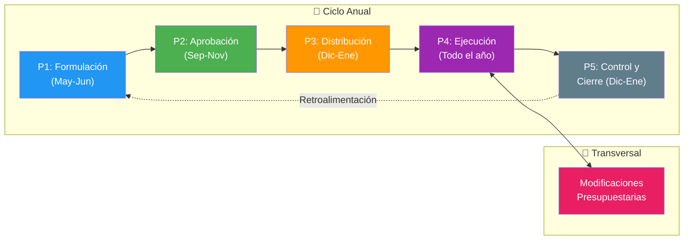
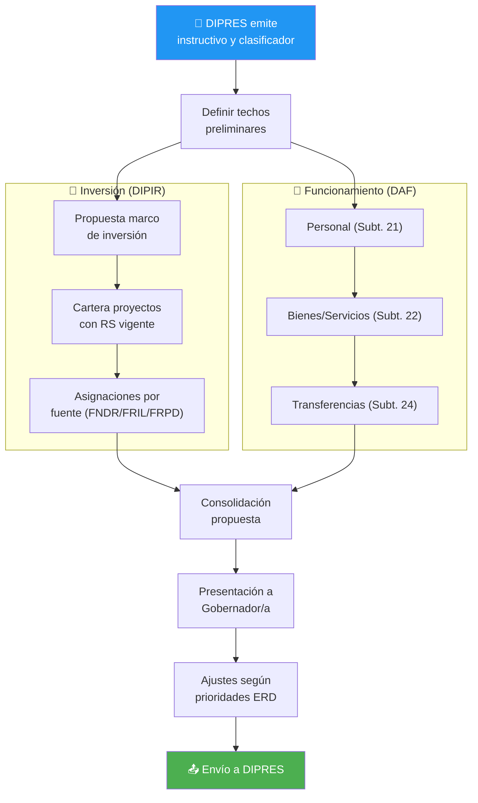
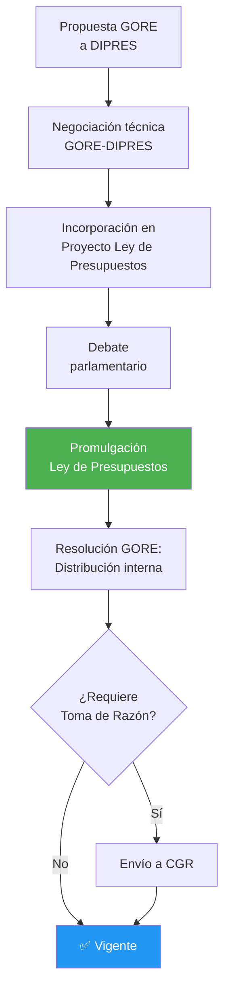
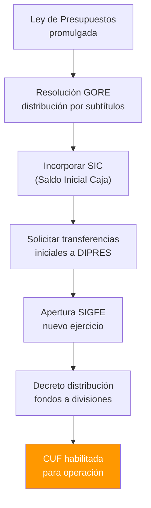
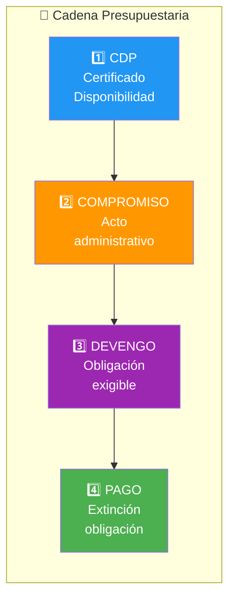
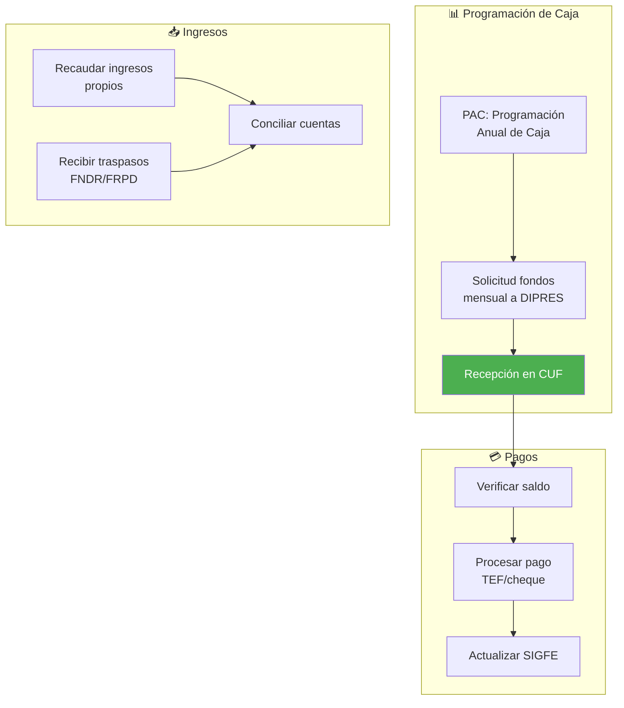
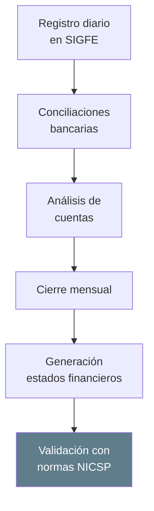
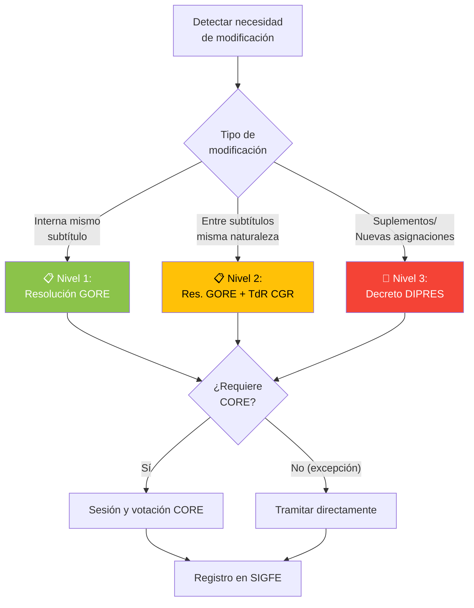
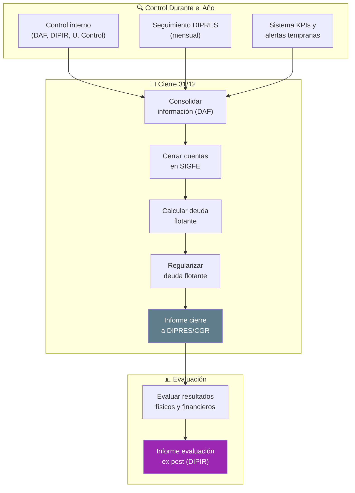
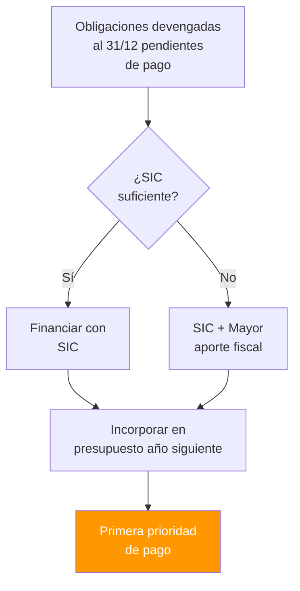

# D02: Ciclo Presupuestario Regional

## Metadatos del Dominio

| Campo           | Valor                                                                                                                                                 |
| --------------- | ----------------------------------------------------------------------------------------------------------------------------------------------------- |
| **ID**          | `DOM-PRESUPUESTO`                                                                                                                                     |
| **Criticidad**  | 🔴 Crítica                                                                                                                                             |
| **Dueño**       | DAF (Funcionamiento) / DIPIR (Inversión)                                                                                                              |
| **Procesos**    | 5                                                                                                                                                     |
| **Subprocesos** | ~15                                                                                                                                                   |
| **Ref. Fuente** | [kb_gn_054_bpmn_c4_koda.yml](file:///Users/felixsanhueza/Developer/gorenuble/knowledge/domains/gn/arquitectura/kb_gn_054_bpmn_c4_koda.yml) L.500-1886 |

---

## Mapa General del Dominio

---

## P1: Formulación del Presupuesto

| Campo       | Valor                                |
| ----------- | ------------------------------------ |
| **ID**      | `BPMN-GN-PRESUPUESTO-FORMULACION-01` |
| **Período** | Mayo-Junio (año anterior)            |

### Diagrama de Flujo

### Estructura del Presupuesto

| Subtítulo | Concepto                  | Responsable |
| --------- | ------------------------- | ----------- |
| 21        | Personal                  | DAF         |
| 22        | Bienes y Servicios        | DAF         |
| 24        | Transferencias Corrientes | DAF/DIPIR   |
| 29        | Activos No Financieros    | DAF         |
| 31        | Inversión (Iniciativas)   | DIPIR       |
| 33        | Transferencias de Capital | DIPIR       |

---

## P2: Aprobación del Presupuesto

| Campo       | Valor                               |
| ----------- | ----------------------------------- |
| **ID**      | `BPMN-GN-PRESUPUESTO-APROBACION-01` |
| **Período** | Septiembre-Noviembre                |

### Diagrama de Flujo

---

## P3: Distribución Inicial

| Campo       | Valor                                 |
| ----------- | ------------------------------------- |
| **ID**      | `BPMN-GN-PRESUPUESTO-DISTRIBUCION-01` |
| **Período** | Diciembre-Enero                       |

### Diagrama de Flujo

---

## P4: Ejecución Presupuestaria

| Campo           | Valor                                 |
| --------------- | ------------------------------------- |
| **ID**          | `BPMN-GN-PRESUPUESTO-EJECUCION-01`    |
| **Período**     | Todo el año                           |
| **Subprocesos** | Cadena SIGFE, Tesorería, Contabilidad |

### Cadena Presupuestaria SIGFE

### Gestión de Tesorería

### Contabilidad Gubernamental

---

## Modificaciones Presupuestarias

| Campo     | Valor                                                |
| --------- | ---------------------------------------------------- |
| **ID**    | `BPMN-GN-PRESUPUESTO-MODIFICACION-01`                |
| **Tipos** | Reasignación, Suplemento, Transferencia Consolidable |

### Diagrama de Niveles

### Excepciones sin Acuerdo CORE

| Excepción                 | Condición                    |
| ------------------------- | ---------------------------- |
| Leyes generales           | Reajustes, sentencias        |
| Regularización ingresos   | Sin incidencia en gastos     |
| Emergencias Glosa 14      | Uso del 3%                   |
| Aumento costo proyectos   | Hasta 10% (tope 7.000 UTM)   |
| Adjudicación licitaciones | Variación hasta 10% sobre RS |

### Transferencias Consolidables

---

## P5: Control y Cierre de Ejercicio

| Campo       | Valor                           |
| ----------- | ------------------------------- |
| **ID**      | `BPMN-GN-PRESUPUESTO-CIERRE-01` |
| **Período** | Diciembre-Enero                 |

### Diagrama de Flujo

### Deuda Flotante

### Reportería Oficial

| Reporte                   | Frecuencia     | Destinatario      |
| ------------------------- | -------------- | ----------------- |
| Informe Ejecución Mensual | Mensual        | DIPRES, CORE      |
| Informes por Glosas       | Trimestral     | Transparencia     |
| Cartera de Proyectos      | Mensual        | Web institucional |
| Acuerdos CORE             | 5 días hábiles | Web institucional |

---

## Sistemas Involucrados

| Sistema             | Función                    |
| ------------------- | -------------------------- |
| `SYS-SIGFE`         | Gestión financiera central |
| `SYS-BIP-SNI`       | Inversión pública          |
| `SYS-TRANSPARENCIA` | Publicación información    |

---

## Normativa Aplicable

| Norma                       | Alcance                      |
| --------------------------- | ---------------------------- |
| LOC 19.175 Art. 72-73       | Competencias presupuestarias |
| Decreto 854/2004 Hacienda   | Clasificador presupuestario  |
| Ley de Presupuestos (anual) | Marco legal ejercicio        |
| Glosa 14 Partida 31         | 3% emergencias               |
| Glosa 16 Partida 31         | Transparencia                |
| NICSP-CGR                   | Contabilidad gubernamental   |
| Resolución 30/2015 CGR      | Rendiciones                  |

---

## Referencias Cruzadas

| Dominio Relacionado                                                                                                                 | Vínculo                       |
| ----------------------------------------------------------------------------------------------------------------------------------- | ----------------------------- |
| [D03 Gestión IPR](file:///Users/felixsanhueza/Developer/gorenuble/knowledge/domains/gn/arquitectura/bpmn/D03_gestion_ipr.md)        | CDP, financiamiento proyectos |
| [D08 Rendiciones](file:///Users/felixsanhueza/Developer/gorenuble/knowledge/domains/gn/arquitectura/bpmn/D08_rendiciones.md)        | Contabilización, SIGFE        |
| [D04 Compras](file:///Users/felixsanhueza/Developer/gorenuble/knowledge/domains/gn/arquitectura/bpmn/D04_compras_contrataciones.md) | Órdenes de compra, contratos  |

---

*Última actualización: 2025-12-16*
