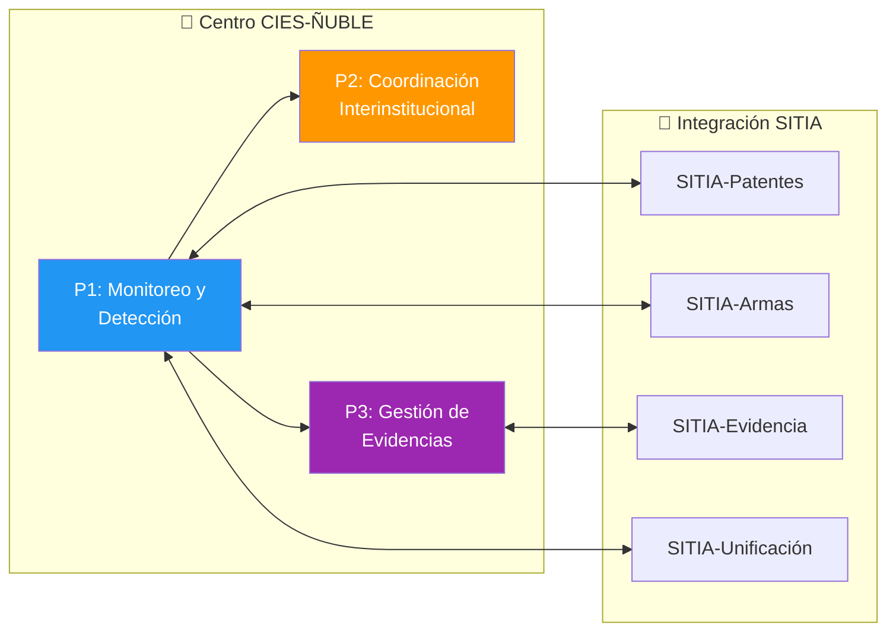
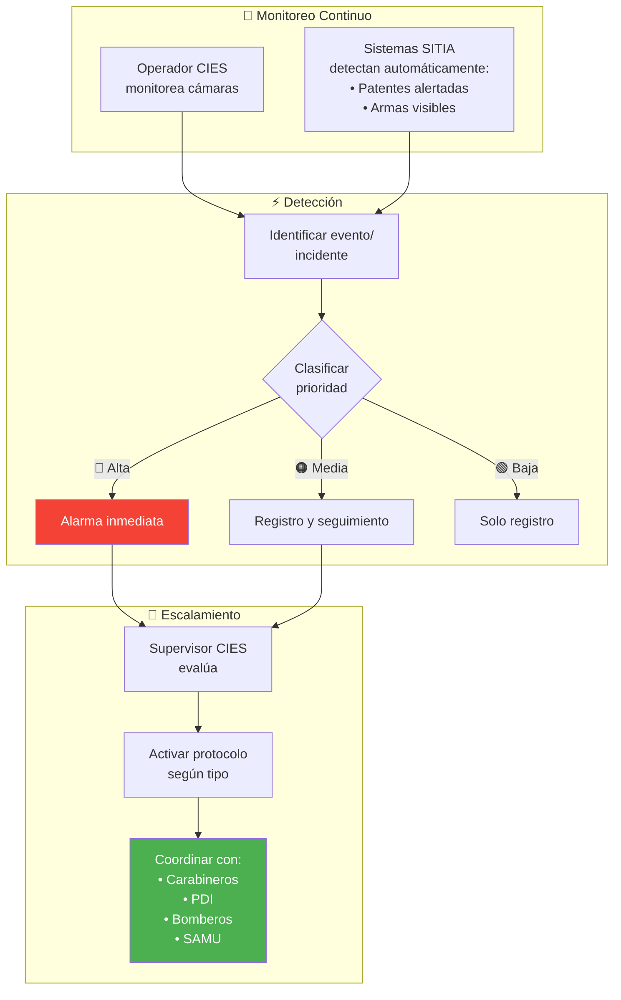
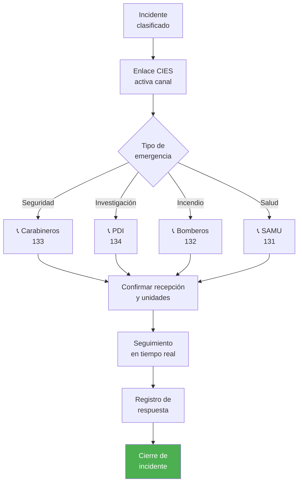
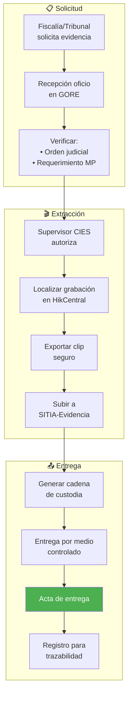
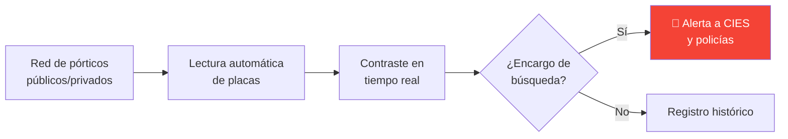
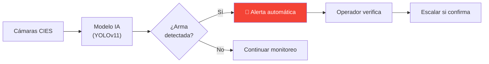
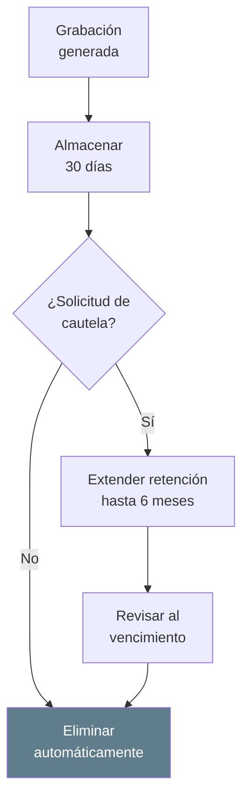
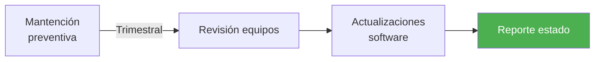

# D09: Gestión Operativa CIES/SITIA (Seguridad Pública)

## Metadatos del Dominio

| Campo           | Valor                                                                                                                                                  |
| --------------- | ------------------------------------------------------------------------------------------------------------------------------------------------------ |
| **ID**          | `DOM-CIES`                                                                                                                                             |
| **Criticidad**  | 🟠 Alta                                                                                                                                                 |
| **Dueño**       | Supervisor CIES                                                                                                                                        |
| **Procesos**    | 3                                                                                                                                                      |
| **Subprocesos** | ~8                                                                                                                                                     |
| **Ref. Fuente** | [kb_gn_054_bpmn_c4_koda.yml](file:///Users/felixsanhueza/Developer/gorenuble/knowledge/domains/gn/arquitectura/kb_gn_054_bpmn_c4_koda.yml) L.4142-4306 |

---

## Mapa General del Dominio

---

## Contexto Operativo

| Aspecto          | Detalle                                 |
| ---------------- | --------------------------------------- |
| **Cobertura**    | 16 horas (08:00-00:00), proyección 24/7 |
| **Ubicación**    | Sala de monitoreo GORE Ñuble            |
| **Coordinación** | Policías, emergencias, 21 municipios    |
| **Marco legal**  | Ley 21.427, Ley 20.965, Ley 20.502      |

---

## P1: Monitoreo, Detección y Escalamiento

| Campo       | Valor                             |
| ----------- | --------------------------------- |
| **ID**      | `BPMN-GN-CIES-SITIA-MONITOREO-01` |
| **Sistema** | HikCentral VMS                    |

### Diagrama de Flujo

### Clasificación de Incidentes

| Prioridad   | Tipo                              | Acción                   |
| ----------- | --------------------------------- | ------------------------ |
| 🔴 **Alta**  | Delito en curso, emergencia vital | Activación inmediata     |
| 🟠 **Media** | Sospecha, situación anómala       | Seguimiento y evaluación |
| 🟢 **Baja**  | Evento menor, registro            | Solo documentar          |

---

## P2: Coordinación Interinstitucional

| Campo         | Valor                                        |
| ------------- | -------------------------------------------- |
| **ID**        | `BPMN-GN-CIES-SITIA-COORD-01`                |
| **Entidades** | Carabineros, PDI, Bomberos, SAMU, Municipios |

### Diagrama de Flujo

### Protocolos de Comunicación

| Canal                  | Uso                           |
| ---------------------- | ----------------------------- |
| Radio VHF              | Comunicación directa policías |
| Líneas directas        | Centrales de emergencia       |
| WhatsApp institucional | Coordinación municipal        |
| Plataforma SITIA       | Integración nacional          |

---

## P3: Gestión de Evidencias Digitales

| Campo          | Valor                               |
| -------------- | ----------------------------------- |
| **ID**         | `BPMN-GN-CIES-SITIA-EVIDENCIA-01`   |
| **Plataforma** | SITIA-Evidencia (Genetec Clearance) |

### Diagrama de Flujo

### Cadena de Custodia Digital

| Elemento        | Verificación      |
| --------------- | ----------------- |
| Hash de archivo | Integridad        |
| Metadatos       | Fecha/hora/cámara |
| Log de accesos  | Quién manipuló    |
| Firma digital   | Autenticidad      |

---

## Capacidades SITIA

### SITIA-Patentes

### SITIA-Armas

---

## Gestión de Privacidad y Retención

### Política de Retención

| Aspecto               | Regla                           |
| --------------------- | ------------------------------- |
| **Retención normal**  | 30 días                         |
| **Eliminación**       | Segura e irreversible           |
| **Cautela ciudadana** | Hasta 6 meses (víctima/testigo) |

### Cumplimiento Normativo

> ⚠️ **Ley 19.628**: Tratamiento de datos personales debe respetar licitud, finalidad y proporcionalidad.

---

## Sostenibilidad Operativa

### Modelo de Financiamiento

| Componente         | Fuente                          |
| ------------------ | ------------------------------- |
| Personal CIES      | Presupuesto anual GORE          |
| Mantención equipos | Garantía 22 meses + presupuesto |
| Servicios SITIA    | Convenio marco con SPD          |

### Mantención

---

## Sistemas Involucrados

| Sistema               | Función             |
| --------------------- | ------------------- |
| `SYS-HIKCENTRAL`      | VMS gestión cámaras |
| `SYS-SITIA`           | Plataforma nacional |
| `SYS-SITIA-EVIDENCIA` | Gestión evidencias  |
| `SYS-SITIA-PATENTES`  | Lectura placas      |
| `SYS-SITIA-ARMAS`     | Detección IA        |

---

## Normativa Aplicable

| Norma          | Alcance                    |
| -------------- | -------------------------- |
| **Ley 21.427** | Sistema Nacional Seguridad |
| **Ley 20.965** | Cámaras vigilancia         |
| **Ley 20.502** | ONEMI/funcionamiento       |
| **Ley 19.628** | Protección vida privada    |
| **Ley 21.719** | Datos personales           |

---

## Referencias Cruzadas

| Dominio Relacionado                                                                                                                              | Vínculo                 |
| ------------------------------------------------------------------------------------------------------------------------------------------------ | ----------------------- |
| [D01 Actos Administrativos](file:///Users/felixsanhueza/Developer/gorenuble/knowledge/domains/gn/arquitectura/bpmn/D01_actos_administrativos.md) | Convenios con entidades |

---

*Última actualización: 2025-12-16*
