# Modelo Omega Avanzado - Sistema GORE Ñuble

> **Versión**: 2.6.0
> **Fecha**: 2025-12-29
> **Fuentes**: LOC GORE (DFL 1-19.175), Guía Técnico-Operativa GORE Ñuble, GORE Ideal 4.0, Gestión IPR, Selector IPR, Rendiciones, Aprobaciones, Ley Presupuestos 2026

## Ficha Territorial de la Región de Ñuble

| Atributo                  | Valor                                                        | Fuente     |
| :------------------------ | :----------------------------------------------------------- | :--------- |
| **Creación**              | Ley N° 21.033 (promulgada 05-09-2017, vigencia 06-09-2018)   | Ley 21.033 |
| **Origen**                | Escisión de la Provincia de Ñuble desde la Región del Biobío | Ley 21.033 |
| **Ubicación**             | Zona centro-sur de Chile                                     | INE        |
| **Superficie**            | 13.178,5 km² (menor región continental)                      | INE        |
| **Población**             | 512.289 habitantes (Censo 2017)                              | INE        |
| **Capital**               | Chillán                                                      | Ley 21.033 |
| **Provincias**            | 3 (Diguillín, Itata, Punilla)                                | Ley 21.033 |
| **Comunas**               | 21                                                           | Ley 21.033 |
| **Índice Envejecimiento** | 97,6 (vs. 79,0 nacional)                                     | CASEN      |
| **Ruralidad**             | 28,7% (vs. 11,3% nacional)                                   | INE        |
| **Pobreza por Ingresos**  | 12,1% (vs. 6,5% nacional)                                    | CASEN      |

## Arquitectura General del Sistema

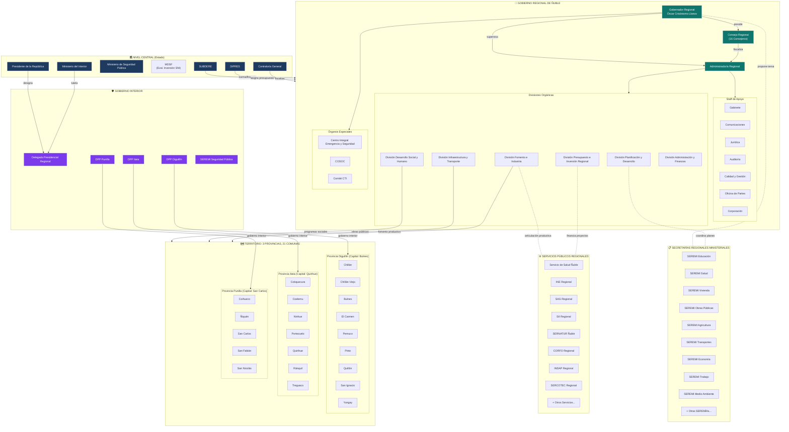
```mermaid
flowchart TB
    subgraph NIVEL_CENTRAL["🏛️ NIVEL CENTRAL (Estado)"]
        PRES["Presidente de la República"]
        MIN_INT["Ministerio del Interior"]
        MIN_SEG["Ministerio de Seguridad Pública"]
        MDSF["MDSF<br/>(Eval. Inversión SNI)"]
        SUBDERE["SUBDERE"]
        DIPRES["DIPRES"]
        CGR["Contraloría General"]
    end

    subgraph GOB_INTERIOR["🛡️ GOBIERNO INTERIOR"]
        DPR["Delegado Presidencial Regional"]
        DPP_DIG["DPP Diguillín"]
        DPP_ITA["DPP Itata"]
        DPP_PUN["DPP Punilla"]
        SEREMI_SEG["SEREMI Seguridad Pública"]
    end

    subgraph GOBIERNO_REGIONAL["🏢 GOBIERNO REGIONAL DE ÑUBLE"]
        GR["Gobernador Regional<br/>Óscar Crisóstomo Llanos"]
        CORE["Consejo Regional<br/>(16 Consejeros)"]
        AR["Administrador/a Regional"]
        
        subgraph STAFF["Staff de Apoyo"]
            GAB["Gabinete"]
            COM["Comunicaciones"]
            JUR["Jurídica"]
            AUD["Auditoría"]
            CAL["Calidad y Gestión"]
            OFP["Oficina de Partes"]
            CORP["Corporación"]
        end
        
        subgraph DIVISIONES["Divisiones Orgánicas"]
            DIPLADE["División Planificación y Desarrollo"]
            DIPIR["División Presupuesto e Inversión Regional"]
            DIDESO["División Desarrollo Social y Humano"]
            DIFOI["División Fomento e Industria"]
            DIINF["División Infraestructura y Transporte"]
            DAF["División Administración y Finanzas"]
        end
        
        subgraph ORGANOS_ESP["Órganos Especiales"]
            CIES["Centro Integral Emergencia y Seguridad"]
            COSOC["COSOC"]
            COM_CTI["Comité CTI"]
        end
    end

    subgraph SEREMIAS["📋 SECRETARÍAS REGIONALES MINISTERIALES"]
        SER_EDU["SEREMI Educación"]
        SER_SAL["SEREMI Salud"]
        SER_VIV["SEREMI Vivienda"]
        SER_OPP["SEREMI Obras Públicas"]
        SER_AGR["SEREMI Agricultura"]
        SER_TRA["SEREMI Transportes"]
        SER_ECO["SEREMI Economía"]
        SER_TRB["SEREMI Trabajo"]
        SER_MMA["SEREMI Medio Ambiente"]
        SER_OTR["+ Otras SEREMÍAs..."]
    end

    subgraph SERVICIOS["⚙️ SERVICIOS PÚBLICOS REGIONALES"]
        SS["Servicio de Salud Ñuble"]
        INE_R["INE Regional"]
        SAG_R["SAG Regional"]
        SII_R["SII Regional"]
        SERNATUR_R["SERNATUR Ñuble"]
        CORFO_R["CORFO Regional"]
        INDAP_R["INDAP Regional"]
        SERCOTEC_R["SERCOTEC Regional"]
        OTR_SP["+ Otros Servicios..."]
    end

    subgraph TERRITORIO["🗺️ TERRITORIO: 3 PROVINCIAS, 21 COMUNAS"]
        subgraph PROV_DIG["Provincia Diguillín (Capital: Bulnes)"]
            MUN_CHI["Chillán"]
            MUN_CHV["Chillán Viejo"]
            MUN_BUL["Bulnes"]
            MUN_ECA["El Carmen"]
            MUN_PEM["Pemuco"]
            MUN_PIN["Pinto"]
            MUN_QUI["Quillón"]
            MUN_SIG["San Ignacio"]
            MUN_YUN["Yungay"]
        end
        
        subgraph PROV_ITA["Provincia Itata (Capital: Quirihue)"]
            MUN_COB["Cobquecura"]
            MUN_COE["Coelemu"]
            MUN_NIN["Ninhue"]
            MUN_POR["Portezuelo"]
            MUN_QIR["Quirihue"]
            MUN_RAN["Ránquil"]
            MUN_TRE["Treguaco"]
        end
        
        subgraph PROV_PUN["Provincia Punilla (Capital: San Carlos)"]
            MUN_COI["Coihueco"]
            MUN_NIQ["Ñiquén"]
            MUN_SCA["San Carlos"]
            MUN_SFA["San Fabián"]
            MUN_SNI["San Nicolás"]
        end
    end

    %% Relaciones Nivel Central
    PRES -->|designa| DPR
    MIN_INT -->|tutela| DPR
    SUBDERE -->|norma/financia| GOBIERNO_REGIONAL
    DIPRES -->|asigna presupuesto| GOBIERNO_REGIONAL
    CGR -->|fiscaliza| GOBIERNO_REGIONAL

    %% Estructura interna GORE
    GR -->|preside| CORE
    GR -->|supervisa| AR
    CORE -->|fiscaliza| AR
    AR --> STAFF
    AR --> DIVISIONES
    GR --> ORGANOS_ESP

    %% Interacción con SEREMÍAs
    GR -.-|propone terna| SEREMIAS
    DIPLADE -.-|coordina planes| SEREMIAS
    
    %% Interacción con Servicios
    DIFOI -.-|articulación productiva| SERVICIOS
    DIPIR -.-|financia proyectos| SERVICIOS

    %% Relación con Territorio
    DIDESO -->|programas sociales| TERRITORIO
    DIINF -->|obras públicas| TERRITORIO
    DIFOI -->|fomento productivo| TERRITORIO
    DPP_DIG -->|gobierno interior| PROV_DIG
    DPP_ITA -->|gobierno interior| PROV_ITA
    DPP_PUN -->|gobierno interior| PROV_PUN

    %% Estilos
    classDef central fill:#1e3a5f,stroke:#fff,color:#fff
    classDef gobint fill:#7c3aed,stroke:#fff,color:#fff
    classDef gore fill:#0f766e,stroke:#fff,color:#fff
    classDef seremi fill:#b45309,stroke:#fff,color:#fff
    classDef servicio fill:#4f46e5,stroke:#fff,color:#fff
    classDef territorio fill:#15803d,stroke:#fff,color:#fff
    
    class PRES,MIN_INT,MIN_SEG,SUBDERE,DIPRES,CGR central
    class DPR,DPP_DIG,DPP_ITA,DPP_PUN,SEREMI_SEG gobint
    class GR,CORE,AR gore
```

## Estructura Orgánica Detallada del GORE

```mermaid
flowchart TB
    subgraph AUTORIDAD_MAXIMA["🎯 AUTORIDAD MÁXIMA"]
        GR["GOBERNADOR REGIÓN DE ÑUBLE<br/>Óscar Crisóstomo Llanos"]
        
        subgraph DEP_GR["Dependencias Directas"]
            COM_GR["Comunicaciones"]
            GAB_GR["Gabinete Gobernador"]
            CIES["Centro Integral Emergencia y Seguridad (CIES)"]
        end
        
        subgraph ORG_ASES["Órganos Asesores/Consultivos"]
            COMITE_CTI["Comité CTCI"]
            COSOC["COSOC"]
        end
    end
    
    subgraph ORGANO_COLEGIADO["⚖️ CONSEJO REGIÓN DE ÑUBLE"]
        CORE["CONSEJO REGIONAL<br/>16 Consejeros Electos"]
        SEC_CORE["Secretaría Ejecutiva CORE"]
        UC_CORE["Unidad Control"]
    end
    
    subgraph ADMINISTRACION["🏛️ ADMINISTRACIÓN REGIONAL"]
        AR["ADMINISTRADOR/A REGIONAL"]
        
        subgraph STAFF_AR["Staff de Apoyo"]
            CORP["Corporación"]
            AUD["Auditoría"]
            JUR["Jurídica"]
            UCGI["Unidad Calidad y Gestión Institucional"]
            OFP["Oficina de Partes"]
        end
    end
    
    subgraph DIV_DIPLADE["📊 DIVISIÓN PLANIFICACIÓN Y DESARROLLO"]
        J_DIPLADE["Jefe División DIPLADE"]
        COMITE_PERT["Comité Pertenencia y Vinculación Estratégica"]
        D_PLAN["Depto. Planificación Estratégica y Ordenamiento Territorial"]
        D_PROY["Depto. Desarrollo Proyectos Estratégicos"]
        D_URB["Depto. Desarrollo Urbano"]
    end
    
    subgraph DIV_DIPIR["💰 DIVISIÓN PRESUPUESTO E INVERSIÓN REGIONAL"]
        J_DIPIR["Jefe División DIPIR"]
        D_AYE["Depto. Análisis y Evaluación"]
        D_PPTO["Depto. Presupuesto"]
        D_INV["Depto. Inversión"]
    end
    
    subgraph DIV_DIDESO["🤝 DIVISIÓN DESARROLLO SOCIAL Y HUMANO"]
        J_DIDESO["Jefe División DIDESO"]
        D_FC["Depto. Fondos Concursables y Programas Sociales"]
        U_SUB["Unidad Subvenciones"]
        U_PS["Unidad Programas Sociales"]
        D_AGT["Depto. Análisis y Gestión Territorial"]
        U_PC["Unidad Participación Ciudadana"]
        U_TP["Unidad Territorial Provincial"]
        U_SPP["Unidad Seguimiento Políticas, Planes y Programas Sociales"]
    end
    
    subgraph DIV_DIFOI["🏭 DIVISIÓN FOMENTO E INDUSTRIA"]
        J_DIFOI["Jefe División DIFOI"]
        D_ZD["Depto. Zonas en Desarrollo"]
        D_DEL["Depto. Desarrollo Económico Local"]
        D_CTI["Depto. CTI para la Competitividad"]
        D_DEA["Depto. Desarrollo Empresarial y Atracción de Inversiones"]
        D_RMA["Depto. Riego y Medioambiente"]
    end
    
    subgraph DIV_DIINF["🛤️ DIVISIÓN INFRAESTRUCTURA Y TRANSPORTE"]
        J_DIINF["Jefe División DIINF"]
        D_IER["Depto. Infraestructura y Equipamiento Regional"]
        U_SB["Unidad Saneamiento Básico"]
        D_GTT["Depto. Gestión en Transportes y Telecomunicaciones"]
        U_CON["Unidad Conectividad"]
    end
    
    subgraph DIV_DAF["📋 DIVISIÓN ADMINISTRACIÓN Y FINANZAS"]
        J_DAF["Jefe División DAF"]
        D_GDP["Depto. Gestión y Desarrollo de Personas"]
        U_GP["Unidad Gestión de Personas"]
        U_DP["Unidad Desarrollo de Personas"]
        D_FIN["Depto. Finanzas"]
        U_GOI["Unidad Gestión Operativa Interna"]
        U_ABA["Unidad Abastecimiento"]
        U_TIC["Unidad TIC"]
    end
    
    %% Conexiones jerárquicas
    GR --> DEP_GR
    GR --> ORG_ASES
    GR --> CORE
    CORE --> SEC_CORE
    CORE --> UC_CORE
    
    GR --> AR
    
    AR --> STAFF_AR
    AR --> J_DIPLADE
    AR --> J_DIPIR
    AR --> J_DIDESO
    AR --> J_DIFOI
    AR --> J_DIINF
    AR --> J_DAF
    
    J_DIPLADE --> COMITE_PERT
    J_DIPLADE --> D_PLAN
    J_DIPLADE --> D_PROY
    J_DIPLADE --> D_URB
    
    J_DIPIR --> D_AYE
    J_DIPIR --> D_PPTO
    J_DIPIR --> D_INV
    
    J_DIDESO --> D_FC
    J_DIDESO --> D_AGT
    D_FC --> U_SUB
    D_FC --> U_PS
    D_AGT --> U_PC
    D_AGT --> U_TP
    D_AGT --> U_SPP
    
    J_DIFOI --> D_ZD
    J_DIFOI --> D_DEL
    J_DIFOI --> D_CTI
    J_DIFOI --> D_DEA
    J_DIFOI --> D_RMA
    
    J_DIINF --> D_IER
    J_DIINF --> D_GTT
    D_IER --> U_SB
    D_GTT --> U_CON
    
    J_DAF --> D_GDP
    J_DAF --> D_FIN
    D_GDP --> U_GP
    D_GDP --> U_DP
    D_FIN --> U_GOI
    D_FIN --> U_ABA
    D_FIN --> U_TIC
    
    %% Estilos
    classDef gobernador fill:#0f766e,stroke:#fff,color:#fff,font-weight:bold
    classDef consejo fill:#7c3aed,stroke:#fff,color:#fff
    classDef admin fill:#1e40af,stroke:#fff,color:#fff
    classDef division fill:#b45309,stroke:#fff,color:#fff
    
    class GR gobernador
    class CORE,SEC_CORE,UC_CORE consejo
    class AR,CORP,AUD,JUR,UCGI,OFP admin
    class J_DIPLADE,J_DIPIR,J_DIDESO,J_DIFOI,J_DIINF,J_DAF division
```

## Restricciones del Sistema

### Límites Jurídicos (LOC GORE)

| Restricción                      | Descripción                                                          | Referencia Legal     |
| :------------------------------- | :------------------------------------------------------------------- | :------------------- |
| **Competencias acotadas**        | GORE solo ejerce competencias expresamente transferidas              | DFL 1-19.175, Art.21 |
| **Sin jerarquía sobre SEREMÍAs** | Coordina pero no instruye a representantes ministeriales             | Art.66               |
| **Presupuesto nacional**         | Recursos asignados por Ley de Presupuestos, sin autonomía tributaria | Art.73               |
| **Control CGR**                  | Toda actuación sujeta a toma de razón y fiscalización                | Ley 10.336           |
| **Ámbitos no descentralizables** | FFAA, Relaciones Exteriores, Orden Público (reservados)              | Art.21 nonies        |

### Marco Legal Transversal

| Ley            | Nombre                                    | Impacto en el GORE                                               |
| :------------- | :---------------------------------------- | :--------------------------------------------------------------- |
| **Ley 21.730** | Seguridad Pública (Nuevo Ministerio)      | Consejo Regional de Seguridad, roles de coordinación             |
| **Ley 20.880** | Probidad y DIP                            | Declaración Intereses/Patrimonio, Fideicomiso Ciego              |
| **Ley 20.730** | Lobby y Gestión Intereses                 | Registro de audiencias, viajes y donativos                       |
| **Ley 18.575** | Bases Generales Administración del Estado | Principios de legalidad, eficiencia, probidad y transparencia    |
| **Ley 19.886** | Compras Públicas                          | Licitación pública como regla general, Mercado Público           |
| **Ley 20.285** | Transparencia y Acceso a Información      | Transparencia activa y pasiva, Consejo para la Transparencia     |
| **Ley 21.180** | Transformación Digital del Estado         | Procedimientos electrónicos obligatorios, FEA, eliminación papel |
| **Ley 21.719** | Protección de Datos Personales            | Obligaciones en tratamiento de datos, Agencia de Protección      |
| **Ley 21.663** | Ciberseguridad e Infraestructura Crítica  | Prevención, reporte y gestión de incidentes cibernéticos         |
| **Ley 21.364** | SINAPRED (Gestión de Desastres)           | Roles en prevención, mitigación, preparación y respuesta         |

### Normas de Inversión y Glosas Relevantes (Ley de Presupuestos 2026)

| Glosa/Norma    | Contenido                                                                                                                                                                     | Fuente           |
| :------------- | :---------------------------------------------------------------------------------------------------------------------------------------------------------------------------- | :--------------- |
| **Glosa 01**   | Marco general FNDR: reglas de asignación y modificación presupuestaria                                                                                                        | Partida 31       |
| **Glosa 03**   | **Prohibiciones**: NO usar recursos inversión para préstamos, gastos en personal/bienes de consumo de receptores, ni aportes a sociedades/empresas (salvo glosas específicas) | Partida 31       |
| **Glosa 06**   | Programas públicos regionales, evaluación ex-ante DIPRES/SES, tope **5% admin GORE + 5% honorarios receptor**                                                                 | Partida 31       |
| **Glosa 07**   | Subvenciones 8% FNDR, concurso público, **asignaciones directas ≤10% (Res. 72/2025 DIPRES)**                                                                                  | Partida 31       |
| **Glosa 12**   | FRIL: transferencias a municipalidades, exención RS <5.000 UTM                                                                                                                | Partida 31       |
| **Glosa 13**   | FRPD (Royalty Minero): I+D+i, instituciones habilitadas                                                                                                                       | Partida 31       |
| **Art. 6**     | Licitación pública obligatoria: proyectos >1.000 UTM, estudios >500 UTM                                                                                                       | Normas Generales |
| **Art. 7**     | Honorarios con cargo a transferencias: calidad de agente público                                                                                                              | Normas Generales |
| **Art. 23-26** | Convenios de transferencia, rendición SISREC, plazos, restitución                                                                                                             | Normas Generales |

### Límites Operativos

| Restricción                    | Impacto                                                    |
| :----------------------------- | :--------------------------------------------------------- |
| **Capacidad técnica limitada** | Dependencia de asistencia SUBDERE para proyectos complejos |
| **Brechas digitales**          | Municipios rurales con baja conectividad y capacidad       |
| **Rotación de personal**       | Pérdida de conocimiento institucional                      |
| **Fragmentación de sistemas**  | Dificultad para consolidar información regional            |

### Aspiraciones GORE 4.0

| Función        | Estado Actual                         | Visión GORE 4.0                               | Herramientas Habilitantes                       |
| :------------- | :------------------------------------ | :-------------------------------------------- | :---------------------------------------------- |
| **Planificar** | Planes estáticos, actualización lenta | Digital Twin del Territorio + prospectiva IA  | Gemelo Digital, Centro Inteligencia Territorial |
| **Financiar**  | Asignación manual, ciclos largos      | Smart Contracts + evaluación automática       | Ventanilla Única IA, Trazabilidad Blockchain    |
| **Ejecutar**   | Ejecución delegada, bajo control      | Monitoreo en tiempo real + alertas proactivas | PMO Regional, Unidad Desbloqueo IA              |
| **Coordinar**  | Mesas de trabajo presenciales         | Plataforma integrada + dashboard ejecutivo    | APIs Datos Abiertos, Interoperabilidad          |
| **Normar**     | Ordenanzas genéricas                  | Normativa adaptativa basada en datos          | Sandboxes Regulatorios, Análisis Impacto        |

## Motor de 5 Funciones del GORE

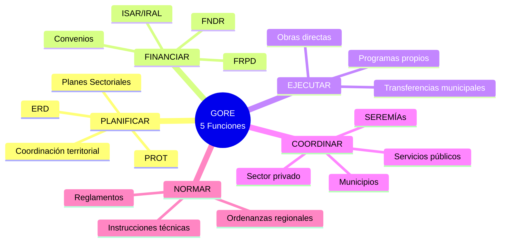
```mermaid
mindmap
  root((GORE<br/>5 Funciones))
    PLANIFICAR
      ERD
      PROT
      Planes Sectoriales
      Coordinación territorial
    FINANCIAR
      FNDR
      FRPD
      ISAR/IRAL
      Convenios
    EJECUTAR
      Obras directas
      Programas propios
      Transferencias municipales
    COORDINAR
      SEREMÍAs
      Servicios públicos
      Municipios
      Sector privado
    NORMAR
      Ordenanzas regionales
      Reglamentos
      Instrucciones técnicas
```

## Planificación Regional

### Requisitos de Información Sectorial (RIS)

> **Fuente**: `kb_gn_010_ris_index_koda.yml`
> Los RIS son documentos obligatorios para la admisibilidad en SNI.

| Tipo RIS                   | Código         | Descripción                             | Fuente               |
| :------------------------- | :------------- | :-------------------------------------- | :------------------- |
| **Proyectos de Inversión** | RIS-PROYINV    | Genérico para todo proyecto SNI (2023)  | kb_gn_010_proyinv    |
| **Programas de Inversión** | RIS-PROGINV    | Genérico para programas (2025)          | kb_gn_010_proginv    |
| **Edificación Pública**    | RIS-EDPUB      | Específico obras edificación            | kb_gn_010_edpub      |
| **Estudios Básicos**       | RIS-EB-PMDT    | Para Planes Maestros Desarrollo (PMDT)  | kb_gn_010_pmdt       |
| **Empresas Públicas**      | RIS-EMPUB      | Estudios/proyectos empresas estado      | kb_gn_010_empub      |
| **Arte y Cultura**         | RIS-ARTCULT    | Infraestructura cultural y artística    | kb_gn_010_artcult    |
| **Deportes**               | RIS-DEPORTES   | Infraestructura deportiva y recintos    | kb_gn_010_deportes   |
| **Patrimonio**             | RIS-PATRIMONIO | Intervención en inmuebles patrimoniales | kb_gn_010_patrimonio |

### Instrumentos de Planificación Regional

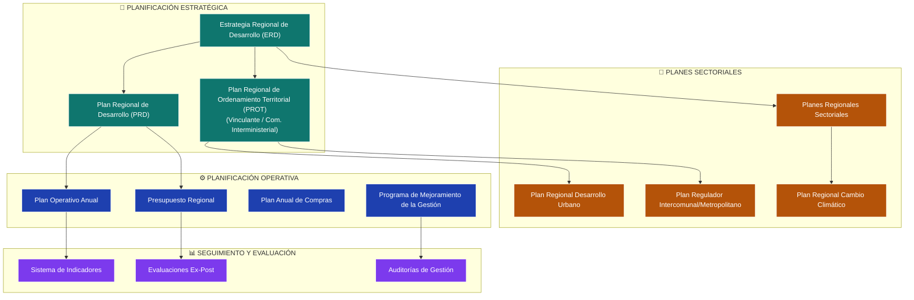
```mermaid
flowchart TB
    subgraph ESTRATEGICO["📐 PLANIFICACIÓN ESTRATÉGICA"]
        ERD["Estrategia Regional de Desarrollo (ERD)"]
        PROT["Plan Regional de Ordenamiento Territorial (PROT)<br/>(Vinculante / Com. Interministerial)"]
        PRD["Plan Regional de Desarrollo (PRD)"]
    end
    
    subgraph SECTORIAL["📑 PLANES SECTORIALES"]
        PRDU["Plan Regional Desarrollo Urbano"]
        PRI["Plan Regulador Intercomunal/Metropolitano"]
        PRCC["Plan Regional Cambio Climático"]
        PRS["Planes Regionales Sectoriales"]
    end
    
    subgraph OPERATIVO["⚙️ PLANIFICACIÓN OPERATIVA"]
        POA["Plan Operativo Anual"]
        PPTO["Presupuesto Regional"]
        PAC["Plan Anual de Compras"]
        PMG["Programa de Mejoramiento de la Gestión"]
    end
    
    subgraph EVALUACION["📊 SEGUIMIENTO Y EVALUACIÓN"]
        IND["Sistema de Indicadores"]
        EVAL["Evaluaciones Ex-Post"]
        AUDIT["Auditorías de Gestión"]
    end
    
    ERD --> PROT
    ERD --> PRD
    ERD --> PRS
    
    PRD --> POA
    PRD --> PPTO
    
    PROT --> PRI
    PROT --> PRDU
    
    PRS --> PRCC
    
    POA --> IND
    PPTO --> EVAL
    PMG --> AUDIT
    
    classDef estrategico fill:#0f766e,stroke:#fff,color:#fff
    classDef sectorial fill:#b45309,stroke:#fff,color:#fff
    classDef operativo fill:#1e40af,stroke:#fff,color:#fff
    classDef evaluacion fill:#7c3aed,stroke:#fff,color:#fff
    
    class ERD,PROT,PRD estrategico
    class PRDU,PRI,PRCC,PRS sectorial
    class POA,PPTO,PAC,PMG operativo
    class IND,EVAL,AUDIT evaluacion
```

## Financiamiento

### Fuentes de Financiamiento

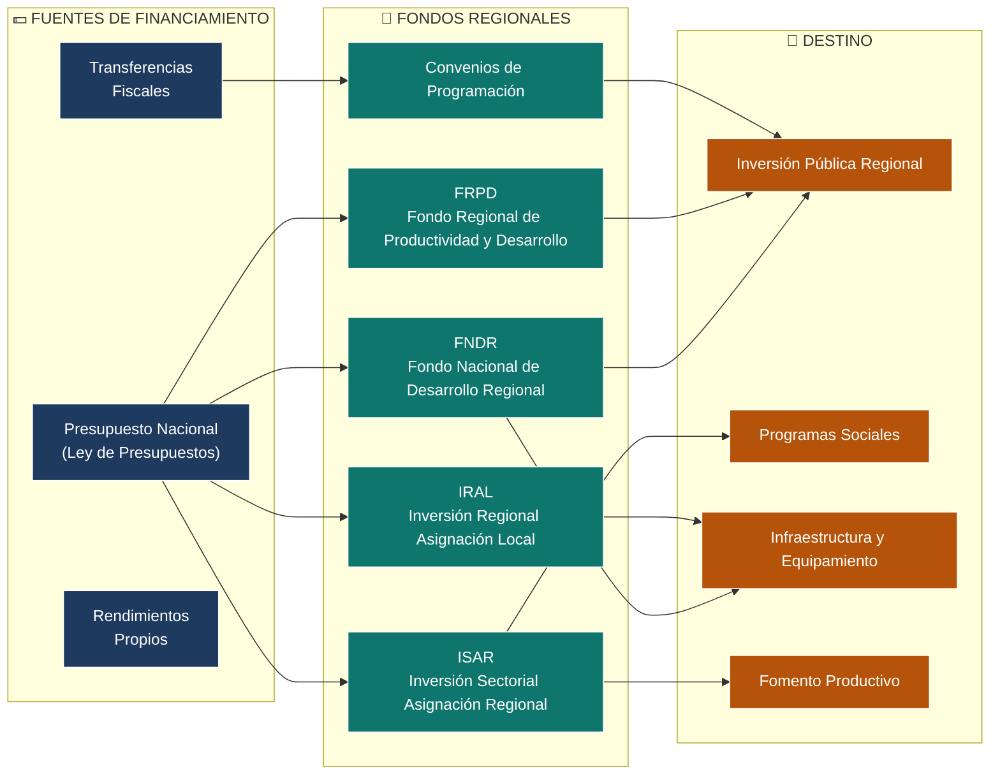
```mermaid
flowchart LR
    subgraph FUENTES["💵 FUENTES DE FINANCIAMIENTO"]
        PPTO_NAC["Presupuesto Nacional<br/>(Ley de Presupuestos)"]
        TRANSF["Transferencias<br/>Fiscales"]
        REND["Rendimientos<br/>Propios"]
    end
    
    subgraph FONDOS["🏦 FONDOS REGIONALES"]
        FNDR["FNDR<br/>Fondo Nacional de Desarrollo Regional"]
        FRPD["FRPD<br/>Fondo Regional de Productividad y Desarrollo"]
        ISAR["ISAR<br/>Inversión Sectorial Asignación Regional"]
        IRAL["IRAL<br/>Inversión Regional Asignación Local"]
        CONV["Convenios de Programación"]
    end
    
    subgraph DESTINO["🎯 DESTINO"]
        INV_PUB["Inversión Pública Regional"]
        PROG_SOC["Programas Sociales"]
        INFRA["Infraestructura y Equipamiento"]
        FOM["Fomento Productivo"]
    end
    
    PPTO_NAC --> FNDR
    PPTO_NAC --> FRPD
    PPTO_NAC --> ISAR
    PPTO_NAC --> IRAL
    TRANSF --> CONV
    
    FNDR --> INV_PUB
    FNDR --> INFRA
    FRPD --> INV_PUB
    ISAR --> PROG_SOC
    ISAR --> FOM
    IRAL --> INFRA
    CONV --> INV_PUB
    
    classDef fuente fill:#1e3a5f,stroke:#fff,color:#fff
    classDef fondo fill:#0f766e,stroke:#fff,color:#fff
    classDef destino fill:#b45309,stroke:#fff,color:#fff
    
    class PPTO_NAC,TRANSF,REND fuente
    class FNDR,FRPD,ISAR,IRAL,CONV fondo
    class INV_PUB,PROG_SOC,INFRA,FOM destino
```

### Ciclo Presupuestario Anual

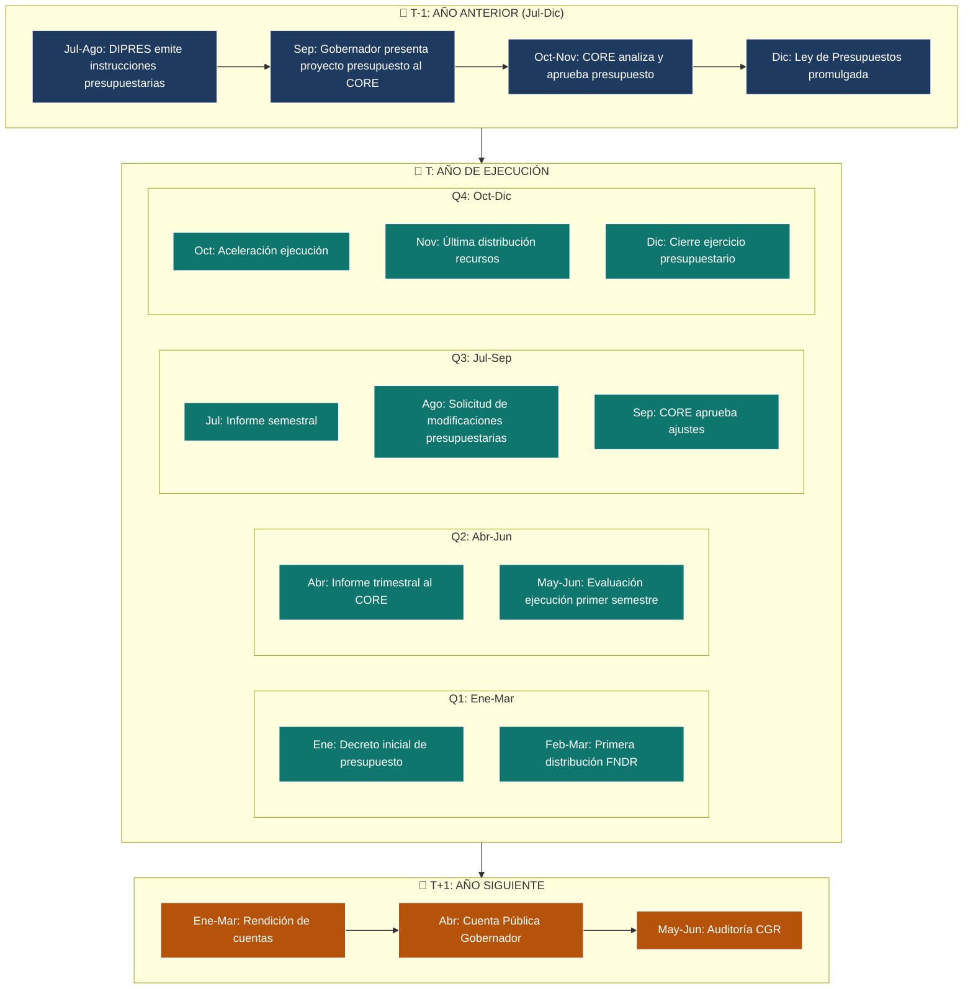
```mermaid
flowchart TB
    subgraph T1["📅 T-1: AÑO ANTERIOR (Jul-Dic)"]
        A1["Jul-Ago: DIPRES emite instrucciones presupuestarias"]
        A2["Sep: Gobernador presenta proyecto presupuesto al CORE"]
        A3["Oct-Nov: CORE analiza y aprueba presupuesto"]
        A4["Dic: Ley de Presupuestos promulgada"]
        A1 --> A2 --> A3 --> A4
    end
    
    subgraph T0["📅 T: AÑO DE EJECUCIÓN"]
        subgraph Q1["Q1: Ene-Mar"]
            B1["Ene: Decreto inicial de presupuesto"]
            B2["Feb-Mar: Primera distribución FNDR"]
        end
        
        subgraph Q2["Q2: Abr-Jun"]
            B3["Abr: Informe trimestral al CORE"]
            B4["May-Jun: Evaluación ejecución primer semestre"]
        end
        
        subgraph Q3["Q3: Jul-Sep"]
            B5["Jul: Informe semestral"]
            B6["Ago: Solicitud de modificaciones presupuestarias"]
            B7["Sep: CORE aprueba ajustes"]
        end
        
        subgraph Q4["Q4: Oct-Dic"]
            B8["Oct: Aceleración ejecución"]
            B9["Nov: Última distribución recursos"]
            B10["Dic: Cierre ejercicio presupuestario"]
        end
    end
    
    subgraph T_PLUS["📅 T+1: AÑO SIGUIENTE"]
        C1["Ene-Mar: Rendición de cuentas"]
        C2["Abr: Cuenta Pública Gobernador"]
        C3["May-Jun: Auditoría CGR"]
        C1 --> C2 --> C3
    end
    
    T1 --> T0 --> T_PLUS
    
    classDef prep fill:#1e3a5f,stroke:#fff,color:#fff
    classDef exec fill:#0f766e,stroke:#fff,color:#fff
    classDef cierre fill:#b45309,stroke:#fff,color:#fff
    
    class A1,A2,A3,A4 prep
    class B1,B2,B3,B4,B5,B6,B7,B8,B9,B10 exec
    class C1,C2,C3 cierre
```

## Catálogo de Entidades

### Actores Institucionales

| ID      | Entidad                        | Tipo                              | Fuente           |
| :------ | :----------------------------- | :-------------------------------- | :--------------- |
| ACT-001 | Gobernador Regional            | Autoridad electa                  | LOC GORE Art.23  |
| ACT-002 | Consejo Regional               | Órgano colegiado                  | LOC GORE Art.28  |
| ACT-003 | Administrador/a Regional       | Cargo confianza                   | LOC GORE Art.68  |
| ACT-004 | Delegado Presidencial Regional | Gobierno Interior/Supervigilancia | LOC GORE Art.1-2 |
| ACT-005 | Delegados Provinciales (3)     | Desconcentrado                    | LOC GORE Art.3   |
| ACT-006 | SEREMÍAs (15+)                 | Ministerial regional              | DL 575           |
| ACT-007 | Servicios Públicos Regionales  | Desconcentrados                   | Diversos         |
| ACT-008 | Alcaldías (21)                 | Autónomas comunales               | LOCM             |
| ACT-009 | COSOC Regional                 | Participación                     | Ley 20.500       |
| ACT-010 | Comité CTI                     | Asesor                            | Interno GORE     |

### Divisiones Orgánicas

| ID      | División                         | Jefatura                | Departamentos       |
| :------ | :------------------------------- | :---------------------- | :------------------ |
| DIV-001 | Planificación y Desarrollo       | Erick Solo de Zaldivar  | 1 Comité + 3 Deptos |
| DIV-002 | Presupuesto e Inversión Regional | Juan Parada González    | 3                   |
| DIV-003 | Desarrollo Social y Humano       | Tamara Valenzuela F.    | 2 + 5 unidades      |
| DIV-004 | Fomento e Industria              | Raúl Súnico Galdames    | 5                   |
| DIV-005 | Infraestructura y Transporte     | Cristián Quiroz Reyes   | 2 + 2 unidades      |
| DIV-006 | Administración y Finanzas        | Alicia Contreras Vielma | 2 + 5 unidades      |

### Instrumentos

| ID      | Instrumento               | Tipo                     | Horizonte  |
| :------ | :------------------------ | :----------------------- | :--------- |
| INS-001 | ERD                       | Estratégico              | 10-20 años |
| INS-002 | PROT                      | Territorial (Vinculante) | 10-15 años |
| INS-003 | ZUBC                      | Borde Costero            | 10-15 años |
| INS-004 | PLADETUR                  | Turístico                | 4-10 años  |
| INS-005 | Presupuesto Regional      | Operativo                | Anual      |
| INS-006 | Convenios de Programación | Contractual              | Variable   |
| INS-007 | Ordenanzas Regionales     | Normativo                | Indefinido |

### Fondos

| ID      | Fondo | Administrador  | Destino principal     |
| :------ | :---- | :------------- | :-------------------- |
| FON-001 | FNDR  | GORE           | Inversión pública     |
| FON-002 | FRPD  | GORE           | CTCI + Fomento        |
| FON-003 | ISAR  | GORE/Sectorial | Programas sectoriales |
| FON-004 | IRAL  | GORE           | Inversión local       |

## Territorio: Detalle Comunal

### Provincia de Diguillín (9 comunas)

| Comuna        | Características                                   |
| :------------ | :------------------------------------------------ |
| Chillán       | Capital regional, mayor población, IDH medio-alto |
| Chillán Viejo | Conurbación con Chillán                           |
| Bulnes        | Capital provincial                                |
| El Carmen     | Rural, agrícola                                   |
| Pemuco        | Alta pobreza (~19%)                               |
| Pinto         | Turismo, precordillera                            |
| Quillón       | Agrícola                                          |
| San Ignacio   | IDH bajo (0.437)                                  |
| Yungay        | Agrícola-forestal                                 |

### Provincia de Itata (7 comunas)

| Comuna     | Características        |
| :--------- | :--------------------- |
| Quirihue   | Capital provincial     |
| Cobquecura | Alta ruralidad (71.5%) |
| Coelemu    | Forestal               |
| Ninhue     | Alta ruralidad (71.2%) |
| Portezuelo | IDH muy bajo (0.444)   |
| Ránquil    | Vitivinícola           |
| Treguaco   | Rural                  |

### Provincia de Punilla (5 comunas)

| Comuna      | Características                    |
| :---------- | :--------------------------------- |
| San Carlos  | Capital provincial, segunda ciudad |
| Coihueco    | Agrícola-ganadero                  |
| Ñiquén      | Rural                              |
| San Fabián  | Turismo, Cordillera                |
| San Nicolás | Agrícola                           |

## Catálogo de Procesos

| ID       | Proceso                    | Tipo         | Frecuencia        | Actores Principales          | Duración Típica |
| :------- | :------------------------- | :----------- | :---------------- | :--------------------------- | :-------------- |
| PROC-001 | Ciclo IPR                  | Operativo    | Continuo          | DIPIR, Formuladores, CORE    | 12-36 meses     |
| PROC-002 | Transferencia Competencias | Estratégico  | Eventual          | GORE, Com. Interministerial  | 6-24 meses      |
| PROC-003 | Ciclo Presupuestario       | Anual        | Anual             | Gobernador, CORE, DIPRES     | 18 meses        |
| PROC-004 | Planificación (ERD/PROT)   | Estratégico  | 10-20 años        | DIPLADE, CORE, COSOC         | 12-24 meses     |
| PROC-005 | Fiscalización CORE         | Control      | Continuo          | CORE, Unidad Control, CGR    | Variable        |
| PROC-006 | Sesión CORE                | Gobernanza   | Quincenal/Mensual | CORE, Gobernador, Secretaría | 3-6 horas       |
| PROC-007 | Emergencia (SENAPRED)      | Contingencia | Eventual          | GORE, DPR, SENAPRED, CIES    | Variable        |

## Dominio IPR: Intervenciones Públicas Regionales (Modelo Unificado)

> **Fuente**: Modelo Omega v2.6.0 (Refactorizado)
> **Concepto Central**: La IPR (Intervención Pública Regional) es una entidad polimórfica que, dependiendo de su naturaleza (Capital vs. Corriente), se materializa a través de distintos mecanismos de financiamiento (Tracks), pero comparte un Ciclo de Vida Canónico (MCD).

### 1. Ontología IPR: Estructura Polimórfica

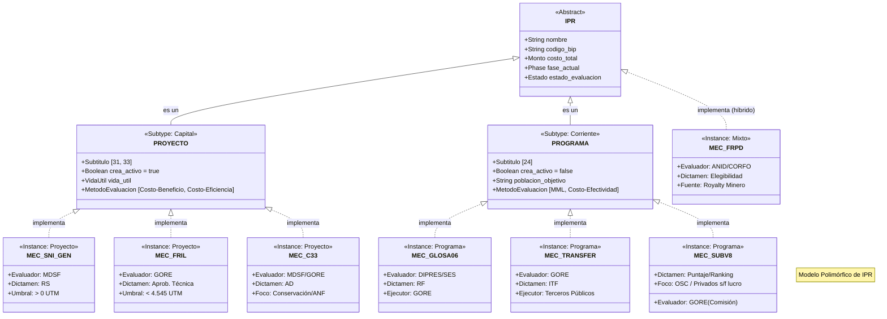
```mermaid
classDiagram
    note "Modelo Polimórfico de IPR"
    direction BT
    
    class IPR {
        <<Abstract>>
        +String nombre
        +String codigo_bip
        +Monto costo_total
        +Phase fase_actual
        +Estado estado_evaluacion
    }

    class PROYECTO {
        <<Subtype: Capital>>
        +Subtitulo [31, 33]
        +Boolean crea_activo = true
        +VidaUtil vida_util
        +MetodoEvaluacion [Costo-Beneficio, Costo-Eficiencia]
    }
    
    class PROGRAMA {
        <<Subtype: Corriente>>
        +Subtitulo [24]
        +Boolean crea_activo = false
        +String poblacion_objetivo
        +MetodoEvaluacion [MML, Costo-Efectividad]
    }

    PROYECTO --|> IPR : es un
    PROGRAMA --|> IPR : es un

    %% Instancias / Mecanismos (Vías Operativas)
    class MEC_SNI_GEN {
        <<Instance: Proyecto>>
        +Evaluador: MDSF
        +Dictamen: RS
        +Umbral: > 0 UTM
    }
    
    class MEC_FRIL {
        <<Instance: Proyecto>>
        +Evaluador: GORE
        +Dictamen: Aprob. Técnica
        +Umbral: < 4.545 UTM
    }
    
    class MEC_C33 {
        <<Instance: Proyecto>>
        +Evaluador: MDSF/GORE
        +Dictamen: AD
        +Foco: Conservación/ANF
    }
    
    class MEC_GLOSA06 {
        <<Instance: Programa>>
        +Evaluador: DIPRES/SES
        +Dictamen: RF
        +Ejecutor: GORE
    }
    
    class MEC_TRANSFER {
        <<Instance: Programa>>
        +Evaluador: GORE
        +Dictamen: ITF
        +Ejecutor: Terceros Públicos
    }

    class MEC_FRPD {
        <<Instance: Mixto>>
        +Evaluador: ANID/CORFO
        +Dictamen: Elegibilidad
        +Fuente: Royalty Minero
    }

    class MEC_SUBV8 {
        <<Instance: Programa>>
        +Evaluador: GORE (Comisión)
        +Dictamen: Puntaje/Ranking
        +Foco: OSC / Privados s/f lucro
    }

    MEC_SNI_GEN ..|> PROYECTO : implementa
    MEC_FRIL ..|> PROYECTO : implementa
    MEC_C33 ..|> PROYECTO : implementa
    
    MEC_GLOSA06 ..|> PROGRAMA : implementa
    MEC_TRANSFER ..|> PROGRAMA : implementa
    MEC_SUBV8 ..|> PROGRAMA : implementa
    MEC_FRPD ..|> IPR : implementa (híbrido)
```

### 2. Modelo Canónico de Estados (MCD): "La Super-Máquina IPR"

Este modelo unifica todos los ciclos de vida en 5 Fases Estándar, utilizando un **Switch de Evaluación Polimórfica (Fase 2)** para derivar la iniciativa al track correspondiente.

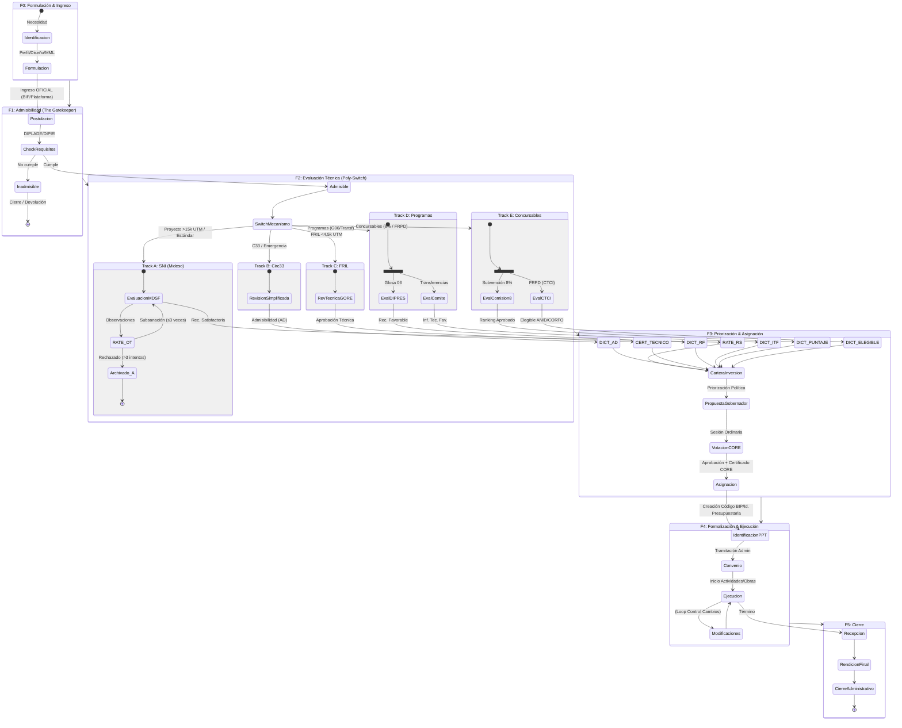
```mermaid
stateDiagram-v2
    direction TB
    
    state "F0: Formulación & Ingreso" as F0 {
        [*] --> Identificacion: Necesidad
        Identificacion --> Formulacion: Perfil/Diseño/MML
        Formulacion --> Postulacion: Ingreso OFICIAL (BIP/Plataforma)
    }
    
    state "F1: Admisibilidad (The Gatekeeper)" as F1 {
        Postulacion --> CheckRequisitos: DIPLADE/DIPIR
        CheckRequisitos --> Admisible: Cumple
        CheckRequisitos --> Inadmisible: No cumple
        Inadmisible --> [*]: Cierre / Devolución
    }
    
    state "F2: Evaluación Técnica (Poly-Switch)" as F2 {
        Admisible --> SwitchMecanismo
        
        state SwitchMecanismo <<choice>>
        
        %% Track A: SNI General
        SwitchMecanismo --> TrackA_SNI: Proyecto >15k UTM / Estándar
        state "Track A: SNI (Mideso)" as TrackA_SNI {
           [*] --> EvaluacionMDSF
           EvaluacionMDSF --> RATE_RS: Rec. Satisfactoria
           EvaluacionMDSF --> RATE_OT: Observaciones
           RATE_OT --> EvaluacionMDSF: Subsanación (≤3 veces)
           RATE_OT --> Archivado_A: Rechazado (>3 intentos)
           Archivado_A --> [*]
        }
        
        %% Track B: Circular 33
        SwitchMecanismo --> TrackB_C33: C33 / Emergencia
        state "Track B: Circ33" as TrackB_C33 {
            [*] --> RevisionSimplificada
            RevisionSimplificada --> DICT_AD: Admisibilidad (AD)
        }
        
        %% Track C: FRIL
        SwitchMecanismo --> TrackC_FRIL: FRIL <4.5k UTM
        state "Track C: FRIL" as TrackC_FRIL {
            [*] --> RevTecnicaGORE
            RevTecnicaGORE --> CERT_TECNICO: Aprobación Técnica
        }
        
        %% Track D: Programas
        SwitchMecanismo --> TrackD_PROG: Programas (G06/Transf)
        state "Track D: Programas" as TrackD_PROG {
            state fork_prog <<fork>>
            [*] --> fork_prog
            fork_prog --> EvalDIPRES: Glosa 06
            fork_prog --> EvalComite: Transferencias
            EvalDIPRES --> DICT_RF: Rec. Favorable
            EvalComite --> DICT_ITF: Inf. Tec. Fav.
        }
        
        %% Track E: Concursables (8% / FRPD)
        SwitchMecanismo --> TrackE_COMP: Concursables (8% / FRPD)
        state "Track E: Concursables" as TrackE_COMP {
            state fork_conc <<fork>>
            [*] --> fork_conc
            fork_conc --> EvalComision8: Subvención 8%
            fork_conc --> EvalCTCI: FRPD (CTCI)
            EvalComision8 --> DICT_PUNTAJE: Ranking Aprobado
            EvalCTCI --> DICT_ELEGIBLE: Elegible ANID/CORFO
        }
    }
    
    state "F3: Priorización & Asignación" as F3 {
        RATE_RS --> CarteraInversion
        DICT_AD --> CarteraInversion
        CERT_TECNICO --> CarteraInversion
        DICT_RF --> CarteraInversion
        DICT_ITF --> CarteraInversion
        DICT_PUNTAJE --> CarteraInversion
        DICT_ELEGIBLE --> CarteraInversion
        
        CarteraInversion --> PropuestaGobernador: Priorización Política
        PropuestaGobernador --> VotacionCORE: Sesión Ordinaria
        VotacionCORE --> Asignacion: Aprobación + Certificado CORE
        Asignacion --> IdentificacionPPT: Creación Código BIP/Id. Presupuestaria
    }
    
    state "F4: Formalización & Ejecución" as F4 {
        IdentificacionPPT --> Convenio: Tramitación Admin
        Convenio --> Ejecucion: Inicio Actividades/Obras
        Ejecucion --> Modificaciones: (Loop Control Cambios)
        Modificaciones --> Ejecucion
        Ejecucion --> Recepcion: Término
    }
    
    state "F5: Cierre" as F5 {
        Recepcion --> RendicionFinal
        RendicionFinal --> CierreAdministrativo
        CierreAdministrativo --> [*]
    }

    F0 --> F1
    F1 --> F2
    F2 --> F3
    F3 --> F4
    F4 --> F5
```

### 3. Matriz de Tracks de Evaluación

| Track  | Mecanismo                  | Evaluador                  | Producto (Dictamen)                  | Plazo Típico |
| :----- | :------------------------- | :------------------------- | :----------------------------------- | :----------- |
| **A**  | **SNI General**            | MDSF                       | **RS** (Recomendación Satisfactoria) | 45-90 días   |
| **B**  | **Circular 33**            | MDSF / GORE                | **AD** (Admisibilidad)               | 15-30 días   |
| **C**  | **FRIL**                   | GORE (DIPIR)               | **AT** (Aprobación Técnica)          | 30-60 días   |
| **D1** | **Glosa 06 (Ej. Directa)** | DIPRES / Sub. Eval. Social | **RF** (Recomendación Favorable)     | 60-120 días  |
| **D2** | **Transferencias**         | GORE (Comité/DAE)          | **ITF** (Informe Técnico Favorable)  | 30-45 días   |
| **E1** | **Subvención 8%**          | GORE (Comisión Evaluadora) | **Puntaje/Ranking**                  | 30-60 días   |
| **E2** | **FRPD (Royalty Minero)**  | ANID / CORFO / GORE        | **Elegibilidad** + RS/RF             | Variable     |

### 4. Árbol de Decisión Simplificado

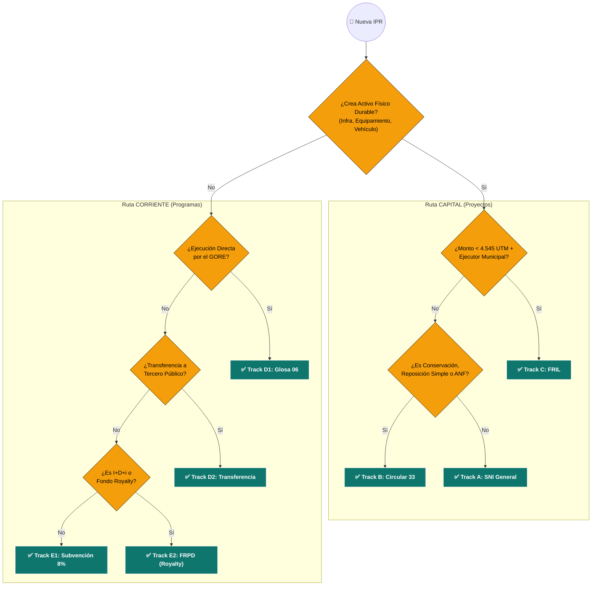
```mermaid
flowchart TB
    INICIO(("🏁 Nueva IPR"))
    
    Q1{"¿Crea Activo Físico Durable?<br/>(Infra, Equipamiento, Vehículo)"}
    
    subgraph CAPITAL["Ruta CAPITAL (Proyectos)"]
        Q2{"¿Monto < 4.545 UTM +<br/>Ejecutor Municipal?"}
        Q3{"¿Es Conservación,<br/>Reposición Simple o ANF?"}
        
        TRACK_C["✅ Track C: FRIL"]
        TRACK_B["✅ Track B: Circular 33"]
        TRACK_A["✅ Track A: SNI General"]
    end
    
    subgraph CORRIENTE["Ruta CORRIENTE (Programas)"]
        Q4{"¿Ejecución Directa<br/>por el GORE?"}
        Q5{"¿Transferencia a<br/>Tercero Público?"}
        Q6{"¿Es I+D+i o<br/>Fondo Royalty?"}
        
        TRACK_D1["✅ Track D1: Glosa 06"]
        TRACK_D2["✅ Track D2: Transferencia"]
        TRACK_E1["✅ Track E1: Subvención 8%"]
        TRACK_E2["✅ Track E2: FRPD (Royalty)"]
    end
    
    INICIO --> Q1
    
    Q1 -->|Sí| Q2
    Q1 -->|No| Q4
    
    Q2 -->|Sí| TRACK_C
    Q2 -->|No| Q3
    Q3 -->|Sí| TRACK_B
    Q3 -->|No| TRACK_A
    
    Q4 -->|Sí| TRACK_D1
    Q4 -->|No| Q5
    Q5 -->|Sí| TRACK_D2
    Q5 -->|No| Q6
    Q6 -->|Sí| TRACK_E2
    Q6 -->|No| TRACK_E1
    
    classDef decision fill:#f59e0b,stroke:#000,color:#000
    classDef track fill:#0f766e,stroke:#fff,color:#fff,font-weight:bold
    
    class Q1,Q2,Q3,Q4,Q5,Q6 decision
    class TRACK_A,TRACK_B,TRACK_C,TRACK_D1,TRACK_D2,TRACK_E1,TRACK_E2 track
```

### 5. Umbrales Críticos del Sistema (2025-2026)

| Concepto               | Umbral (UTM/$) | Regla / Consecuencia                                        |
| :--------------------- | :------------- | :---------------------------------------------------------- |
| **Exención RS (FRIL)** | < 4.545 UTM    | Evaluación interna GORE (Track C).                          |
| **Licitación Pública** | > 1.000 UTM    | Obligatoria para Obras. (500 UTM para Estudios).            |
| **Toma de Razón CGR**  | > 2.500 UTM    | Contratos y Convenios van a Contraloría.                    |
| **Aprobación CORE**    | > 7.000 UTM    | Requiere acuerdo explícito (Bajo este monto, solo informe). |
| **Evaluación SNI**     | > 15.000 UTM   | Track A Obligatorio (salvo excepciones C33).                |
| **Garantía Privados**  | > 1.000 UTM    | Pagaré/Boleta por el 5% al 100% según fondo.                |

## Vía SNI: Evaluación de Proyectos por MDSF

> **Fuente**: `kb_gn_024_guia_idi_sni_koda.yml`
>
> ⚠️ **Nota**: "IDI" (Iniciativa de Inversión) es la nomenclatura SNI para referirse a Proyectos. No es un mecanismo de financiamiento separado.

### Formulación y Evaluación SNI

**1. Problema Principal y Situaciones**:

* **Problema de Cobertura**: Cantidad insuficiente de oferta para satisfacer la demanda.
* **Problema de Calidad**: Oferta existente no cumple estándares normativos o de servicio.
* **Situaciones de Análisis**:
  * *Sin Proyecto*: Proyección optimizada de la situación actual (base de comparación).
  * *Con Proyecto*: Escenario con la inversión operando.
  * **Evaluación**: Se realiza sobre el **flujo incremental** (Con Proyecto - Sin Proyecto).

**2. Separabilidad de Componentes**:

* **Independientes**: Problemas distintos → Proyectos separados.
* **Unificados**: Componentes inseparables técnica/funcionalmente → Un solo proyecto.
* **Separables**: Mismo problema pero componentes ejecutables por separado → Evaluar c/u y el conjunto.

### Vigencia de la Recomendación (RATE RS)

> **Regla de Oro**: La vigencia de un RATE favorable (RS) es de **3 años presupuestarios** consecutivos.
> Si no se obtiene la identificación presupuestaria en este plazo, se pierde la condición de RS y se debe reevaluar.

### Principio de Proporcionalidad SNI

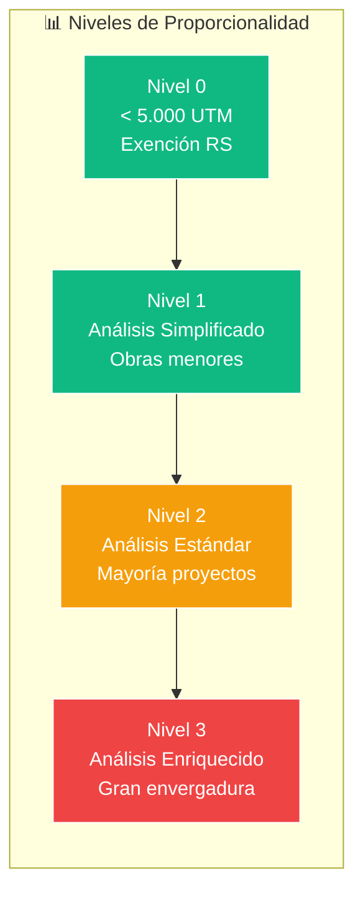
```mermaid
flowchart LR
    subgraph NIVELES["📊 Niveles de Proporcionalidad"]
        N0["Nivel 0<br/>< 5.000 UTM<br/>Exención RS"]
        N1["Nivel 1<br/>Análisis Simplificado<br/>Obras menores"]
        N2["Nivel 2<br/>Análisis Estándar<br/>Mayoría proyectos"]
        N3["Nivel 3<br/>Análisis Enriquecido<br/>Gran envergadura"]
    end
    
    N0 --> N1 --> N2 --> N3
    
    classDef simple fill:#10b981,stroke:#fff,color:#fff
    classDef medio fill:#f59e0b,stroke:#fff,color:#fff
    classDef complejo fill:#ef4444,stroke:#fff,color:#fff
    
    class N0,N1 simple
    class N2 medio
    class N3 complejo
```

| Nivel | Umbral           | Requisitos                                    | Etapas Preinversión                          |
| :---- | :--------------- | :-------------------------------------------- | :------------------------------------------- |
| **0** | < 5.000 UTM      | Carta responsabilidad, Carpeta Digital        | Solo Ejecución                               |
| **1** | Baja complejidad | RIS simplificado                              | Perfil → Ejecución                           |
| **2** | Estándar         | RIS completo, ATE                             | Perfil → Prefactibilidad → Ejecución         |
| **3** | Alta complejidad | RIS enriquecido, metodologías complementarias | Idea → Perfil → Prefact. → Fact. → Ejecución |

### Indicadores Económicos SNI

| Indicador | Fórmula                      | Uso                   | Criterio Decisión       |
| :-------- | :--------------------------- | :-------------------- | :---------------------- |
| **VAN**   | `-I₀ + Σ[BNₜ/(1+r)ᵗ]`        | ACB                   | VAN ≥ 0 → Viable        |
| **TIR**   | `VAN = 0 → r = TIR`          | Complementario        | TIR ≥ TSD → Conveniente |
| **VAC**   | `I₀ + Σ[(CTₜ-BAₜ)/(1+r)ᵗ]`   | ACE                   | Menor VAC → Preferido   |
| **CAE**   | `VAC × [r(1+r)ⁿ]/[(1+r)ⁿ-1]` | Comparar vidas útiles | Menor CAE → Preferido   |

> **TSD 2025**: 5.5% (Tasa Social de Descuento)

### Subsistemas del SNI

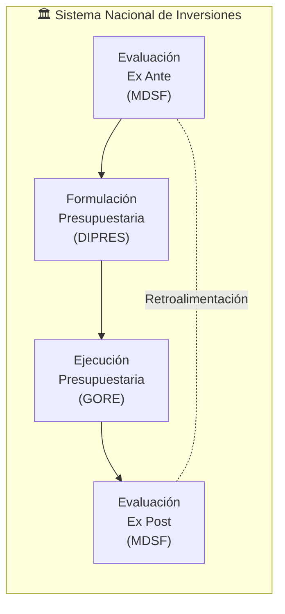
```mermaid
flowchart LR
    subgraph SNI["🏛️ Sistema Nacional de Inversiones"]
        EX_ANTE["Evaluación<br/>Ex Ante<br/>(MDSF)"]
        FORM_PPT["Formulación<br/>Presupuestaria<br/>(DIPRES)"]
        EJEC_PPT["Ejecución<br/>Presupuestaria<br/>(GORE)"]
        EX_POST["Evaluación<br/>Ex Post<br/>(MDSF)"]
    end
    
    EX_ANTE --> FORM_PPT --> EJEC_PPT --> EX_POST
    EX_POST -.-|Retroalimentación| EX_ANTE
```

### Tipos de IDI (Subtítulo 31)

| Ítem   | Tipo                | Descripción                      | Procesos Válidos                          |
| :----- | :------------------ | :------------------------------- | :---------------------------------------- |
| **01** | Estudios Básicos    | Información para identificar IDI | Diagnóstico, Exploración, Investigación   |
| **02** | Proyectos           | Crear/ampliar/mejorar activos    | Obras civiles, Equipamiento, Consultorías |
| **03** | Programas Inversión | Capacidad recurso humano/físico  | Capacitación, Transferencia, Prevención   |

## Dominio PPR: Programas (Ejecución Directa / Glosa 06)

> **Fuente**: `kb_gn_025_guia_programas_koda.yml`

### Reglas de Oro y Restricciones PPR

1. **Ejecución Directa**: GORE se encarga de la implementación, contratación de RRHH y bienes/servicios. No se transfiere responsabilidad.
2. **Instrumentos Oficiales**: Usar **Formularios de Perfil y Diseño PPR GORE** (NO Ficha IDI SNI).
3. **Tope Gastos Administrativos**: **Máximo 5%** del presupuesto total puede destinarse a gastos de administración interna del programa (Glosa 06).
4. **Tope Honorarios Receptor**: **Máximo 5%** adicional para personal a honorarios en la entidad pública receptora (Glosa 06, Ley 21.796).
5. **No Inversión**: Prohibido crear activos físicos o infraestructura como propósito principal.

### Lógica Vertical MML (Metodología Marco Lógico)

| Nivel           | Definición                                          | Regla de Formulación                                  |
| :-------------- | :-------------------------------------------------- | :---------------------------------------------------- |
| **Fin**         | Objetivo superior al que contribuye el programa     | Vinculación con ERD/Política Pública                  |
| **Propósito**   | Cambio específico en población objetivo (Resultado) | `Población + Verbo + Variable a cambiar`              |
| **Componentes** | Bienes/Servicios (Productos) entregados al usuario  | `Bien/Servicio + Verbo pasivo` (NO acciones internas) |
| **Actividades** | Acciones principales para producir componentes      | Insumos para presupuesto y cronograma                 |

> ⚠️ **Propósito Único**: Cada programa debe tener **un solo propósito** que revierta el Problema Central.

### Ciclo de Vida PPR

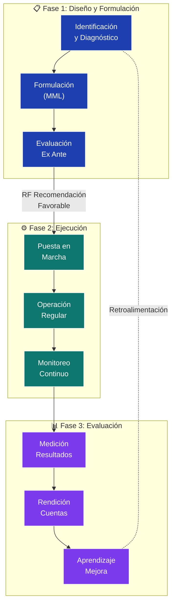
```mermaid
flowchart TB
    subgraph F1["📋 Fase 1: Diseño y Formulación"]
        F1A["Identificación<br/>y Diagnóstico"]
        F1B["Formulación<br/>(MML)"]
        F1C["Evaluación<br/>Ex Ante"]
    end
    
    subgraph F2["⚙️ Fase 2: Ejecución"]
        F2A["Puesta en<br/>Marcha"]
        F2B["Operación<br/>Regular"]
        F2C["Monitoreo<br/>Continuo"]
    end
    
    subgraph F3["📊 Fase 3: Evaluación"]
        F3A["Medición<br/>Resultados"]
        F3B["Rendición<br/>Cuentas"]
        F3C["Aprendizaje<br/>Mejora"]
    end
    
    F1A --> F1B --> F1C
    F1C -->|RF Recomendación<br/>Favorable| F2A
    F2A --> F2B --> F2C
    F2C --> F3A --> F3B --> F3C
    F3C -.-|Retroalimentación| F1A
    
    classDef fase1 fill:#1e40af,stroke:#fff,color:#fff
    classDef fase2 fill:#0f766e,stroke:#fff,color:#fff
    classDef fase3 fill:#7c3aed,stroke:#fff,color:#fff
    
    class F1A,F1B,F1C fase1
    class F2A,F2B,F2C fase2
    class F3A,F3B,F3C fase3
```

### Criterios de Evaluación DIPRES/SES

| Criterio         | Pregunta Clave             | Subcriterios                                                                                 |
| :--------------- | :------------------------- | :------------------------------------------------------------------------------------------- |
| **Atingencia**   | ¿Es el programa correcto?  | Vínculo Problema-Diagnóstico-Intervención, Alineación ERD, Población objetivo, No duplicidad |
| **Coherencia**   | ¿La lógica es sólida?      | Cadena causal MML, Estrategia clara, Enfoques transversales                                  |
| **Consistencia** | ¿Es viable y monitoreable? | Indicadores SMART, Sistemas de información, Presupuesto coherente                            |

### Tipos de Población PPR

| Tipo             | Definición                     | Ejemplo                                  |
| :--------------- | :----------------------------- | :--------------------------------------- |
| **Potencial**    | Universo con el problema       | Todos los jóvenes desempleados de Ñuble  |
| **Objetivo**     | Subconjunto con focalización   | Jóvenes 18-29, RSH ≤40%, comunas rurales |
| **Beneficiaria** | Atendidos efectivamente en año | 500 jóvenes capacitados en 2026          |

## Dominio FRIL: Fondo Regional de Iniciativa Local

> **Fuente**: `kb_gn_026_guia_fril_koda.yml`

### Caracterización FRIL

| Aspecto            | Descripción                                             |
| :----------------- | :------------------------------------------------------ |
| **Naturaleza**     | Fondo FNDR para infraestructura comunal de menor escala |
| **Umbral Máximo**  | **≤ 4.545 UTM** (~$306M) – 10% margen para aumentos     |
| **Umbral Mínimo**  | **M$100** – piso de postulación                         |
| **Max Proyectos**  | 5 por comuna/llamado (excluye A2 Agua y A3 Vial)        |
| **Ejecutor**       | Municipalidades                                         |
| **Evaluación**     | Evaluación Técnica GORE (exento SNI/MDSF)               |
| **Financiamiento** | Subtítulo 33 FNDR                                       |

### Reglas Especiales FRIL

1. **Excepción A2/A3**: Proyectos de **Acceso al Agua** y **Viales** NO cuentan para el máximo de 5 proyectos/comuna.
2. **Vigencia Licitación**: Si a los **90 días** desde el convenio no se licita, **se pierde la recomendación técnica**.
3. **Multiubicación**: Un proyecto puede tener múltiples ubicaciones en la comuna si comparten objetivo y se licitan juntas.

### Categorías de Proyecto FRIL

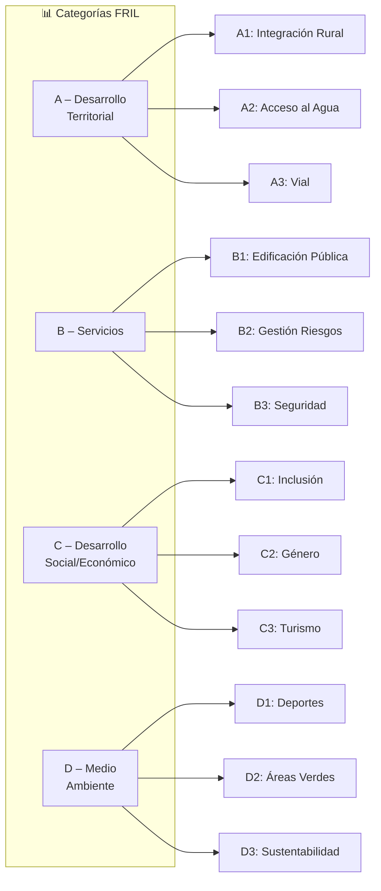
```mermaid
flowchart LR
    subgraph CATFRIL["📊 Categorías FRIL"]
        A["A – Desarrollo<br/>Territorial"]
        B["B – Servicios"]
        C["C – Desarrollo<br/>Social/Económico"]
        D["D – Medio<br/>Ambiente"]
    end
    
    A --> A1["A1: Integración Rural"]
    A --> A2["A2: Acceso al Agua"]
    A --> A3["A3: Vial"]
    
    B --> B1["B1: Edificación Pública"]
    B --> B2["B2: Gestión Riesgos"]
    B --> B3["B3: Seguridad"]
    
    C --> C1["C1: Inclusión"]
    C --> C2["C2: Género"]
    C --> C3["C3: Turismo"]
    
    D --> D1["D1: Deportes"]
    D --> D2["D2: Áreas Verdes"]
    D --> D3["D3: Sustentabilidad"]
```

### Ciclo FRIL

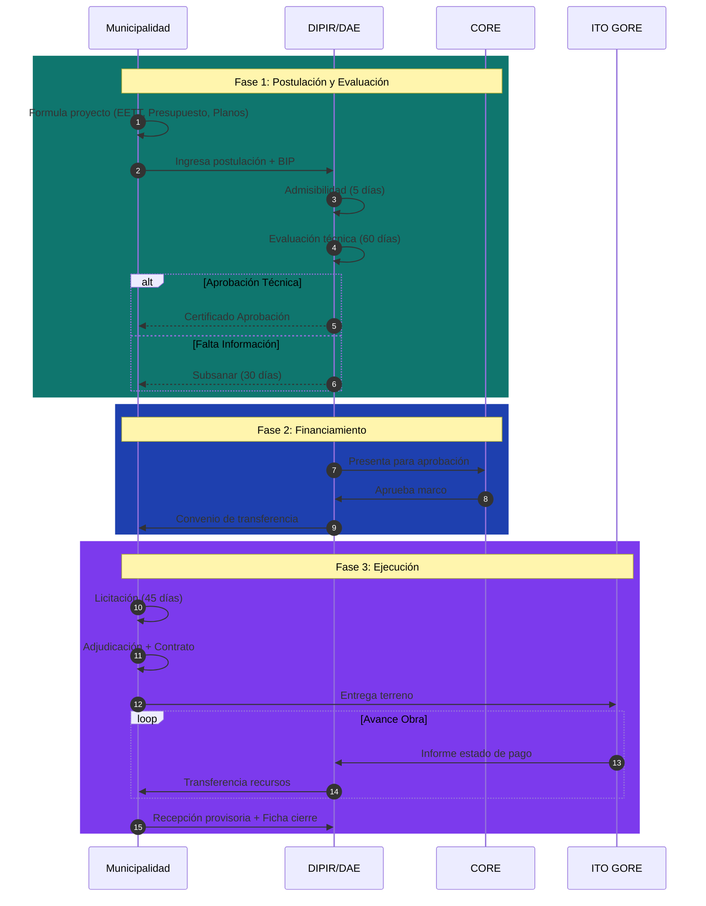
```mermaid
sequenceDiagram
    autonumber
    participant MUN as Municipalidad
    participant GORE as DIPIR/DAE
    participant CORE as CORE
    participant ITO as ITO GORE
    
    rect rgb(15, 118, 110)
        Note over MUN,CORE: Fase 1: Postulación y Evaluación
        MUN->>MUN: Formula proyecto (EETT, Presupuesto, Planos)
        MUN->>GORE: Ingresa postulación + BIP
        GORE->>GORE: Admisibilidad (5 días)
        GORE->>GORE: Evaluación técnica (60 días)
        alt Aprobación Técnica
            GORE-->>MUN: Certificado Aprobación
        else Falta Información
            GORE-->>MUN: Subsanar (30 días)
        end
    end
    
    rect rgb(30, 64, 175)
        Note over MUN,CORE: Fase 2: Financiamiento
        GORE->>CORE: Presenta para aprobación
        CORE->>GORE: Aprueba marco
        GORE->>MUN: Convenio de transferencia
    end
    
    rect rgb(124, 58, 237)
        Note over MUN,ITO: Fase 3: Ejecución
        MUN->>MUN: Licitación (45 días)
        MUN->>MUN: Adjudicación + Contrato
        MUN->>ITO: Entrega terreno
        loop Avance Obra
            ITO->>GORE: Informe estado de pago
            GORE->>MUN: Transferencia recursos
        end
        MUN->>GORE: Recepción provisoria + Ficha cierre
    end
```

### Restricciones FRIL

| Prohibición                    | Justificación             |
| :----------------------------- | :------------------------ |
| Gastos personal/consumo        | Solo obras civiles        |
| Proyectos con fines de lucro   | Naturaleza pública        |
| Fraccionamiento de obras       | Evasión de umbrales       |
| 2+ proyectos mismo terreno/año | Control duplicidad        |
| ANF sin proyecto asociado      | Solo complemento de obras |

## Dominio C33: Circular 33

> **Fuente**: `kb_gn_029_guia_circ33_koda.yml`

### Categorías Circular 33

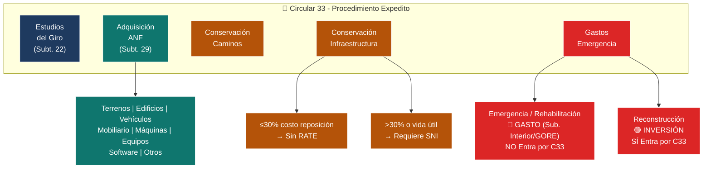
```mermaid
flowchart TB
    subgraph C33["🔧 Circular 33 - Procedimiento Expedito"]
        EST["Estudios<br/>del Giro<br/>(Subt. 22)"]
        ANF["Adquisición<br/>ANF<br/>(Subt. 29)"]
        CONS_CAM["Conservación<br/>Caminos"]
        CONS_INF["Conservación<br/>Infraestructura"]
        EMERG["Gastos<br/>Emergencia"]
    end
    
    ANF --> ANF_TYPES["Terrenos | Edificios | Vehículos<br/>Mobiliario | Máquinas | Equipos<br/>Software | Otros"]
    
    CONS_INF --> COND_30["≤30% costo reposición<br/>→ Sin RATE"]
    CONS_INF --> COND_GT[">30% o vida útil<br/>→ Requiere SNI"]
    
    EMERG --> F_GASTO["Emergencia / Rehabilitación<br/>🔴 GASTO (Sub. Interior/GORE)<br/>NO Entra por C33"]
    EMERG --> F_INV["Reconstrucción<br/>🟢 INVERSIÓN<br/>SÍ Entra por C33"]
    
    classDef giro fill:#1e3a5f,stroke:#fff,color:#fff
    classDef anf fill:#0f766e,stroke:#fff,color:#fff
    classDef cons fill:#b45309,stroke:#fff,color:#fff
    classDef emerg fill:#dc2626,stroke:#fff,color:#fff
    
    class EST giro
    class ANF,ANF_TYPES anf
    class CONS_CAM,CONS_INF,COND_30,COND_GT cons
    class EMERG,F_GASTO,F_INV emerg
```

### Reglas Operativas Críticas C33

1. **Cofinanciamiento ANF**: Exige **aporte propio mínimo del 20%** de la institución solicitante.
2. **Plazo Postulación**: Se aceptan solicitudes hasta el **31 de Octubre** de cada año.
3. **Emergencia**: Solo la fase de **Reconstrucción** (Inversión) es elegible vía C33. Emergencia y Rehabilitación son Gasto.
4. **Metodología**: Conservación y Reposición requieren análisis de **Costo-Anual Equivalente (CAE)** o Costo-Eficiencia.

### Matriz de Documentación C33

| Documento                 | Estudios |  ANF  | Cons. Caminos | Cons. Infra | Emergencia |
| :------------------------ | :------: | :---: | :-----------: | :---------: | :--------: |
| Oficio Conductor          |    ✓     |   ✓   |       ✓       |      ✓      |     ✓      |
| Ficha IDI                 |    ✓     |   ✓   |       ✓       |      ✓      |     ✓      |
| Ficha C33 (Anexo 1)       |    ✓     |   ✓   |       –       |      –      |     ✓      |
| TDR                       |    ✓     |   ✓   |       –       |      –      |     –      |
| EETT + Presupuesto        |    ✓     |   ○   |       ✓       |      ✓      |     ○      |
| 3 Cotizaciones/Tasaciones |    –     |   ✓   |       –       |      –      |     –      |
| Decreto Emergencia        |    –     |   –   |       –       |      –      |     ✓      |
| Evaluación Económica      |    –     |   ✓   |       ✓       |      ✓      |     ○      |
| Cert. Mal Estado (Rep.)   |    –     |   ○   |       –       |      –      |     –      |
| Cert. Conservación 30%    |    –     |   –   |       –       |      ✓      |     –      |

> ✓ = Obligatorio | ○ = Si procede | – = No aplica

## Dominio FRPD: Fondo Regional para la Productividad y el Desarrollo

> **Fuente**: `kb_gn_027_guia_frpd_koda.yml`

### Origen y Marco FRPD

| Aspecto         | Descripción                                                |
| :-------------- | :--------------------------------------------------------- |
| **Origen**      | Royalty Minero (Ley N°21.591)                              |
| **Ámbitos**     | Fomento productivo, CTCI, desarrollo regional              |
| **Postulantes** | Instituciones habilitadas por SUBCTCI (Res. Ex. N°33/2024) |
| **Alineación**  | ERD + Estrategia Regional CTCI                             |

### Bifurcación Post-Selección FRPD

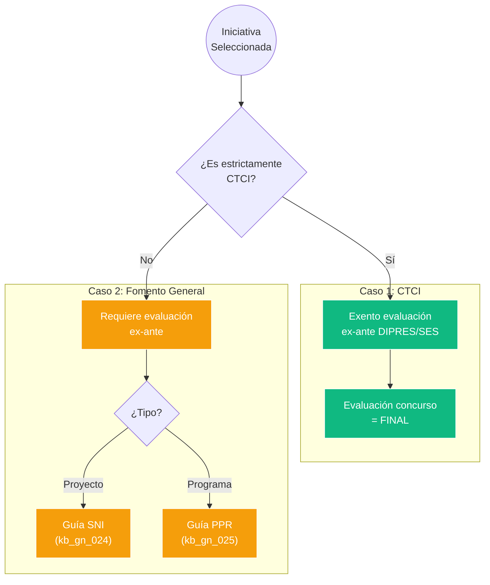
```mermaid
flowchart TB
    SEL(("Iniciativa<br/>Seleccionada"))
    
    Q_CTCI{"¿Es estrictamente<br/>CTCI?"}
    
    subgraph CASO1["Caso 1: CTCI"]
        EXENTA["Exento evaluación<br/>ex-ante DIPRES/SES"]
        FINAL["Evaluación concurso<br/>= FINAL"]
    end
    
    subgraph CASO2["Caso 2: Fomento General"]
        EVAL_EX["Requiere evaluación<br/>ex-ante"]
        Q_TIPO{"¿Tipo?"}
        IDI_SNI["Guía SNI<br/>(kb_gn_024)"]
        PPR_G06["Guía PPR<br/>(kb_gn_025)"]
    end
    
    SEL --> Q_CTCI
    Q_CTCI -->|Sí| EXENTA --> FINAL
    Q_CTCI -->|No| EVAL_EX --> Q_TIPO
    Q_TIPO -->|Proyecto| IDI_SNI
    Q_TIPO -->|Programa| PPR_G06
    
    classDef ctci fill:#10b981,stroke:#fff,color:#fff
    classDef fomento fill:#f59e0b,stroke:#fff,color:#fff
    
    class EXENTA,FINAL ctci
    class EVAL_EX,IDI_SNI,PPR_G06 fomento
```

### Sectores y Focos Prioritarios FRPD 2025

| Sector Prioritario     | Focos                                       |
| :--------------------- | :------------------------------------------ |
| Atracción Inversiones  | Desarrollo regional estratégico             |
| Desarrollo Empresarial | Pymes, emprendimiento, inversión productiva |
| Turismo/Medioambiente  | Sustentabilidad, eco-innovación             |
| Energía/Conectividad   | Transición energética, brecha digital       |

### Criterios Admisibilidad FRPD

| Criterio               | Requisito                                       |
| :--------------------- | :---------------------------------------------- |
| **Máx. iniciativas**   | 2 por postulante                                |
| **Plazo ejecución**    | ≤ 30 meses                                      |
| **Cobertura**          | Regional (21 comunas) o territorial justificado |
| **Max Remuneraciones** | **30%** del monto total con cargo al fondo      |
| **Profesional Local**  | Mín **1 residente en Ñuble** contratado         |
| **Gastos Admin**       | Máx **5%** del total (Art. 25 Ley 21.796)       |

### Reglas y Restricciones FRPD

1. **Garantía Privados**: Obligatoria si transferencia > **1.000 UTM** → **5%** del total, vigencia 90 días post-término.
2. **Puntaje Elegibilidad**: Mínimo **5 puntos** promedio ponderado para pasar a Evaluación Técnica.
3. **Vigencia RS**: 3 años (año obtención + 2 siguientes), sin cambios sustantivos.
4. **Aprobación CORE**: > 7.000 UTM → Aprobación; ≤ 7.000 UTM → Solo toma conocimiento.
5. **Viáticos Prohibidos**: Viáticos, alimentación, pasajes, peajes y estacionamiento NO se cargan al FRPD.
6. **Parentesco**: Inhabilidad hasta **4° consanguinidad / 3° afinidad** con Gobernador, CORE o directivos GORE.

### Ponderación Evaluación Técnica

| Variable                  | Peso  |
| :------------------------ | :---: |
| Mérito Innovador          |  40%  |
| Coherencia Regional (ERD) |  30%  |
| Coherencia Componentes    |  20%  |
| Coherencia Global         |  10%  |

## Dominio Transferencia PPR: Programas a Entidades Públicas

> **Fuente**: `kb_gn_001_transferencia_ppr_koda.yml`

### Caracterización Transferencia PPR

| Aspecto         | Descripción                                         |
| :-------------- | :-------------------------------------------------- |
| **Alcance**     | PPR ejecutados por terceros públicos                |
| **Evaluación**  | Interna GORE (exento evaluación ex-ante DIPRES/SES) |
| **Dictamen**    | ITF (Informe Técnico Favorable) - NO es RATE RS     |
| **Plataforma**  | Plataforma Digital (NO usa BIP)                     |
| **Metodología** | MML obligatorio                                     |

### Kit de Postulación (Admisibilidad)

> ⚠️ **Digital**: Todo ingreso debe ser vía plataforma digital del GORE.

| N°   | Documento              | Formulario Código           |
| :--- | :--------------------- | :-------------------------- |
| 1    | Oficio Conductor       | N/A                         |
| 2    | **Diseño de Programa** | `FORM-PPR-TRANSFER-PUBLIC`  |
| 3    | Presupuesto Detallado  | Excel / PDF                 |
| 4    | Cotizaciones Respaldo  | N/A                         |
| 5    | Perfil de Cargos       | `FORM-ANEXO1-PERFIL-CARGOS` |
| 6    | **Patrocinio GORE**    | `FORM-PPR-PATROCINIO-GORE`  |
| 7    | DJ Rendiciones/SISREC  | `FORM-PPR-RENDICIONES-DJ`   |
| 8    | DJ No Fraccionamiento  | `FORM-PPR-NO-FRACCION-DJ`   |
| 9    | Compromiso Financiero  | `FORM-PPR-FINANZAS-COMP`    |

### Reglas y Restricciones de Transferencia

1. **Personal Entidad Receptora**: Máximo **5%** del monto transferido puede usarse para contratar personal a honorarios para gestión del programa.
2. **Probidad y Parentesco**: Prohibido contratar a cónyuges o parientes (hasta 3° grado consanguinidad / 2° afinidad) de autoridades GORE o directivos de la institución.
3. **Prohibiciones Financieras**: No usar recursos para otorgar préstamos, invertir en instrumentos financieros o constituir sociedades.
4. **Rendición**: Obligatoria vía plataforma **SISREC** (Contraloría).

### Proceso Evaluación Interna

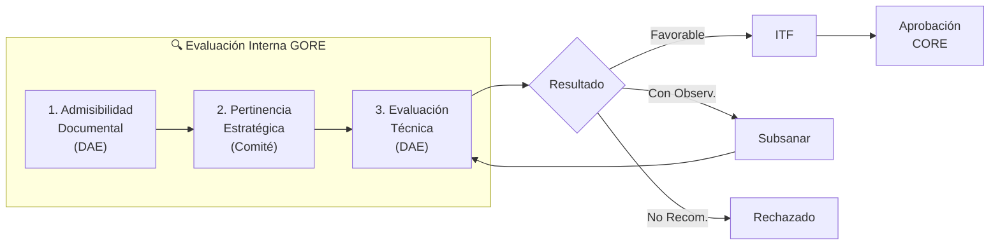
```mermaid
flowchart LR
    subgraph EVAL["🔍 Evaluación Interna GORE"]
        ADM["1. Admisibilidad<br/>Documental<br/>(DAE)"]
        PERT["2. Pertinencia<br/>Estratégica<br/>(Comité)"]
        TEC["3. Evaluación<br/>Técnica<br/>(DAE)"]
    end
    
    ADM --> PERT --> TEC
    
    TEC --> RES{"Resultado"}
    RES -->|Favorable| ITF["ITF"]
    RES -->|Con Observ.| SUB["Subsanar"]
    RES -->|No Recom.| REC["Rechazado"]
    
    ITF --> CORE["Aprobación<br/>CORE"]
    SUB --> TEC
```

### Restricciones de Gasto

| Ítem                             | Límite                   |
| :------------------------------- | :----------------------- |
| Personal a honorarios            | Máx. 5% transferencia    |
| Gastos administración GORE       | Máx. 5% (no transferido) |
| Préstamos/sociedades             | PROHIBIDO                |
| Subcontratación objeto principal | PROHIBIDO                |

## Dominio Subvención 8%: Vinculación con la Comunidad

> **Fuente**: `kb_gn_028_instructivo_subvencion_8_koda.yml`

### Caracterización Subvención 8%

| Aspecto              | Descripción                                                                     |
| :------------------- | :------------------------------------------------------------------------------ |
| **Base legal**       | Glosa 07, Subt. 24, Ley Presupuestos 2026.                                      |
| **Monto total 2025** | **M$ 4.850.000** (Total Privados: M$ 4.850.000 / Municipios: M$ 730.000)        |
| **Postulantes**      | Instituciones Privadas s/f lucro, Org. Base y Municipalidades.                  |
| **Plazo ejecución**  | Máx **8 meses** (Privados) / **9 meses** (Municipios).                          |
| **Garantía**         | **Pagaré Notarial** obligatorio para Privados (100% monto + 18 meses vigencia). |

### Tabla Maestra de Fondos y Montos Tope (Privados)

| Fondo            | Presupuesto       | Tope Inst. Intermedia | Tope Org. Base | Tope Especiales                                    |
| :--------------- | :---------------- | :-------------------- | :------------- | :------------------------------------------------- |
| **Cultura**      | $600M + $270M Esp | **$5.000.000**        | **$2.500.000** | $60M (Películas), $20M (Festivales), $10M (Libros) |
| **Deporte**      | $1.000M           | **$5.000.000**        | **$3.000.000** | $15M (Ligas), $6M (Alto Rendimiento)               |
| **Social**       | $500M             | **$5.500.000**        | **$3.500.000** | $10M (Residencias Mejor Niñez)                     |
| **Seguridad**    | $1.550M           | **$8.000.000**        | **$5.500.000** | N/A                                                |
| **Medio Amb.**   | $400M             | **$5.000.000**        | **$3.500.000** | N/A                                                |
| **Adulto Mayor** | $400M             | **$4.000.000**        | **$3.000.000** | N/A                                                |
| **Género**       | $400M             | **$6.500.000**        | **$3.500.000** | N/A                                                |

> **Nota**: "Tope Especiales" aplica a líneas específicas definidas en el instructivo (ej. Representación, Eventos Masivos).

### Reglas Operativas Críticas (Procedimiento Admisibilidad)

1. **Unicidad**: Máximo **1 iniciativa** por institución postulante.
    * *Excepción 1*: Cultura/Deporte pueden postular una 2ª iniciativa si es de **Representación** (Regional/Nac/Int).
    * *Excepción 2*: Colaboradores Mejor Niñez pueden postular múltiples residencias.
2. **Asignación Directa ≤10%**: Previo acuerdo CORE, hasta 10% del Concurso 8% puede destinarse a **casos emblemáticos, excepcionales y emergentes** (Res. 72/2025 DIPRES).
3. **Excepción SISREC**: Proyectos **≤ 500 UTM** pueden ser autorizados a rendir fuera de plataforma SISREC (en papel).
4. **Pagaré**: Requisito habilitante para la transferencia en privados. Sin pagaré no hay desembolso.
5. **Coordinación**: Actividades deben coordinarse con GORE (DIDESO) con **10 días** de antelación.

### Matriz de Admisibilidad (Checklist)

| Documento Requerido       | Condición                                        |
| :------------------------ | :----------------------------------------------- |
| **Oficio Conductor**      | Firmado por Rep. Legal.                          |
| **RUT Institución**       | Fotocopia legible.                               |
| **Cédula Rep. Legal**     | Ambos lados.                                     |
| **Directorio Vigente**    | **< 60 días** antigüedad (Registro Civil).       |
| **Cert. Receptor Fondos** | Inscripción Ley 19.862 vigente.                  |
| **Cuenta Bancaria**       | A nombre de la institución (No personal).        |
| **Declaraciones Juradas** | Inhabilidades, Parentesco, No Drogas/Alcohol.    |
| **Cotizaciones**          | 1 por ítem (Equipamiento, Difusión, Producción). |
| **Carta Respaldo**        | Permiso de uso de recinto (si aplica).           |

> ⚠️ **Inadmisibilidad Inmediata**: Si el monto del formulario, la carta y el presupuesto NO coinciden exactamante.

## Catálogo Unificado de Mecanismos IPR

| Mecanismo             | Vía      | Costo Típico | Evaluador    | Dictamen           | Ejecutor         | Plazo Ejecución |
| :-------------------- | :------- | :----------- | :----------- | :----------------- | :--------------- | :-------------- |
| **SNI General**       | Proyecto | > 15.000 UTM | MDSF         | RS                 | GORE/Terceros    | 12-36 meses     |
| **FRIL**              | Proyecto | < 5.000 UTM  | GORE         | Aprobación Técnica | Municipalidad    | 12-24 meses     |
| **Circular 33**       | Proyecto | Variable     | MDSF/GORE    | AD                 | GORE/Terceros    | 6-18 meses      |
| **Glosa 06 Directa**  | Programa | Variable     | DIPRES/SES   | RF                 | GORE             | 12 meses        |
| **Transferencia PPR** | Programa | Variable     | GORE         | ITF                | Entidad Pública  | 12 meses        |
| **Subvención 8%**     | Programa | < $15M       | GORE         | Concurso           | OSC/Municipio    | 8 meses         |
| **FRPD (CTCI)**       | Mixto    | Variable     | ANID/CORFO   | Concurso           | Inst. Habilitada | ≤ 30 meses      |
| **FRPD (Fomento)**    | Mixto    | Variable     | SNI/Glosa 06 | RS o RF            | Inst. Habilitada | ≤ 30 meses      |

## Dominio Rendiciones de Cuentas

> **Fuente**: `kb_gn_020_gestion_rendiciones_koda.yml`

### Marco Normativo de Rendiciones

| Norma                             | Contenido Clave                                                      | Aplicación GORE    |
| :-------------------------------- | :------------------------------------------------------------------- | :----------------- |
| **CPR Art. 98-99**                | CGR examina y juzga cuentas                                          | Todo fondo público |
| **Res. 30/2015 CGR**              | Procedimiento obligatorio de rendición                               | Toda transferencia |
| **Art. 18 Res. 30**               | **Prohibición** entregar nuevos fondos si hay rendiciones pendientes | Decisión de pago   |
| **Art. 31 Res. 30**               | Obligación restituir fondos no rendidos                              | Reintegro          |
| **Ley 21.180**                    | Expediente y firma electrónica obligatorios                          | SISREC             |
| **Ley 21.719**                    | Protección datos personales en rendiciones                           | Publicación        |
| **Res. Ex. 1858/2023 CGR**        | Uso obligatorio SISREC para Subt. 24/33                              | Toda transferencia |
| **Ley Presupuestos (Art. 23-26)** | Marco transferencias a privados (concurso, garantías, SISREC)        | Subv. 8%, FRPD     |

### Principios Rectores de Rendición

| Principio               | Definición                                              |
| :---------------------- | :------------------------------------------------------ |
| **Legalidad**           | Gastos amparados por ley y disposiciones reglamentarias |
| **Veracidad-Fidelidad** | Información y documentación auténticas e íntegras       |
| **Acreditación**        | Todo movimiento respaldado con comprobantes auténticos  |
| **Exactitud**           | Cálculos y montos precisos                              |
| **Oportunidad**         | Rendiciones dentro de plazos establecidos               |
| **Transparencia**       | Proceso accesible a control ciudadano y fiscalizador    |
| **Eficiencia-Eficacia** | Uso orientado al logro de objetivos institucionales     |
| **Probidad**            | Verificación de conducta recta y leal                   |

### Ciclo de Vida de Rendición (Flujo SISREC Estándar)

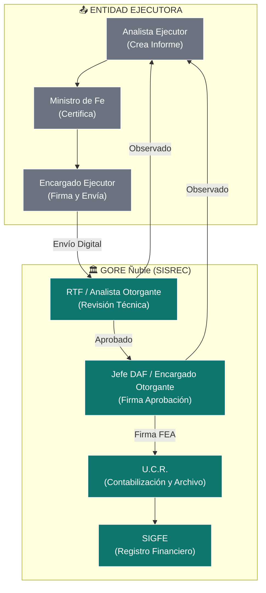
```mermaid
flowchart TB
    subgraph EE["📤 ENTIDAD EJECUTORA"]
        EE1["Analista Ejecutor<br/>(Crea Informe)"]
        EE2["Ministro de Fe<br/>(Certifica)"]
        EE3["Encargado Ejecutor<br/>(Firma y Envía)"]
    end
    
    subgraph GORE["🏛️ GORE Ñuble (SISREC)"]
        RTF["RTF / Analista Otorgante<br/>(Revisión Técnica)"]
        JEFE["Jefe DAF / Encargado Otorgante<br/>(Firma Aprobación)"]
        UCR["U.C.R.<br/>(Contabilización y Archivo)"]
        SIGFE["SIGFE<br/>(Registro Financiero)"]
    end

    EE1 --> EE2
    EE2 --> EE3
    EE3 -->|Envío Digital| RTF
    
    RTF -->|Aprobado| JEFE
    RTF -->|Observado| EE1
    
    JEFE -->|Firma FEA| UCR
    JEFE -->|Observado| EE1
    
    UCR --> SIGFE
    
    classDef ee fill:#6b7280,stroke:#fff,color:#fff
    classDef gore fill:#0f766e,stroke:#fff,color:#fff
    
    class EE1,EE2,EE3 ee
    class RTF,JEFE,UCR,SIGFE gore
```

### Flujo SISREC (Rendición Electrónica)

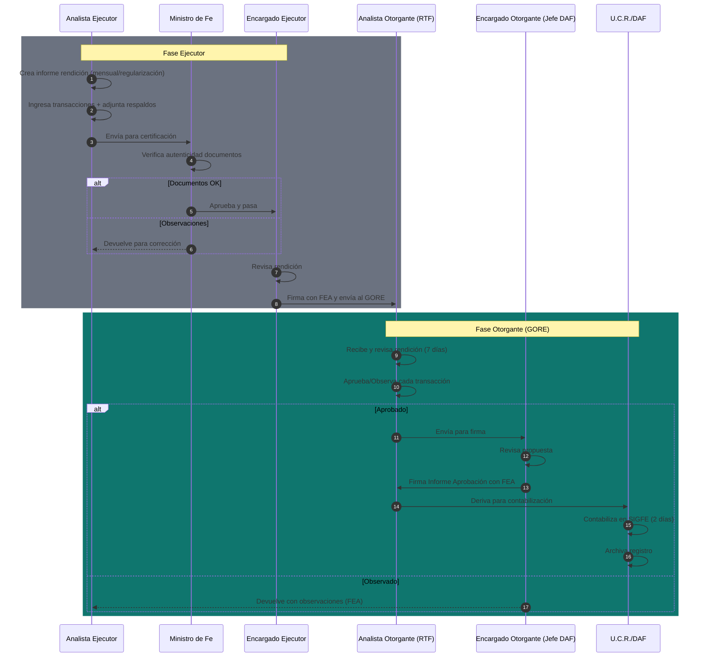
```mermaid
sequenceDiagram
    autonumber
    participant AE as Analista Ejecutor
    participant MF as Ministro de Fe
    participant EE as Encargado Ejecutor
    participant AO as Analista Otorgante (RTF)
    participant EO as Encargado Otorgante (Jefe DAF)
    participant UCR as U.C.R./DAF
    
    rect rgb(107, 114, 128)
        Note over AE,EE: Fase Ejecutor
        AE->>AE: Crea informe rendición (mensual/regularización)
        AE->>AE: Ingresa transacciones + adjunta respaldos
        AE->>MF: Envía para certificación
        MF->>MF: Verifica autenticidad documentos
        alt Documentos OK
            MF->>EE: Aprueba y pasa
        else Observaciones
            MF-->>AE: Devuelve para corrección
        end
        EE->>EE: Revisa rendición
        EE->>AO: Firma con FEA y envía al GORE
    end
    
    rect rgb(15, 118, 110)
        Note over AO,UCR: Fase Otorgante (GORE)
        AO->>AO: Recibe y revisa rendición (7 días)
        AO->>AO: Aprueba/Observa cada transacción
        alt Aprobado
            AO->>EO: Envía para firma
            EO->>EO: Revisa propuesta
            EO->>AO: Firma Informe Aprobación con FEA
            AO->>UCR: Deriva para contabilización
            UCR->>UCR: Contabiliza en SIGFE (2 días)
            UCR->>UCR: Archiva registro
        else Observado
            EO-->>AE: Devuelve con observaciones (FEA)
        end
    end
```

### Actores de Rendición

| Actor                 | Rol (SISREC)                        | División           | Función Clave                     |
| :-------------------- | :---------------------------------- | :----------------- | :-------------------------------- |
| **RTF**               | Analista Otorgante                  | DIPIR/DIDESO/DIFOI | Revisión técnica-financiera       |
| **Jefe DAF**          | Encargado Otorgante                 | DAF                | Firma resolución aprobación       |
| **U.C.R.**            | Administrador / Encargado (Soporte) | DAF                | Control, contabilización, archivo |
| **Entidad Ejecutora** | Analista / Ministro Fe / Encargado  | Externa            | Rendición de cuentas              |
| **Unidad Control**    | Auditor (Visualizador)              | GORE - Staff       | Auditoría selectiva               |

### Plazos de Rendición

| Etapa                      | Plazo (Días Hábiles GORE) | Responsable          |
| :------------------------- | :------------------------ | :------------------- |
| Presentación rendición     | 15 del mes siguiente      | Entidad Ejecutora    |
| Revisión técnica           | 7 días                    | RTF (Analista)       |
| Devolución por Observación | 1 día                     | Jefe DAF (Encargado) |
| Contabilización            | 2 días                    | U.C.R./DAF           |
| Archivo                    | 2 días                    | U.C.R./DAF           |

### Consecuencias por Incumplimiento

| Norma                              | Consecuencia                                                                    |
| :--------------------------------- | :------------------------------------------------------------------------------ |
| **Art. 18 Res. 30 CGR**            | No se pueden entregar nuevos fondos si existen rendiciones exigibles pendientes |
| **Art. 31 Res. 30 CGR**            | Obligación de restituir fondos no rendidos, observados o no ejecutados          |
| **Responsabilidad Administrativa** | Censura, multa, suspensión o destitución (Ley 18.834)                           |
| **Responsabilidad Civil**          | Restitución de fondos vía Juicio de Cuentas CGR                                 |
| **Responsabilidad Penal**          | Malversación, fraude al fisco (Código Penal)                                    |

### Documentación Auténtica de Rendición

| Tipo Soporte                 | Requisito                                                                | Validez SISREC       |
| :--------------------------- | :----------------------------------------------------------------------- | :------------------- |
| **Papel (Original)**         | Documento original firmado                                               | Solo en flujo legado |
| **Copia autenticada**        | Firma de ministro de fe o funcionario autorizado                         | Excepcional          |
| **Electrónico (Ley 19.799)** | Firma electrónica simple o avanzada                                      | Estándar SISREC      |
| **Digitalizado**             | Copia simple; requiere autenticación FEA del Ministro de Fe del ejecutor | Estándar SISREC      |

### Flujo Legado Sin SISREC (Modalidad Excepcional)

> **Aplica a**: Convenios antiguos no migrados o proyectos ≤ 500 UTM autorizados.

| Paso  | Responsable       | Actividad                                           | Plazo (Días Hábiles) |
| :---: | :---------------- | :-------------------------------------------------- | :------------------: |
|   1   | Entidad Ejecutora | Prepara rendición papel/digital → Oficina de Partes |   15 del mes sig.    |
|   2   | Oficina de Partes | Recepciona, registra, deriva a U.C.R./DAF           |          2           |
|   3   | U.C.R./DAF        | Registra en base de datos, deriva a RTF             |          2           |
|   4   | RTF               | Revisión técnica-financiera                         |          7           |
|   5   | RTF               | Si observa: comunica a EE para subsanación          |          2           |
|   6   | U.C.R./DAF        | Control final mediante checklist                    |          4           |
|   7   | U.C.R./DAF        | Contabiliza en SIGFE                                |          2           |
|   8   | U.C.R./DAF        | Archiva expediente                                  |          1           |

### Particularidades de Rendición por Fondo

| Fondo                  | Plataforma  | Requisito Especial                  | Documentos Clave                   |
| :--------------------- | :---------- | :---------------------------------- | :--------------------------------- |
| **FNDR S.31**          | SIGFE + BIP | Carpeta Digital Ex-Post al cierre   | Estados de pago, facturas, ITO     |
| **FNDR S.33**          | SISREC      | Informe avance + comprobantes       | Convenio, actas recepción          |
| **FRIL**               | SISREC      | Exención RS si <5.000 UTM           | Guía Operativa SUBDERE             |
| **FRPD (CTCI)**        | SISREC      | Acreditación hitos I+D+i            | Informes técnicos, patentes        |
| **Subvención 8%**      | SISREC      | Medios de verificación obligatorios | Listas asistencia, fotos, difusión |
| **Glosa 06 (Directa)** | SIGFE       | Tope 5% gastos admin.               | Componentes MML, reportes DIPRES   |
| **C33 Conservación**   | SISREC      | Solo partidas conservación          | Certificado AD (MDSF)              |

## Dominio Flujos de Aprobación

> **Fuente**: `kb_gn_015_aprobaciones_koda.yml`

### Principios de Aprobación

| Principio                     | Descripción                                                       |
| :---------------------------- | :---------------------------------------------------------------- |
| **Legalidad**                 | Actos dentro de competencia legal; nulidad si excede atribuciones |
| **Escrituración Electrónica** | Expediente electrónico único (Ley 21.180)                         |
| **Impugnabilidad**            | Todo acto es recurrible (reposición, jerárquico)                  |
| **Probidad y Transparencia**  | Interés general sobre particular; acceso público                  |
| **Control Externo**           | CGR fiscaliza legalidad (Toma de Razón)                           |

### Matriz de Actores en Flujos de Aprobación

| Entidad                      | Rol Principal en Aprobaciones                    | Facultad Clave                       |
| :--------------------------- | :----------------------------------------------- | :----------------------------------- |
| **Gobernador/a Regional**    | Firma ejecutiva final de actos adm.              | Propone presupuesto al CORE          |
| **Consejo Regional (CORE)**  | Aprueba presupuesto, planes, distribución fondos | Fiscaliza gestión Gobernador         |
| **Administrador/a Regional** | V°B° final antes de firma Gobernador             | Subrogancia legal                    |
| **DAF**                      | Elabora convenios, resoluciones pago             | Controla rendiciones, registra SIGFE |
| **DIPIR**                    | Lidera formulación presupuesto inversión         | Evalúa técnicamente IDI              |
| **DIPLADE**                  | Elabora y monitorea ERD                          | Secretaría ejecutiva ARI/PROPIR      |
| **Asesoría Jurídica**        | Control de legalidad interno                     | Redacta resoluciones/decretos        |
| **Unidad de Control**        | Control preventivo/posterior                     | Audita selectivamente procesos       |
| **Oficina de Partes**        | Punto único ingreso documentación                | Asigna número registro SGDOC         |
| **CDR**                      | Filtro estratégico/político-técnico IPR          | Jefaturas División + Adm. Regional   |
| **RTF**                      | Primera línea revisión proyectos                 | Analista Otorgante en SISREC         |
| **SEREMI MDSF**              | Evalúa técnicamente IDI para RS/AD               | Compuerta de evaluación SNI          |
| **DIPRES**                   | Evalúa ex-ante PPR (Glosa 06)                    | Visa modificaciones Partida 31       |
| **CGR**                      | Toma de Razón (control preventivo)               | Fiscaliza legalidad actos            |

### Restricciones Presupuesto 2026 para Aprobaciones

| Glosa                         | Restricción / Excepción                                         | Implicación                         |
| :---------------------------- | :-------------------------------------------------------------- | :---------------------------------- |
| **Glosa 10/11 (S.31/S.33)**   | Aumentos ≤10% costo aprobado NO requieren nueva aprobación CORE | Agiliza modificaciones menores      |
| **Glosa 14 (3% Emergencias)** | Traspasable a Subsecretaría Interior                            | Coordinación con SUBINT obligatoria |
| **Glosa 14 (2% Emergencias)** | Uso interno GORE sin esperar total tramitación                  | Respuesta rápida catástrofes        |
| **Glosa 03**                  | **Prohibido**: Préstamos, personal, bienes/servicios consumo    | Inversión pura                      |
| **Art. 07 Ley Ppto**          | Transferencias S.24/33 con desglose previo mensual a DIPRES     | Autorización máxima por concepto    |

### Flujo Resolución Exenta

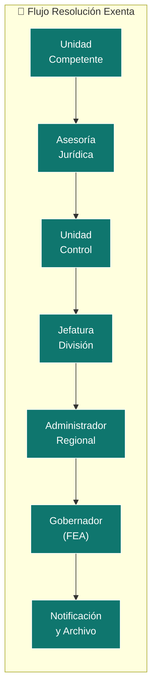
```mermaid
flowchart LR
    subgraph FLUJO["📝 Flujo Resolución Exenta"]
        A["Unidad<br/>Competente"] --> B["Asesoría<br/>Jurídica"]
        B --> C["Unidad<br/>Control"]
        C --> D["Jefatura<br/>División"]
        D --> E["Administrador<br/>Regional"]
        E --> F["Gobernador<br/>(FEA)"]
        F --> G["Notificación<br/>y Archivo"]
    end
    
    classDef paso fill:#0f766e,stroke:#fff,color:#fff
    class A,B,C,D,E,F,G paso
```

### Flujo Convenio de Transferencia

```mermaid
sequenceDiagram
    autonumber
    participant DIV as División Técnica
    participant JUR as Asesoría Jurídica
    participant DAF as DAF
    participant GR as Gobernador
    participant RECEP as Entidad Receptora
    participant CGR as CGR
    
    rect rgb(30, 64, 175)
        Note over DIV,DAF: Fase Elaboración
        DIV->>DIV: Elabora borrador convenio
        DIV->>JUR: Envía para revisión
        JUR->>JUR: Control de legalidad
        JUR->>DAF: Pasa para revisión financiera
        DAF->>DAF: Revisa cláusulas rendición
    end
    
    rect rgb(15, 118, 110)
        Note over GR,RECEP: Fase Firma
        DAF->>GR: Presenta convenio
        GR->>RECEP: Firma bilateral
        RECEP->>GR: Firma representante legal
    end
    
    rect rgb(124, 58, 237)
        Note over GR,CGR: Fase Formalización
        GR->>GR: Emite Resolución Aprobatoria
        GR->>CGR: Envía para Toma de Razón
        CGR->>CGR: Control preventivo legalidad
        CGR-->>GR: Toma de Razón
        Note over GR: Transferencia habilitada
    end
```

### Modificaciones Presupuestarias

| Tipo                           | Afecta Partida 31 | Acto Requerido               | Excepción CORE                                     |
| :----------------------------- | :---------------- | :--------------------------- | :------------------------------------------------- |
| Reasignación Interna           | No                | Resolución GORE              | —                                                  |
| Creación Iniciativas FRPD      | No                | Resolución GORE              | —                                                  |
| Suplemento Presupuestario      | Sí                | Decreto Supremo + Resolución | —                                                  |
| Transferencia Otros Organismos | Sí                | Decreto Supremo + Resolución | —                                                  |
| Emergencias (3% SUBINT)        | Sí                | Decreto Supremo + Resolución | Traspasable a Subsecretaría Interior               |
| Emergencias (2% GORE)          | Sí                | Resolución GORE              | Uso interno GORE (coordinación SUBINT)             |
| Aumento ≤10% costo aprobado    | No                | Resolución GORE              | **Glosa 10/11**: No requiere nueva aprobación CORE |

### Proceso Modificación Presupuestaria

```mermaid
flowchart TB
    subgraph INTERNO["🏛️ APROBACIÓN INTERNA"]
        DIPIR["DIPIR prepara<br/>propuesta"]
        DAF["DAF revisa<br/>funcionamiento"]
        GR_PROP["Gobernador<br/>presenta"]
        CORE["CORE aprueba"]
    end
    
    subgraph EXTERNO["🔒 APROBACIÓN EXTERNA"]
        DIPRES["DIPRES visa"]
        CGR_TDR["CGR Toma<br/>de Razón"]
        VIGENCIA["Vigencia<br/>(ajuste SIGFE)"]
    end
    
    DIPIR --> DAF --> GR_PROP --> CORE
    CORE --> DIPRES --> CGR_TDR --> VIGENCIA
    
    classDef interno fill:#0f766e,stroke:#fff,color:#fff
    classDef externo fill:#7c3aed,stroke:#fff,color:#fff
    
    class DIPIR,DAF,GR_PROP,CORE interno
    class DIPRES,CGR_TDR,VIGENCIA externo
```

## Leyenda de Relaciones

```mermaid
flowchart LR
    A[Entidad A] ==>|Jerarquía formal| B[Entidad B]
    C[Entidad C] -->|Dependencia funcional| D[Entidad D]
    E[Entidad E] -.-|Coordinación/Colaboración| F[Entidad F]
    G[Entidad G] <-.-|Bidireccional| H[Entidad H]
```

| Tipo de línea          | Significado                    |
| :--------------------- | :----------------------------- |
| `==>` (gruesa)         | Relación jerárquica/normativa  |
| `-->` (normal)         | Dependencia funcional          |
| `-.-` (punteada)       | Coordinación sin subordinación |
| `<-.-` (bidireccional) | Relación colaborativa          |

## Catálogo Expandido de Actores

### Actores de Gobernanza (LOC 19.175)

| Entidad                   | Rol Fundamental (LOC GORE)                                                                                                               | Referencia |
| :------------------------ | :--------------------------------------------------------------------------------------------------------------------------------------- | :--------- |
| **Gobernador Regional**   | Órgano **EJECUTIVO** del GORE. Preside el CORE. Elegido por sufragio universal.                                                          | Art. 23    |
| **Delegado Presidencial** | Jefe del **GOBIERNO INTERIOR**. Representante natural e inmediato del Presidente. Supervisa servicios públicos no dependientes del GORE. | Art. 1-2   |
| **Consejo Regional**      | Órgano **NORMATIVO, RESOLUTIVO Y FISCALIZADOR**. Hace efectiva la participación de la comunidad regional.                                | Art. 36    |

### Dualidad: Gobierno Regional vs Gobierno Interior

```mermaid
flowchart LR
    subgraph GORE["🏢 GOBIERNO REGIONAL (Administración Superior)"]
        GR["Gobernador Regional<br/>(Ejecutivo)"]
        CORE["Consejo Regional<br/>(Normativo/Fiscalizador)"]
        GR <--> CORE
    end

    subgraph GOB_INT["🛡️ GOBIERNO INTERIOR (Orden y Seguridad)"]
        DPR["Delegado Presidencial<br/>Regional"]
        DPP["Delegados<br/>Provinciales"]
        SEREMI["SEREMIS<br/>(Coordinación)"]
        DPR --> DPP
        DPR -.-> SEREMI
    end
    
    GR -.->|Coordinación sin subordinación| DPR
    GORE -.->|Competencias Transferidas| GOB_INT
    
    style GORE fill:#0f766e,stroke:#fff,color:#fff
    style GOB_INT fill:#7c3aed,stroke:#fff,color:#fff
```

### Proceso de Transferencia de Competencias (LOC Art. 21 bis y ss.)

> **Definición**: Traspaso de facultades, funciones o atribuciones desde ministerios/servicios al GORE. Puede ser **Temporal** (min 1 año) o **Definitiva**.

```mermaid
flowchart TB
    INICIO((Inicio))
    
    subgraph SOLICITUD["1. SOLICITUD"]
        OFICIO["De Oficio<br/>(Presidente)"]
        GORE_SOL["A pedido del GORE<br/>(Gobernador + CORE)"]
    end
    
    subgraph ANALISIS["2. ANÁLISIS TÉCNICO"]
        COMITE["COMITÉ INTERMINISTERIAL<br/>(Preside: Interior / Sec: SUBDERE)"]
        COMISION["COMISIÓN DE ESTUDIOS<br/>(Paritaria GORE-Nivel Central)"]
    end
    
    subgraph DECISION["3. DECISIÓN"]
        DECRETO["DECRETO SUPREMO<br/>(Ministerio Interior + Hacienda + SEGPRES)"]
    end
    
    INICIO --> OFICIO & GORE_SOL
    OFICIO & GORE_SOL --> COMITE
    COMITE -->|Instruye| COMISION
    COMISION -->|Informe fundado| COMITE
    COMITE -->|Recomendación| DECRETO
    
    DECRETO --> TEMP["TRANSFERENCIA TEMPORAL<br/>(Revocable Adm.)"]
    DECRETO --> DEF["TRANSFERENCIA DEFINITIVA<br/>(Revocable solo por Ley)"]
```

### Causales de Cese e Inhabilidades (LOC Art. 23 sexies)

| Tipo                 | Causal Principal                                     | Autoridad que declara            |
| :------------------- | :--------------------------------------------------- | :------------------------------- |
| **Cese**             | Infracción grave probidad / Notable abandono deberes | **TRICEL** (Req. 1/3 Consejeros) |
| **Cese**             | Incapacidad física/psíquica permanente               | **TRICEL**                       |
| **Inhabilidad**      | Contratos/Juicios con el GORE > 200 UTM              | **TRICEL**                       |
| **Incompatibilidad** | Simultaneidad con otros cargos públicos              | **De pleno derecho**             |

### Gestión de Seguridad Pública (Ley 21.730)

| Entidad                     | Rol Fundamental                                                         | Relación con GORE                     |
| :-------------------------- | :---------------------------------------------------------------------- | :------------------------------------ |
| **Ministerio de Seguridad** | Rectoría nacional, orden público y prevención.                          | Dicta Política Nacional.              |
| **Delegado Presidencial**   | Coordinación operativa regional. Preside Consejo Regional de Seguridad. | Coordinación (sin subordinación).     |
| **Consejo Reg. Seguridad**  | Instancia de coordinación interinstitucional.                           | **Gobernador** integra (Voz y Voto).  |
| **SEREMI Seguridad**        | Representación desconcentrada del Ministerio.                           | Asesoría técnica a GORE y Municipios. |

> **Nota Crítica**: El GORE financia (FNDR) pero **NO** dirige a las policías. Toda inversión debe alinearse a la Política Nacional de Seguridad Pública.

### Ecosistema de Integridad y Transparencia

| Norma          | Instrumento                      | Obligados GORE                        | Plazos Críticos                        |
| :------------- | :------------------------------- | :------------------------------------ | :------------------------------------- |
| **Ley 20.880** | **DIP** (Intereses y Patrimonio) | Gob, Cores, Jefes Div, Prof > Grado 3 | Al asumir, Marzo (anual), al cesar.    |
| **Ley 20.880** | Mandato / Fideicomiso            | Gob, Cores (Patrimonio > 25.000 UF)   | 90 días desde asunción.                |
| **Ley 20.730** | Registro de **Lobby**            | Gob, Cores, Jefes, Sec. CORE          | Registro mensual de audiencias/viajes. |
| **Ley 19.653** | Deber de Abstención              | Todos los funcionarios                | Inmediato ante conflicto de interés.   |

### Actores de Gobernanza y Gestión

| Entidad                      | Rol Principal en Aprobaciones                                                                         | Fuente Normativa     |
| :--------------------------- | :---------------------------------------------------------------------------------------------------- | :------------------- |
| **Gobernador/a Regional**    | Firma ejecutiva final de actos adm. Propone presupuesto/planes al CORE. Repr. judicial/extrajudicial. | GORE-GUIA-ESTRUCTURA |
| **Consejo Regional (CORE)**  | Aprueba presupuesto, ERD, FNDR, 8%, FRIL. Fiscaliza gestión del Gobernador.                           | GORE-GUIA-ESTRUCTURA |
| **Administrador/a Regional** | Coordina gestión adm. interna. V°B° final pre-firma. Subrogancia legal.                               | GORE-GUIA-ESTRUCTURA |
| **DIPIR**                    | Lidera presupuesto inversión. Evalúa técnicamente IDI. Monitorea avance físico-financiero.            | KB-GN-CTX-AUTH       |
| **DIPLADE**                  | Lidera ERD. Secretaría ejecutiva coordinación gasto (ARI/PROPIR).                                     | KB-GN-CTX-AUTH       |
| **DAF**                      | Ejecuta gestión financiera. Elabora convenios/pagos. Controla rendiciones. Registra en SIGFE.         | STS-KB-GN-RENDICION  |
| **Asesoría Jurídica**        | Control legalidad interno actos/convenios. Redacta resoluciones/decretos.                             | KB-GN-015            |
| **Unidad de Control**        | Control preventivo/posterior legalidad. Dependencia técnica CGR. Audita procesos.                     | STS-KB-GN-RENDICION  |
| **Comité Directivo (CDR)**   | Filtro estratégico y político-técnico de IPR pre-evaluación.                                          | GORE-IPR-PHASE1      |
| **Oficina de Partes**        | Punto único ingreso formal doc. externa. Asigna folio. Deriva.                                        | GORE-IPR-PHASE1      |
| **RTF**                      | Referente Técnico-Financiero. Primera línea revisión proyectos.                                       | STS-KB-GN-RENDICION  |
| **UCR**                      | Unidad Control Rendiciones (DAF). Control operativo rendiciones.                                      | KB-GN-020            |
| **Ministro de Fe**           | Certifica autenticidad documentos en SISREC (Ejecutor).                                               | KB-GN-020            |

## Dominio Gestión Presupuestaria

> **Fuente**: `kb_gn_018_gestion_prpto_koda.yml`

### Ciclo Presupuestario Regional

```mermaid
flowchart TB
    subgraph FORM["📅 FORMULACIÓN"]
        DIPIR["DIPIR<br/>(Inversión/ARI)"]
        DAF["DAF<br/>(Funcionamiento)"]
        PROP["Propuesta<br/>Gobernador"]
    end

    subgraph APROB["⚖️ APROBACIÓN"]
        CORE["CORE<br/>(Distribución Inicial)"]
        DIPRES["DIPRES<br/>(Resoluciones)"]
        CGR["CGR<br/>(Toma de Razón)"]
    end

    subgraph EJEC["💸 EJECUCIÓN"]
        SIGFE["Registro<br/>SIGFE (DAF)"]
        BIP["Registro<br/>BIP (DIPIR)"]
        MODS["Modificaciones<br/>(Reasignaciones)"]
    end
    
    DIPIR & DAF --> PROP
    PROP --> CORE
    CORE --> DIPRES --> CGR
    CGR --> SIGFE & BIP
    SIGFE <--> MODS
    
    classDef form fill:#3b82f6,stroke:#fff,color:#fff
    classDef aprob fill:#8b5cf6,stroke:#fff,color:#fff
    classDef ejec fill:#10b981,stroke:#fff,color:#fff
    
    class DIPIR,DAF,PROP form
    class CORE,DIPRES,CGR aprob
    class SIGFE,BIP,MODS ejec
```

### Roles en la Gestión Presupuestaria

| Rol       | Enfoque Principal           | Responsabilidades Clave                                                                                         |
| :-------- | :-------------------------- | :-------------------------------------------------------------------------------------------------------------- |
| **DIPIR** | Inversión (S31, S33, S24)   | Lidera formulación de inversión (ARI). Monitoreo físico-financiero (BIP). Gestiona modificaciones de inversión. |
| **DAF**   | Financiero / Funcionamiento | Lidera presupuesto funcionamiento (S21, S22). Ejecución financiera (Pagos/SIGFE). Control de saldos y caja.     |
| **CORE**  | Normativo / Fiscalizador    | Aprueba distribución inicial (Inversión). Aprueba modificaciones de inversión. Fiscaliza ejecución.             |

### Clasificadores Presupuestarios Clave (Partida 31)

| Subtítulo | Nombre                         | Uso en GORE Ñuble                                                                 |
| :-------- | :----------------------------- | :-------------------------------------------------------------------------------- |
| **21**    | Gastos en Personal             | Remuneraciones planta/contrata. (Gestión DAF)                                     |
| **22**    | Bienes y Servicios de Consumo  | Gastos operativos (luz, agua, materiales). (Gestión DAF)                          |
| **24**    | Transferencias Corrientes      | Programas (Glosa 06), 8% FNDR, Transf. a Privados/Públicos. (DIPIR/DAF)           |
| **29**    | Adquisición Activos No Financ. | Compra de activos propios (computadores, vehículos). (DAF)                        |
| **31**    | Iniciativas de Inversión       | **Ejecución Directa**: Proyectos propios del GORE (obras, estudios). (DIPIR)      |
| **33**    | Transferencias de Capital      | **Ejecución Indirecta**: Transferencias a Municipios (FRIL), Serviu, etc. (DIPIR) |

## Glosario General del Sistema

| Categoría       | Entidad                                        | Definición                                                           |
| :-------------- | :--------------------------------------------- | :------------------------------------------------------------------- |
| **IPR**         | Intervención Pública Regional                  | Superclase: proyectos, programas, estudios                           |
| **IDI**         | Iniciativa de Inversión                        | Nomenclatura SNI para Proyecto (NO es un mecanismo)                  |
| **PPR**         | Programa Público Regional                      | IPR de gasto corriente (Subt. 24) → G06, Transf, 8%                  |
| **MEC**         | Mecanismo de Financiamiento                    | Vía operativa para materializar IPR (SNI, FRIL, etc.)                |
| **RATE**        | Resultado Análisis Técnico-Económico           | Dictamen MDSF (RS, FI, OT, AD)                                       |
| **RF**          | Recomendación Favorable                        | Dictamen DIPRES/SES para PPR                                         |
| **ITF**         | Informe Técnico Favorable                      | Dictamen interno GORE para transferencias                            |
| **MML**         | Metodología de Marco Lógico                    | Herramienta de formulación de programas                              |
| **BIP**         | Banco Integrado de Proyectos                   | Plataforma SNI para IDI                                              |
| **RIS**         | Requisitos de Información Sectorial            | Documentos de admisibilidad                                          |
| **CDP**         | Certificado de Disponibilidad Presupuestaria   | Acredita fondos disponibles                                          |
| **CDR**         | Comité Directivo Regional                      | Filtro de pertinencia estratégica                                    |
| **TSD**         | Tasa Social de Descuento                       | 5.5% (2025) para evaluación social                                   |
| **FRIL**        | Fondo Regional Iniciativa Local                | Infraestructura municipal ≤5.000 UTM                                 |
| **C33**         | Circular 33                                    | Procedimiento expedito (estudios, ANF, conservación)                 |
| **FRPD**        | Fondo Regional Productividad                   | Mixto: financia proyectos o programas (CTCI+Fomento)                 |
| **Sub 8%**      | Subvención 8%                                  | Fondos concursables para OSC                                         |
| **CTCI**        | Ciencia, Tecnología, Conocimiento e Innovación | Ámbito de acción FRPD                                                |
| **OSC**         | Organización de la Sociedad Civil              | Postulantes privados sin fines de lucro                              |
| **SISREC**      | Sistema de Rendición Electrónica de Cuentas    | Plataforma CGR para rendiciones Subt. 24/33                          |
| **SIGFE**       | Sistema de Información Gestión Financiera      | Sistema contable-financiero del Estado                               |
| **FEA**         | Firma Electrónica Avanzada                     | Mecanismo que sustituye firma manuscrita                             |
| **UCR**         | Unidad de Control de Rendiciones               | Unidad especializada en DAF para control rendiciones                 |
| **RTF**         | Referente Técnico-Financiero                   | Profesional GORE responsable de revisión técnica                     |
| **TdR**         | Toma de Razón                                  | Control preventivo de legalidad por CGR                              |
| **ANF**         | Activo No Financiero                           | Bienes físicos adquiridos (terrenos, equipos, etc.)                  |
| **ZUBC**        | Zonificación del Uso del Borde Costero         | Instrumento que define usos del borde costero regional               |
| **PLADETUR**    | Plan Regional de Desarrollo Turístico          | Instrumento de planificación turística regional                      |
| **Decreto**     | Acto Administrativo (con TdR CGR)              | Norma dictada por autoridad sujeta a control externo                 |
| **Resolución**  | Acto Administrativo (exento o con TdR)         | Decisión formal del GORE, puede ser exenta o afecta                  |
| **PMO**         | Oficina de Gestión de Proyectos                | Torre de control para monitoreo de cartera regional                  |
| **MDSF**        | Ministerio de Desarrollo Social y Familia      | Organismo que evalúa técnico-económicamente IDI en SNI               |
| **Devengo**     | Momento de Exigibilidad Presupuestaria         | Privados/Munic: al tramitar convenio; Serv.Púb: al aprobar rendición |
| **Postulación** | IPR presentada para evaluación                 | Estado previo a clasificación o aprobación                           |
| **ARI**         | Anteproyecto Regional de Inversiones           | Planificación de inversión regional para el año siguiente            |
| **PROPIR**      | Programa Público Inversión Regional            | Instrumento de monitoreo de ejecución anual                          |
| **SIC**         | Saldo Inicial de Caja                          | Recursos remanentes del año anterior (requiere incorporación)        |
| **Deuda Flot.** | Deuda Flotante                                 | Obligaciones devengadas no pagadas al 31/12                          |

> **Modelo Omega GORE Ñuble v2.6.0**
> **Fuentes integradas**: 16 KBs KODA (Intro, Organigrama, LOC GORE, GORE Ideal 4.0, Gestión IPR, Selector IPR, Guía IDI, Guía PPR, FRIL, C33, FRPD, Transferencia PPR, Subvención 8%, Rendiciones, Aprobaciones, Ley Presupuestos 2026)
> **Última actualización**: 2025-12-29
> **Auditorías**: Omega 2.0 + KBs Fuente + IPR (todas las brechas P1/P2 remediadas)
