# Modelo Omega Avanzado - Sistema GORE Ñuble

> **Versión**: 2.3.0
> **Fecha**: 2025-12-28
> **Fuentes**: LOC GORE (DFL 1-19.175), Guía Técnico-Operativa GORE Ñuble, GORE Ideal 4.0, Gestión IPR, Selector IPR, Rendiciones, Aprobaciones

---

## 1. Arquitectura General del Sistema

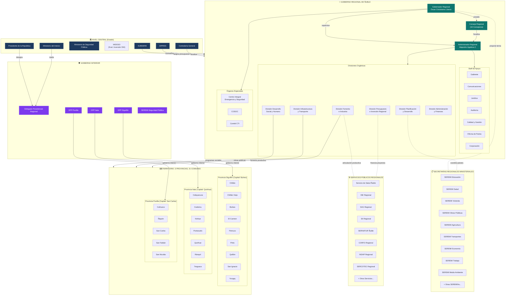

---

## 2. Estructura Orgánica Detallada del GORE

```mermaid
flowchart TB
    subgraph AUTORIDAD_MAXIMA["🎯 AUTORIDAD MÁXIMA"]
        GR["GOBERNADOR REGIONAL<br/>Óscar Crisóstomo Llanos<br/><i>Electo por sufragio universal</i>"]
    end
    
    subgraph ORGANO_COLEGIADO["⚖️ ÓRGANO COLEGIADO"]
        CORE["CONSEJO REGIONAL<br/>16 Consejeros Electos"]
        SEC_CORE["Secretaría Ejecutiva CORE"]
        UC_CORE["Unidad Control CORE"]
    end
    
    subgraph ADMINISTRACION["🏛️ ADMINISTRACIÓN REGIONAL"]
        AR["ADMINISTRADOR REGIONAL<br/>Alejandro Aguilera Z."]
        
        subgraph STAFF_AR["Staff de Apoyo"]
            CORP["Corporación"]
            AUD["Auditoría"]
            JUR["Jurídica"]
            UCGI["Unidad Calidad<br/>y Gestión Institucional"]
            OFP["Oficina de Partes"]
        end
    end
    
    subgraph DIV_DIPLADE["📊 DIVISIÓN PLANIFICACIÓN Y DESARROLLO"]
        J_DIPLADE["Jefe División<br/>Erick Solo de Zaldivar"]
        D_PLAN["Depto. Planificación Estratégica<br/>y Ordenamiento Territorial"]
        D_PROY["Depto. Desarrollo<br/>Proyectos Estratégicos"]
        D_URB["Depto. Desarrollo Urbano"]
    end
    
    subgraph DIV_DIPIR["💰 DIVISIÓN PRESUPUESTO E INVERSIÓN REGIONAL"]
        J_DIPIR["Jefe División<br/>Juan Parada González"]
        D_AYE["Depto. Análisis<br/>y Evaluación"]
        D_PPTO["Depto. Presupuesto"]
        D_INV["Depto. Inversión"]
    end
    
    subgraph DIV_DIDESO["🤝 DIVISIÓN DESARROLLO SOCIAL Y HUMANO"]
        J_DIDESO["Jefe División<br/>Tamara Valenzuela F."]
        D_FC["Depto. Fondos Concursables<br/>y Programas Sociales"]
        D_AGT["Depto. Análisis y<br/>Gestión Territorial"]
    end
    
    subgraph DIV_DIFOI["🏭 DIVISIÓN FOMENTO E INDUSTRIA"]
        J_DIFOI["Jefe División<br/>Raúl Súnico Galdames"]
        D_ZD["Depto. Zonas en Desarrollo"]
        D_DEL["Depto. Desarrollo<br/>Económico Local"]
        D_CTI["Depto. CTI para<br/>la Competitividad"]
    end
    
    subgraph DIV_DIINF["🛤️ DIVISIÓN INFRAESTRUCTURA Y TRANSPORTE"]
        J_DIINF["Jefe División<br/>Cristián Quiroz Reyes"]
        D_IER["Depto. Infraestructura y<br/>Equipamiento Regional"]
        D_GTT["Depto. Gestión en<br/>Transportes y Telecomunicaciones"]
    end
    
    subgraph DIV_DIAF["📋 DIVISIÓN ADMINISTRACIÓN Y FINANZAS"]
        J_DIAF["Jefe División<br/>Alicia Contreras Vielma"]
        D_GDP["Depto. Gestión y<br/>Desarrollo de Personas"]
        D_FIN["Depto. Finanzas"]
    end
    
    %% Conexiones jerárquicas
    GR --> CORE
    CORE --> SEC_CORE
    CORE --> UC_CORE
    
    GR --> AR
    
    AR --> STAFF_AR
    AR --> J_DIPLADE
    AR --> J_DIPIR
    AR --> J_DIDESO
    AR --> J_DIFOI
    AR --> J_DIINF
    AR --> J_DIAF
    
    J_DIPLADE --> D_PLAN
    J_DIPLADE --> D_PROY
    J_DIPLADE --> D_URB
    
    J_DIPIR --> D_AYE
    J_DIPIR --> D_PPTO
    J_DIPIR --> D_INV
    
    J_DIDESO --> D_FC
    J_DIDESO --> D_AGT
    
    J_DIFOI --> D_ZD
    J_DIFOI --> D_DEL
    J_DIFOI --> D_CTI
    
    J_DIINF --> D_IER
    J_DIINF --> D_GTT
    
    J_DIAF --> D_GDP
    J_DIAF --> D_FIN
    
    %% Estilos
    classDef gobernador fill:#0f766e,stroke:#fff,color:#fff,font-weight:bold
    classDef consejo fill:#7c3aed,stroke:#fff,color:#fff
    classDef admin fill:#1e40af,stroke:#fff,color:#fff
    classDef division fill:#b45309,stroke:#fff,color:#fff
    
    class GR gobernador
    class CORE,SEC_CORE,UC_CORE consejo
    class AR,CORP,AUD,JUR,UCGI,OFP admin
    class J_DIPLADE,J_DIPIR,J_DIDESO,J_DIFOI,J_DIINF,J_DIAF division
```

---

## 3. Instrumentos de Planificación Regional

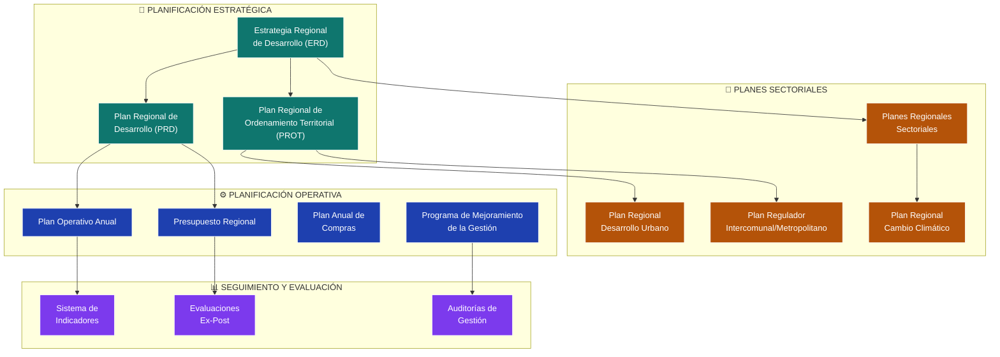

---

## 4. Mecanismos de Financiamiento

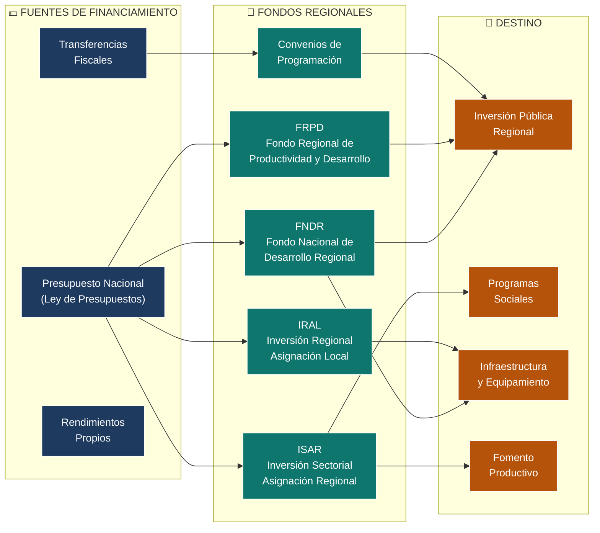

---

## 5. Articulación Multinivel

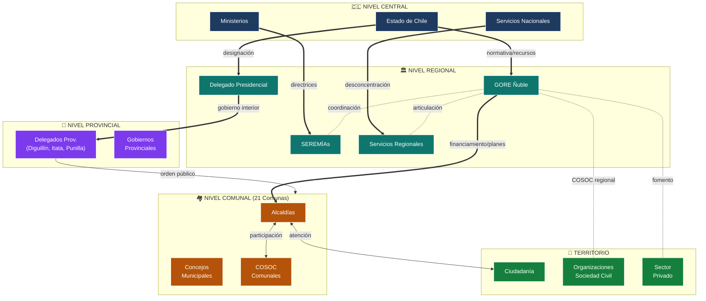

---

## 6. Motor de 5 Funciones del GORE

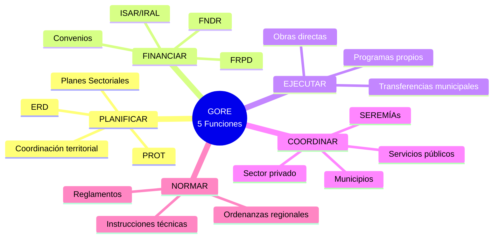

---

## 7. Restricciones del Sistema

### 7.1 Límites Jurídicos (LOC GORE)

| Restricción                      | Descripción                                                          | Referencia Legal     |
| :------------------------------- | :------------------------------------------------------------------- | :------------------- |
| **Competencias acotadas**        | GORE solo ejerce competencias expresamente transferidas              | DFL 1-19.175, Art.21 |
| **Sin jerarquía sobre SEREMÍAs** | Coordina pero no instruye a representantes ministeriales             | Art.66               |
| **Presupuesto nacional**         | Recursos asignados por Ley de Presupuestos, sin autonomía tributaria | Art.73               |
| **Control CGR**                  | Toda actuación sujeta a toma de razón y fiscalización                | Ley 10.336           |
| **Ámbitos no descentralizables** | FFAA, Relaciones Exteriores, Orden Público (reservados)              | Art.21 nonies        |

### 7.2 Límites Operativos

| Restricción                    | Impacto                                                    |
| :----------------------------- | :--------------------------------------------------------- |
| **Capacidad técnica limitada** | Dependencia de asistencia SUBDERE para proyectos complejos |
| **Brechas digitales**          | Municipios rurales con baja conectividad y capacidad       |
| **Rotación de personal**       | Pérdida de conocimiento institucional                      |
| **Fragmentación de sistemas**  | Dificultad para consolidar información regional            |

### 7.3 Aspiraciones GORE 4.0

| Función        | Estado Actual                         | Visión GORE 4.0                               |
| :------------- | :------------------------------------ | :-------------------------------------------- |
| **Planificar** | Planes estáticos, actualización lenta | Digital Twin del Territorio + prospectiva IA  |
| **Financiar**  | Asignación manual, ciclos largos      | Smart Contracts + evaluación automática       |
| **Ejecutar**   | Ejecución delegada, bajo control      | Monitoreo en tiempo real + alertas proactivas |
| **Coordinar**  | Mesas de trabajo presenciales         | Plataforma integrada + dashboard ejecutivo    |
| **Normar**     | Ordenanzas genéricas                  | Normativa adaptativa basada en datos          |

---

## 8. Catálogo de Entidades

### 8.1 Actores Institucionales

| ID      | Entidad                        | Tipo                  | Fuente          |
| :------ | :----------------------------- | :-------------------- | :-------------- |
| ACT-001 | Gobernador Regional            | Autoridad electa      | LOC GORE Art.23 |
| ACT-002 | Consejo Regional               | Órgano colegiado      | LOC GORE Art.28 |
| ACT-003 | Administrador Regional         | Cargo confianza       | LOC GORE Art.68 |
| ACT-004 | Delegado Presidencial Regional | Representante central | LOC GORE Art.1  |
| ACT-005 | Delegados Provinciales (3)     | Desconcentrado        | LOC GORE Art.3  |
| ACT-006 | SEREMÍAs (15+)                 | Ministerial regional  | DL 575          |
| ACT-007 | Servicios Públicos Regionales  | Desconcentrados       | Diversos        |
| ACT-008 | Alcaldías (21)                 | Autónomas comunales   | LOCM            |
| ACT-009 | COSOC Regional                 | Participación         | Ley 20.500      |
| ACT-010 | Comité CTI                     | Asesor                | Interno GORE    |

### 8.2 Divisiones Orgánicas

| ID      | División                         | Jefatura                | Departamentos  |
| :------ | :------------------------------- | :---------------------- | :------------- |
| DIV-001 | Planificación y Desarrollo       | Erick Solo de Zaldivar  | 4              |
| DIV-002 | Presupuesto e Inversión Regional | Juan Parada González    | 3              |
| DIV-003 | Desarrollo Social y Humano       | Tamara Valenzuela F.    | 2 + 5 unidades |
| DIV-004 | Fomento e Industria              | Raúl Súnico Galdames    | 5              |
| DIV-005 | Infraestructura y Transporte     | Cristián Quiroz Reyes   | 2 + 2 unidades |
| DIV-006 | Administración y Finanzas        | Alicia Contreras Vielma | 2 + 5 unidades |

### 8.3 Instrumentos

| ID      | Instrumento               | Tipo        | Horizonte  |
| :------ | :------------------------ | :---------- | :--------- |
| INS-001 | ERD                       | Estratégico | 10-20 años |
| INS-002 | PROT                      | Territorial | 10-15 años |
| INS-003 | Presupuesto Regional      | Operativo   | Anual      |
| INS-004 | Convenios de Programación | Contractual | Variable   |
| INS-005 | Ordenanzas Regionales     | Normativo   | Indefinido |

### 8.4 Fondos

| ID      | Fondo | Administrador  | Destino principal     |
| :------ | :---- | :------------- | :-------------------- |
| FON-001 | FNDR  | GORE           | Inversión pública     |
| FON-002 | FRPD  | GORE           | Preinversión          |
| FON-003 | ISAR  | GORE/Sectorial | Programas sectoriales |
| FON-004 | IRAL  | GORE           | Inversión local       |

---

## 9. Territorio: Detalle Comunal

### Provincia de Diguillín (9 comunas)

| Comuna        | Características                                   |
| :------------ | :------------------------------------------------ |
| Chillán       | Capital regional, mayor población, IDH medio-alto |
| Chillán Viejo | Conurbación con Chillán                           |
| Bulnes        | Capital provincial                                |
| El Carmen     | Rural, agrícola                                   |
| Pemuco        | Alta pobreza (~19%)                               |
| Pinto         | Turismo, precordillera                            |
| Quillón       | Agrícola                                          |
| San Ignacio   | IDH bajo (0.437)                                  |
| Yungay        | Agrícola-forestal                                 |

### Provincia de Itata (7 comunas)

| Comuna     | Características        |
| :--------- | :--------------------- |
| Quirihue   | Capital provincial     |
| Cobquecura | Alta ruralidad (71.5%) |
| Coelemu    | Forestal               |
| Ninhue     | Alta ruralidad (71.2%) |
| Portezuelo | IDH muy bajo (0.444)   |
| Ránquil    | Vitivinícola           |
| Treguaco   | Rural                  |

### Provincia de Punilla (5 comunas)

| Comuna      | Características                    |
| :---------- | :--------------------------------- |
| San Carlos  | Capital provincial, segunda ciudad |
| Coihueco    | Agrícola-ganadero                  |
| Ñiquén      | Rural                              |
| San Fabián  | Turismo, Cordillera                |
| San Nicolás | Agrícola                           |

---

## 10. Leyenda de Relaciones

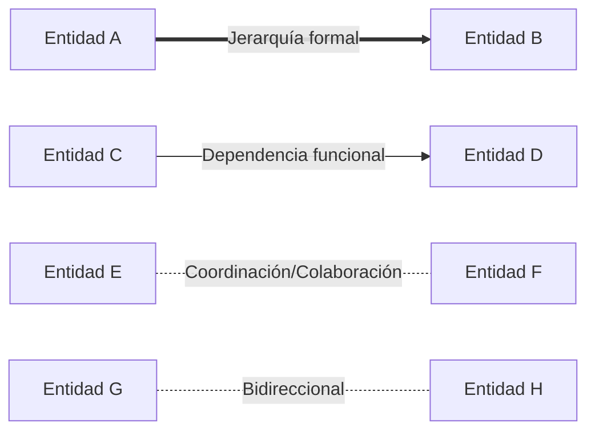

| Tipo de línea          | Significado                    |
| :--------------------- | :----------------------------- |
| `==>` (gruesa)         | Relación jerárquica/normativa  |
| `-->` (normal)         | Dependencia funcional          |
| `-.-` (punteada)       | Coordinación sin subordinación |
| `<-.-` (bidireccional) | Relación colaborativa          |

---

## 11. Procesos del Sistema GORE

### 11.1 Ciclo de Vida de Iniciativa de Inversión Pública (IPR)

```mermaid
stateDiagram-v2
    [*] --> Identificacion: Demanda territorial

    state Identificacion {
        [*] --> Idea
        Idea --> Perfil: Formulación inicial
    }
    
    Identificacion --> Admisibilidad: Ingreso formal
    
    state Admisibilidad {
        [*] --> RevisionTecnica: DIPIR evalúa
        RevisionTecnica --> Admisible: Cumple requisitos
        RevisionTecnica --> Inadmisible: No cumple
        Inadmisible --> [*]: Devuelto al formulador
    }
    
    Admisibilidad --> Evaluacion: Proyecto admitido
    
    state Evaluacion {
        [*] --> RATE: Análisis técnico-económico
        RATE --> RS: Recomendación favorable
        RATE --> OT: Observaciones técnicas
        OT --> RATE: Subsanación
        RS --> [*]: Listo para asignación
    }
    
    Evaluacion --> Priorizacion: Cartera evaluada
    
    state Priorizacion {
        [*] --> ARI: Anteproyecto Regional Inversiones
        ARI --> PropuestaGR: Gobernador propone
        PropuestaGR --> VotacionCORE: CORE decide
        VotacionCORE --> Aprobado: Mayoría a favor
        VotacionCORE --> Rechazado: Sin apoyo
    }
    
    Priorizacion --> Ejecucion: Asignación presupuestaria
    
    state Ejecucion {
        [*] --> Licitacion: Bases y llamado
        Licitacion --> Adjudicacion: Selección oferente
        Adjudicacion --> Contrato: Formalización
        Contrato --> ObraEnCurso: Ejecución física
        ObraEnCurso --> RecepcionProvisoria: Término obras
        RecepcionProvisoria --> RecepcionDefinitiva: Garantías vencidas
    }
    
    Ejecucion --> Cierre: Finiquito técnico-financiero
    
    state Cierre {
        [*] --> RendicionCuentas: Documentación final
        RendicionCuentas --> InformeFinal: Evaluación ex-post
        InformeFinal --> [*]: Proyecto cerrado
    }
    
    Cierre --> [*]
```

### 11.2 Ciclo Presupuestario Anual

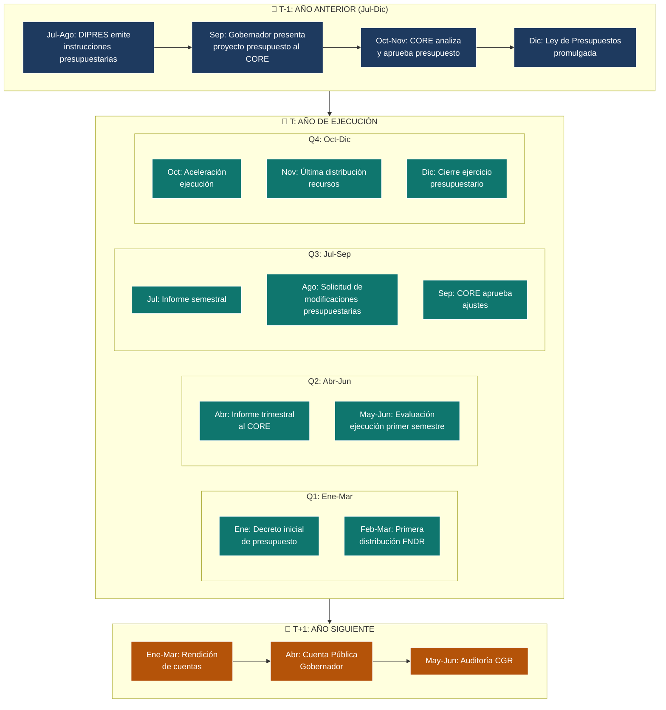

---

## 12. Catálogo de Procesos

| ID       | Proceso                    | Tipo         | Frecuencia        | Actores Principales          | Duración Típica |
| :------- | :------------------------- | :----------- | :---------------- | :--------------------------- | :-------------- |
| PROC-001 | Ciclo IPR                  | Operativo    | Continuo          | DIPIR, Formuladores, CORE    | 12-36 meses     |
| PROC-002 | Transferencia Competencias | Estratégico  | Eventual          | GORE, SUBDERE, Ministerios   | 6-24 meses      |
| PROC-003 | Ciclo Presupuestario       | Anual        | Anual             | Gobernador, CORE, DIPRES     | 18 meses        |
| PROC-004 | Planificación (ERD/PROT)   | Estratégico  | 10-20 años        | DIPLADE, CORE, COSOC         | 12-24 meses     |
| PROC-005 | Fiscalización CORE         | Control      | Continuo          | CORE, Unidad Control, CGR    | Variable        |
| PROC-006 | Sesión CORE                | Gobernanza   | Quincenal/Mensual | CORE, Gobernador, Secretaría | 3-6 horas       |
| PROC-007 | Emergencia (SINAPRED)      | Contingencia | Eventual          | GORE, DPR, SENAPRED, CIES    | Variable        |

---

## 13. Dominio IPR: Intervenciones Públicas Regionales

> **Fuente**: `kb_gn_019_gestion_ipr_koda.yml`, `kb_gn_011_selector_ipr_koda.yml`

### 13.1 Taxonomía de IPR

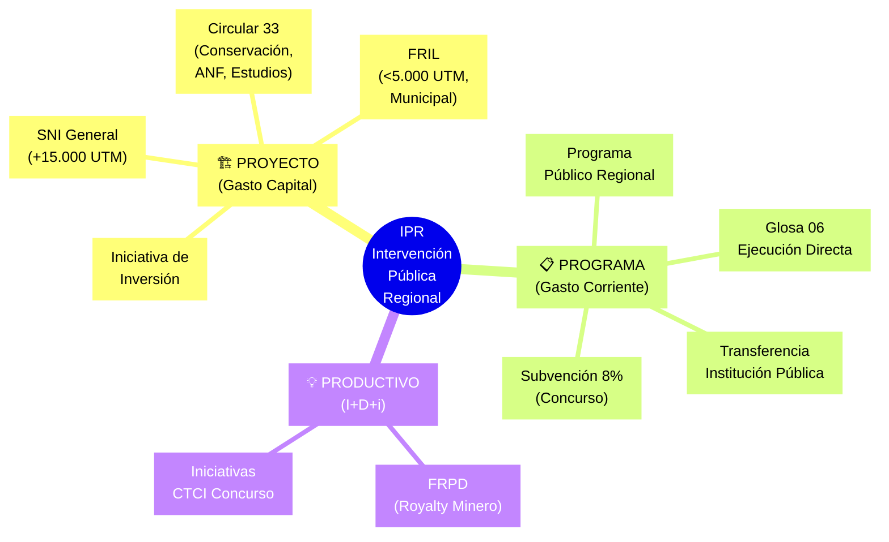

### 13.2 Catálogo de Mecanismos de Financiamiento

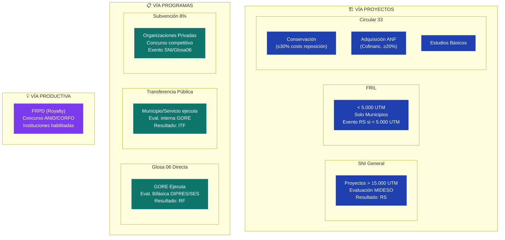

### 13.3 Árbol de Decisión: Selector de Mecanismo

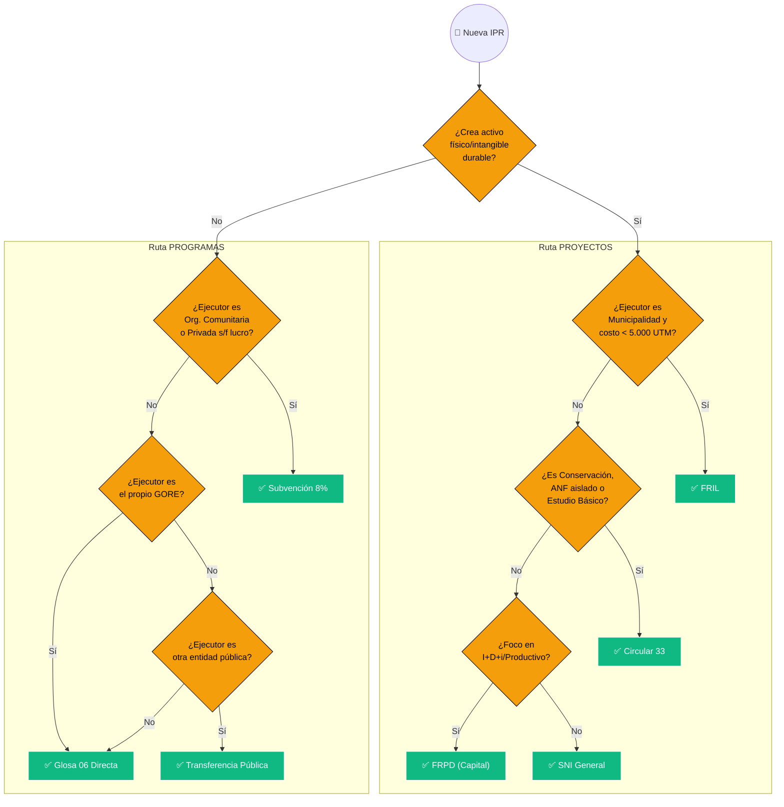

### 13.4 Tracks de Evaluación Técnica

| Track                              | Descripción                             | Evaluador          | Resultado    | Aplica a                            |
| :--------------------------------- | :-------------------------------------- | :----------------- | :----------- | :---------------------------------- |
| **Track A: SNI**                   | Evaluación técnico-económica estándar   | MIDESO (SEREMI)    | RS, FI, OT   | IDI > 15.000 UTM                    |
| **Track B: PPR Glosa 06**          | Evaluación bifásica (Perfil + Diseño)   | DIPRES/SES         | RF           | Programas ejecución directa GORE    |
| **Track C-1: < 5.000 UTM**         | Procedimiento simplificado municipios   | GORE               | Exento RS    | FRIL, proyectos menores             |
| **Track C-2: Conservación**        | Evaluación de admisibilidad             | MIDESO             | AD           | Conservación ≤30% reposición        |
| **Track D: Transferencia Pública** | Evaluación interna GORE multifásica     | GORE (DAE, Comité) | ITF          | Transferencias a entidades públicas |
| **Track E: Subvención 8%**         | Concurso competitivo por puntaje        | GORE               | Puntaje      | Organizaciones privadas s/f lucro   |
| **Track F: FRPD**                  | Concurso previo + evaluación según tipo | CORFO/ANID + GORE  | Elegibilidad | I+D+i por instituciones habilitadas |

### 13.5 Estados del Ciclo IPR


### 13.6 Umbrales Críticos

| Umbral                               | Valor                  | Consecuencia                      |
| :----------------------------------- | :--------------------- | :-------------------------------- |
| **Licitación Pública Proyectos**     | > 1.000 UTM            | Obligatoria (salvo emergencia)    |
| **Licitación Pública Estudios**      | > 500 UTM              | Obligatoria (salvo emergencia)    |
| **Exención RS (FRIL)**               | < 5.000 UTM            | No requiere informe MIDESO        |
| **Aprobación CORE obligatoria**      | ≥ 7.000 UTM            | Debe pasar por CORE (referencial) |
| **Garantías instituciones privadas** | > 1.000 UTM            | Exigir garantía (pagaré, boleta)  |
| **Conservación**                     | ≤ 30% costo reposición | Aplica vía simplificada C33       |
| **Cofinanciamiento ANF**             | ≥ 20%                  | Exigido para adquisición ANF      |
| **Tope administración Glosa 06**     | ≤ 5%                   | Máximo para gastos GORE           |

---

## 14. Dominio IDI: Iniciativas de Inversión en el SNI

> **Fuente**: `kb_gn_024_guia_idi_sni_koda.yml`

### 14.1 Principio de Proporcionalidad SNI

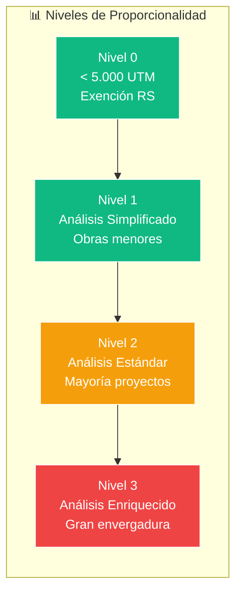

| Nivel | Umbral           | Requisitos                                    | Etapas Preinversión                          |
| :---- | :--------------- | :-------------------------------------------- | :------------------------------------------- |
| **0** | < 5.000 UTM      | Carta responsabilidad, Carpeta Digital        | Solo Ejecución                               |
| **1** | Baja complejidad | RIS simplificado                              | Perfil → Ejecución                           |
| **2** | Estándar         | RIS completo, ATE                             | Perfil → Prefactibilidad → Ejecución         |
| **3** | Alta complejidad | RIS enriquecido, metodologías complementarias | Idea → Perfil → Prefact. → Fact. → Ejecución |

### 14.2 Indicadores Económicos SNI

| Indicador | Fórmula                      | Uso                   | Criterio Decisión       |
| :-------- | :--------------------------- | :-------------------- | :---------------------- |
| **VAN**   | `-I₀ + Σ[BNₜ/(1+r)ᵗ]`        | ACB                   | VAN ≥ 0 → Viable        |
| **TIR**   | `VAN = 0 → r = TIR`          | Complementario        | TIR ≥ TSD → Conveniente |
| **VAC**   | `I₀ + Σ[(CTₜ-BAₜ)/(1+r)ᵗ]`   | ACE                   | Menor VAC → Preferido   |
| **CAE**   | `VAC × [r(1+r)ⁿ]/[(1+r)ⁿ-1]` | Comparar vidas útiles | Menor CAE → Preferido   |

> **TSD 2025**: 5.5% (Tasa Social de Descuento)

### 14.3 Subsistemas del SNI

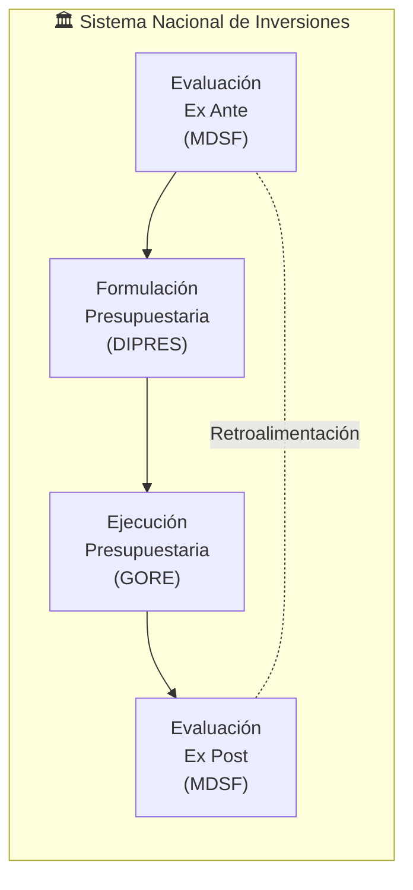

### 14.4 Tipos de IDI (Subtítulo 31)

| Ítem   | Tipo                | Descripción                      | Procesos Válidos                          |
| :----- | :------------------ | :------------------------------- | :---------------------------------------- |
| **01** | Estudios Básicos    | Información para identificar IDI | Diagnóstico, Exploración, Investigación   |
| **02** | Proyectos           | Crear/ampliar/mejorar activos    | Obras civiles, Equipamiento, Consultorías |
| **03** | Programas Inversión | Capacidad recurso humano/físico  | Capacitación, Transferencia, Prevención   |

---

## 15. Dominio PPR: Programas Públicos Regionales

> **Fuente**: `kb_gn_025_guia_programas_koda.yml`

### 15.1 Ciclo de Vida PPR

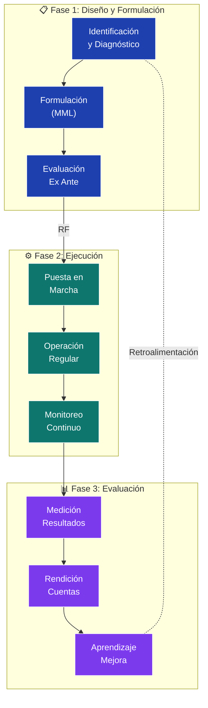

### 15.2 Criterios de Evaluación DIPRES/SES

| Criterio         | Pregunta Clave             | Subcriterios                                                                                 |
| :--------------- | :------------------------- | :------------------------------------------------------------------------------------------- |
| **Atingencia**   | ¿Es el programa correcto?  | Vínculo Problema-Diagnóstico-Intervención, Alineación ERD, Población objetivo, No duplicidad |
| **Coherencia**   | ¿La lógica es sólida?      | Cadena causal MML, Estrategia clara, Enfoques transversales                                  |
| **Consistencia** | ¿Es viable y monitoreable? | Indicadores SMART, Sistemas de información, Presupuesto coherente                            |

### 15.3 Tipos de Población PPR

| Tipo             | Definición                     | Ejemplo                                  |
| :--------------- | :----------------------------- | :--------------------------------------- |
| **Potencial**    | Universo con el problema       | Todos los jóvenes desempleados de Ñuble  |
| **Objetivo**     | Subconjunto con focalización   | Jóvenes 18-29, RSH ≤40%, comunas rurales |
| **Beneficiaria** | Atendidos efectivamente en año | 500 jóvenes capacitados en 2026          |

---

## 16. Dominio FRIL: Fondo Regional de Iniciativa Local

> **Fuente**: `kb_gn_026_guia_fril_koda.yml`

### 16.1 Caracterización FRIL

| Aspecto            | Descripción                                             |
| :----------------- | :------------------------------------------------------ |
| **Naturaleza**     | Fondo FNDR para infraestructura comunal de menor escala |
| **Umbral**         | ≤ 5.000 UTM (aprox. $306M)                              |
| **Ejecutor**       | Municipalidades                                         |
| **Evaluación**     | GORE (exento SNI/MIDESO)                                |
| **Financiamiento** | Subtítulo 33 FNDR                                       |

### 16.2 Categorías de Proyecto FRIL

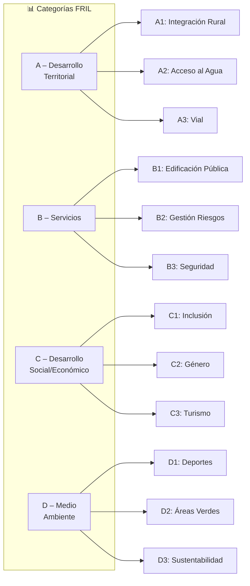

### 16.3 Ciclo FRIL

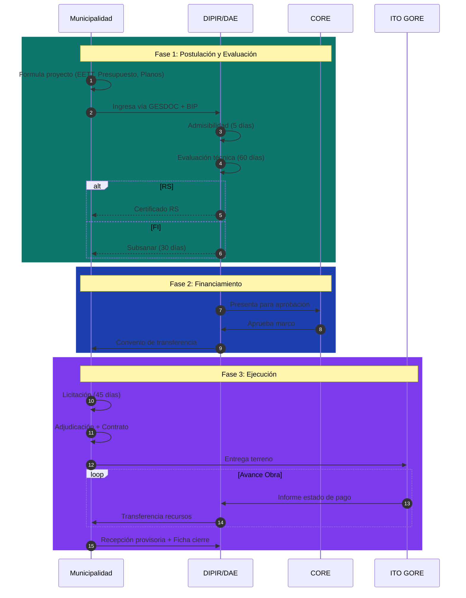

### 16.4 Restricciones FRIL

| Prohibición                    | Justificación             |
| :----------------------------- | :------------------------ |
| Gastos personal/consumo        | Solo obras civiles        |
| Proyectos con fines de lucro   | Naturaleza pública        |
| Fraccionamiento de obras       | Evasión de umbrales       |
| 2+ proyectos mismo terreno/año | Control duplicidad        |
| ANF sin proyecto asociado      | Solo complemento de obras |

---

## 17. Dominio C33: Circular 33

> **Fuente**: `kb_gn_029_guia_circ33_koda.yml`

### 17.1 Categorías Circular 33

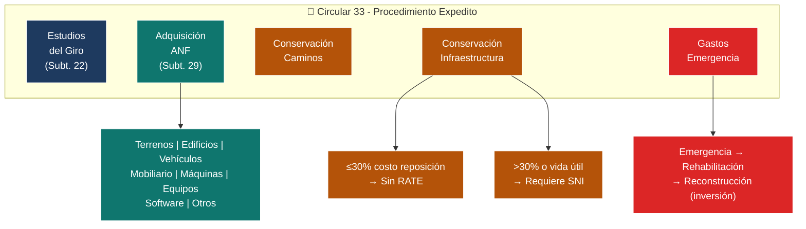

### 17.2 Matriz de Documentación C33

| Documento                 | Estudios |  ANF  | Cons. Caminos | Cons. Infra | Emergencia |
| :------------------------ | :------: | :---: | :-----------: | :---------: | :--------: |
| Oficio Conductor          |    ✓     |   ✓   |       ✓       |      ✓      |     ✓      |
| Ficha IDI                 |    ✓     |   ✓   |       ✓       |      ✓      |     ✓      |
| Ficha C33 (Anexo 1)       |    ✓     |   ✓   |       –       |      –      |     ✓      |
| TDR                       |    ✓     |   ✓   |       –       |      –      |     –      |
| EETT + Presupuesto        |    ✓     |   ○   |       ✓       |      ✓      |     ○      |
| 3 Cotizaciones/Tasaciones |    –     |   ✓   |       –       |      –      |     –      |
| Decreto Emergencia        |    –     |   –   |       –       |      –      |     ✓      |

> ✓ = Obligatorio | ○ = Si procede | – = No aplica

---

## 18. Dominio FRPD: Fondo Regional para la Productividad y el Desarrollo

> **Fuente**: `kb_gn_027_guia_frpd_koda.yml`

### 18.1 Origen y Marco FRPD

| Aspecto         | Descripción                                                |
| :-------------- | :--------------------------------------------------------- |
| **Origen**      | Royalty Minero (Ley N°21.591)                              |
| **Ámbitos**     | Fomento productivo, CTCI, desarrollo regional              |
| **Postulantes** | Instituciones habilitadas por SUBCTCI (Res. Ex. N°33/2024) |
| **Alineación**  | ERD + Estrategia Regional CTCI                             |

### 18.2 Bifurcación Post-Selección FRPD

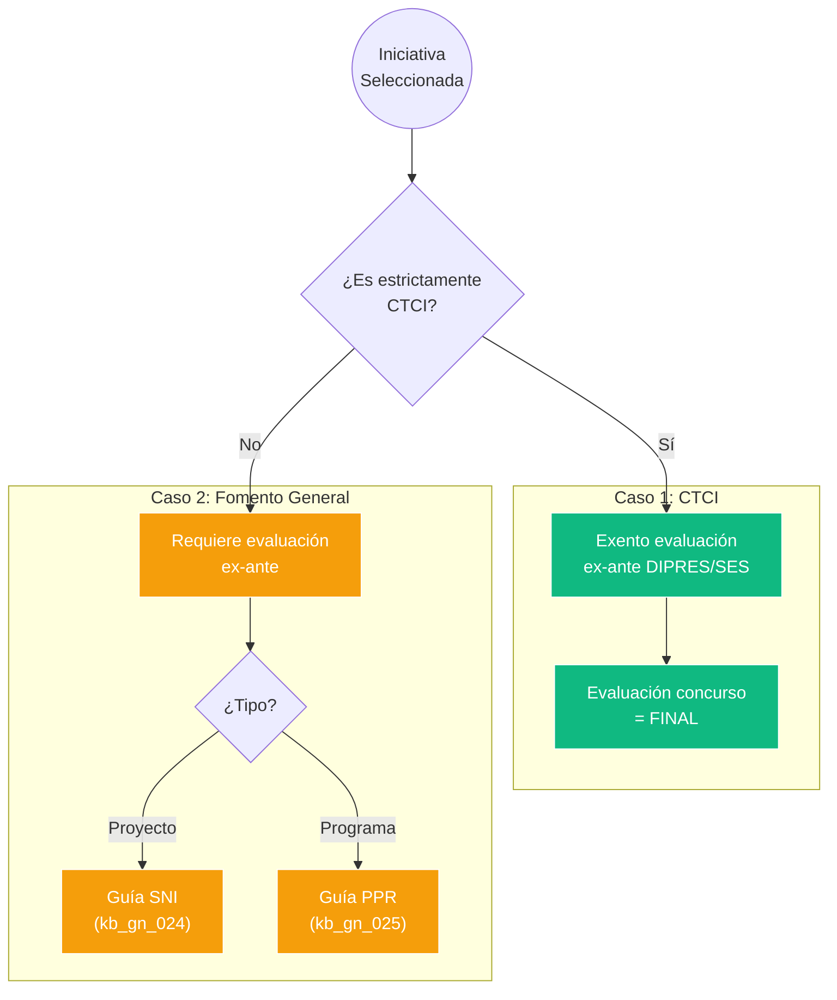

### 18.3 Sectores y Focos Prioritarios FRPD 2025

| Sector Prioritario     | Focos                                       |
| :--------------------- | :------------------------------------------ |
| Atracción Inversiones  | Desarrollo regional estratégico             |
| Desarrollo Empresarial | Pymes, emprendimiento, inversión productiva |
| Turismo/Medioambiente  | Sustentabilidad, eco-innovación             |
| Energía/Conectividad   | Transición energética, brecha digital       |

### 18.4 Criterios Admisibilidad FRPD

| Criterio             | Requisito                                       |
| :------------------- | :---------------------------------------------- |
| **Máx. iniciativas** | 2 por postulante                                |
| **Plazo ejecución**  | ≤ 30 meses                                      |
| **Cobertura**        | Regional (21 comunas) o territorial justificado |
| **RRHH**             | Mín. 1 profesional residente en Ñuble           |
| **Remuneraciones**   | Máx. 30% del fondo                              |
| **Gastos admin**     | Máx. 5%                                         |

---

## 19. Dominio Transferencia PPR: Programas a Entidades Públicas

> **Fuente**: `kb_gn_001_transferencia_ppr_koda.yml`

### 19.1 Caracterización Transferencia PPR

| Aspecto         | Descripción                                         |
| :-------------- | :-------------------------------------------------- |
| **Alcance**     | PPR ejecutados por terceros públicos                |
| **Evaluación**  | Interna GORE (exento evaluación ex-ante DIPRES/SES) |
| **Dictamen**    | ITF (Informe Técnico Favorable) - NO es RATE RS     |
| **Plataforma**  | GESDOC (NO usa BIP)                                 |
| **Metodología** | MML obligatorio                                     |

### 19.2 Proceso Evaluación Interna

```mermaid
flowchart LR
    subgraph EVAL["🔍 Evaluación Interna GORE"]
        ADM["1. Admisibilidad<br/>Documental<br/>(DAE)"]
        PERT["2. Pertinencia<br/>Estratégica<br/>(Comité)"]
        TEC["3. Evaluación<br/>Técnica<br/>(DAE)"]
    end
    
    ADM --> PERT --> TEC
    
    TEC --> RES{"Resultado"}
    RES -->|Favorable| ITF["ITF"]
    RES -->|Con Observ.| SUB["Subsanar"]
    RES -->|No Recom.| REC["Rechazado"]
    
    ITF --> CORE["Aprobación<br/>CORE"]
    SUB --> TEC
```

### 19.3 Restricciones de Gasto

| Ítem                             | Límite                   |
| :------------------------------- | :----------------------- |
| Personal a honorarios            | Máx. 5% transferencia    |
| Gastos administración GORE       | Máx. 5% (no transferido) |
| Préstamos/sociedades             | PROHIBIDO                |
| Subcontratación objeto principal | PROHIBIDO                |

---

## 20. Dominio Subvención 8%: Vinculación con la Comunidad

> **Fuente**: `kb_gn_028_instructivo_subvencion_8_koda.yml`

### 20.1 Caracterización Subvención 8%

| Aspecto              | Descripción                         |
| :------------------- | :---------------------------------- |
| **Base legal**       | Glosa 07, Subt. 24 Ley Presupuestos |
| **Monto total 2025** | M$ 4.850.000                        |
| **Postulantes**      | OSC + Municipalidades               |
| **Plazo ejecución**  | 8 meses desde transferencia         |

### 20.2 Fondos Temáticos

```mermaid
flowchart TB
    subgraph FONDOS_8["💰 Fondos Subvención 8%"]
        CULT["🎭 Cultura<br/>$600M"]
        SOC["🤝 Social/Inclusión<br/>$500M"]
        GEN["⚧ Equidad Género<br/>$400M"]
        DEP["⚽ Deporte<br/>$1.000M"]
        AM["👴 Personas Mayores<br/>$400M"]
        MA["🌿 Medio Ambiente<br/>$400M"]
        SEG["🛡️ Seguridad<br/>$1.550M"]
    end
    
    classDef cultura fill:#7c3aed,stroke:#fff,color:#fff
    classDef social fill:#2563eb,stroke:#fff,color:#fff
    classDef genero fill:#ec4899,stroke:#fff,color:#fff
    classDef deporte fill:#10b981,stroke:#fff,color:#fff
    classDef am fill:#f59e0b,stroke:#fff,color:#fff
    classDef ma fill:#22c55e,stroke:#fff,color:#fff
    classDef seg fill:#dc2626,stroke:#fff,color:#fff
    
    class CULT cultura
    class SOC social
    class GEN genero
    class DEP deporte
    class AM am
    class MA ma
    class SEG seg
```

### 20.3 Áreas por Fondo

| Fondo                | Áreas                                                                                                            |
| :------------------- | :--------------------------------------------------------------------------------------------------------------- |
| **Cultura**          | Artes escénicas, audiovisuales, visuales, musicales, literatura, tradición, ciencias, patrimonio, representación |
| **Social**           | Social, Inclusión, Prevención psicosocial, Residencias Mejor Niñez                                               |
| **Género**           | Prevención VBG, Formación/autonomía, Mujer rural, Diversidad sexual                                              |
| **Deporte**          | Formativo, Recreativo, Inclusivo, Competición, Representación                                                    |
| **Personas Mayores** | Envejecimiento activo, Dependencia moderada/severa                                                               |
| **Medio Ambiente**   | Protección, Educación, Eficiencia hídrica/energética, Mascotas                                                   |
| **Seguridad**        | Prevención situacional, Recuperación espacios, Equipamiento comunitario                                          |

### 20.4 Estructura de Gastos

| Ítem                   | Descripción                                                 | Límites                        |
| :--------------------- | :---------------------------------------------------------- | :----------------------------- |
| **Equipamiento**       | Bienes duraderos post-proyecto                              | Logo GORE obligatorio          |
| **Gestión/Producción** | Actividades directas, materiales fungibles                  | Alimentación máx. $10K/persona |
| **Difusión**           | Medios, artículos promocionales                             | 3-10% del presupuesto          |
| **Honorarios**         | RRHH: Profesional $25K/hr, Técnico $23K/hr, Monitor $18K/hr | Según perfil                   |

---

## 21. Catálogo Unificado de Mecanismos IPR

| Mecanismo             | Vía      | Costo Típico | Evaluador    | Dictamen  | Ejecutor         | Plazo Ejecución |
| :-------------------- | :------- | :----------- | :----------- | :-------- | :--------------- | :-------------- |
| **SNI General**       | Proyecto | > 15.000 UTM | MIDESO       | RS        | GORE/Terceros    | 12-36 meses     |
| **FRIL**              | Proyecto | < 5.000 UTM  | GORE         | Exento RS | Municipalidad    | 12-24 meses     |
| **Circular 33**       | Proyecto | Variable     | MIDESO/GORE  | AD        | GORE/Terceros    | 6-18 meses      |
| **Glosa 06 Directa**  | Programa | Variable     | DIPRES/SES   | RF        | GORE             | 12 meses        |
| **Transferencia PPR** | Programa | Variable     | GORE         | ITF       | Entidad Pública  | 12 meses        |
| **Subvención 8%**     | Programa | < $15M       | GORE         | Concurso  | OSC/Municipio    | 8 meses         |
| **FRPD (CTCI)**       | Mixto    | Variable     | ANID/CORFO   | Concurso  | Inst. Habilitada | ≤ 30 meses      |
| **FRPD (Fomento)**    | Mixto    | Variable     | SNI/Glosa 06 | RS o RF   | Inst. Habilitada | ≤ 30 meses      |

---

## 22. Árbol de Decisión: Selector de Mecanismo (Vista Ampliada)

```mermaid
flowchart TB
    START(("🎯 NUEVA<br/>IPR"))
    
    Q1{"¿CREAR<br/>ACTIVO?"}
    
    subgraph PROY["🏗️ PROYECTOS"]
        Q2{"¿Muni +<br/><5000 UTM?"}
        Q3{"¿Conserv/<br/>ANF/Estudio?"}
        Q4{"¿I+D+i<br/>Productivo?"}
        
        FRIL["✅ FRIL"]
        C33["✅ C33"]
        FRPD_P["✅ FRPD"]
        SNI["✅ SNI"]
    end
    
    subgraph PROG["📋 PROGRAMAS"]
        Q5{"¿OSC/<br/>Privado?"}
        Q6{"¿GORE<br/>ejecuta?"}
        Q7{"¿Entidad<br/>pública?"}
        
        SUB8["✅ Sub 8%"]
        G06["✅ G06"]
        TRANSF["✅ Transf."]
    end
    
    START --> Q1
    Q1 -->|Sí| Q2
    Q1 -->|No| Q5
    
    Q2 -->|Sí| FRIL
    Q2 -->|No| Q3
    Q3 -->|Sí| C33
    Q3 -->|No| Q4
    Q4 -->|Sí| FRPD_P
    Q4 -->|No| SNI
    
    Q5 -->|Sí| SUB8
    Q5 -->|No| Q6
    Q6 -->|Sí| G06
    Q6 -->|No| Q7
    Q7 -->|Sí| TRANSF
    Q7 -->|No| G06
    
    classDef dec fill:#f59e0b,stroke:#000,color:#000
    classDef res fill:#10b981,stroke:#fff,color:#fff
    
    class Q1,Q2,Q3,Q4,Q5,Q6,Q7 dec
    class FRIL,C33,FRPD_P,SNI,SUB8,G06,TRANSF res
```

---

## 23. Dominio Rendiciones de Cuentas

> **Fuente**: `kb_gn_020_gestion_rendiciones_koda.yml`

### 23.1 Ciclo de Vida de Rendición

```mermaid
flowchart TB
    subgraph EE["📤 ENTIDAD EJECUTORA"]
        EE1["Prepara rendición<br/>(comprobantes, informe)"]
        EE2["Ingresa vía SISREC"]
    end
    
    subgraph GORE["🏛️ GORE Ñuble"]
        OP["Oficina de Partes<br/>(Recepción)"]
        UCR["U.C.R.<br/>(Control Rendiciones)"]
        RTF["RTF<br/>(Revisión Técnica)"]
        DAF["DAF<br/>(Contabilización)"]
        SIGFE["SIGFE<br/>(Registro)"]
        ARCH["Archivo<br/>(Expediente)"]
    end
    
    EE1 --> EE2
    EE2 --> OP
    OP --> UCR
    UCR --> RTF
    
    RTF -->|Aprobado| DAF
    RTF -->|Observado| EE1
    
    DAF --> SIGFE
    SIGFE --> ARCH
    
    classDef ee fill:#6b7280,stroke:#fff,color:#fff
    classDef gore fill:#0f766e,stroke:#fff,color:#fff
    
    class EE1,EE2 ee
    class OP,UCR,RTF,DAF,SIGFE,ARCH gore
```

### 23.2 Flujo SISREC (Rendición Electrónica)

```mermaid
sequenceDiagram
    autonumber
    participant AE as Analista Ejecutor
    participant MF as Ministro de Fe
    participant EE as Encargado Ejecutor
    participant AO as Analista Otorgante (RTF)
    participant EO as Encargado Otorgante (Jefe DAF)
    participant UCR as U.C.R./DAF
    
    rect rgb(107, 114, 128)
        Note over AE,EE: Fase Ejecutor
        AE->>AE: Crea informe rendición (mensual/regularización)
        AE->>AE: Ingresa transacciones + adjunta respaldos
        AE->>MF: Envía para certificación
        MF->>MF: Verifica autenticidad documentos
        alt Documentos OK
            MF->>EE: Aprueba y pasa
        else Observaciones
            MF-->>AE: Devuelve para corrección
        end
        EE->>EE: Revisa rendición
        EE->>AO: Firma con FEA y envía al GORE
    end
    
    rect rgb(15, 118, 110)
        Note over AO,UCR: Fase Otorgante (GORE)
        AO->>AO: Recibe y revisa rendición (7 días)
        AO->>AO: Aprueba/Observa cada transacción
        alt Aprobado
            AO->>EO: Envía para firma
            EO->>EO: Revisa propuesta
            EO->>AO: Firma Informe Aprobación con FEA
            AO->>UCR: Deriva para contabilización
            UCR->>UCR: Contabiliza en SIGFE (2 días)
            UCR->>UCR: Archiva registro
        else Observado
            EO-->>AE: Devuelve con observaciones (FEA)
        end
    end
```

### 23.3 Actores de Rendición

| Actor                 | Rol                           | División                   | Función SISREC                    |
| :-------------------- | :---------------------------- | :------------------------- | :-------------------------------- |
| **U.C.R.**            | Control operativo rendiciones | DAF                        | Administrador/Encargado Otorgante |
| **RTF**               | Revisión técnica-financiera   | DIPIR/DIDESO/DIFOI         | Analista Otorgante                |
| **Jefe DAF**          | Firma aprobación              | DAF                        | Encargado Otorgante               |
| **Unidad Control**    | Auditoría selectiva           | GORE - Staff               | —                                 |
| **Entidad Ejecutora** | Rinde cuentas                 | Externa (Muni/SSP/Privado) | Analista/Ministro Fe/Encargado    |

### 23.4 Plazos de Rendición

| Etapa                  | Plazo                             | Responsable                |
| :--------------------- | :-------------------------------- | :------------------------- |
| Presentación rendición | 15 días hábiles del mes siguiente | Entidad Ejecutora          |
| Registro y derivación  | 2 días hábiles                    | Oficina de Partes → U.C.R. |
| Revisión técnica       | 7 días hábiles                    | RTF                        |
| Contabilización        | 2 días hábiles                    | U.C.R./DAF                 |
| Archivo                | 1 día hábil                       | U.C.R./DAF                 |

### 23.5 Consecuencias por Incumplimiento

| Norma                              | Consecuencia                                                                    |
| :--------------------------------- | :------------------------------------------------------------------------------ |
| **Art. 18 Res. 30 CGR**            | No se pueden entregar nuevos fondos si existen rendiciones exigibles pendientes |
| **Art. 31 Res. 30 CGR**            | Obligación de restituir fondos no rendidos, observados o no ejecutados          |
| **Responsabilidad Administrativa** | Censura, multa, suspensión o destitución (Ley 18.834)                           |
| **Responsabilidad Civil**          | Restitución de fondos vía Juicio de Cuentas CGR                                 |
| **Responsabilidad Penal**          | Malversación, fraude al fisco (Código Penal)                                    |

---

## 24. Dominio Flujos de Aprobación

> **Fuente**: `kb_gn_015_aprobaciones_koda.yml`

### 24.1 Principios de Aprobación

| Principio                     | Descripción                                                       |
| :---------------------------- | :---------------------------------------------------------------- |
| **Legalidad**                 | Actos dentro de competencia legal; nulidad si excede atribuciones |
| **Escrituración Electrónica** | Expediente electrónico único (Ley 21.180)                         |
| **Impugnabilidad**            | Todo acto es recurrible (reposición, jerárquico)                  |
| **Probidad y Transparencia**  | Interés general sobre particular; acceso público                  |
| **Control Externo**           | CGR fiscaliza legalidad (Toma de Razón)                           |

### 24.2 Flujo Resolución Exenta

```mermaid
flowchart LR
    subgraph FLUJO["📝 Flujo Resolución Exenta"]
        A["Unidad<br/>Competente"] --> B["Asesoría<br/>Jurídica"]
        B --> C["Unidad<br/>Control"]
        C --> D["Jefatura<br/>División"]
        D --> E["Administrador<br/>Regional"]
        E --> F["Gobernador<br/>(FEA)"]
        F --> G["Notificación<br/>y Archivo"]
    end
    
    classDef paso fill:#0f766e,stroke:#fff,color:#fff
    class A,B,C,D,E,F,G paso
```

### 24.3 Flujo Convenio de Transferencia

```mermaid
sequenceDiagram
    autonumber
    participant DIV as División Técnica
    participant JUR as Asesoría Jurídica
    participant DAF as DAF
    participant GR as Gobernador
    participant RECEP as Entidad Receptora
    participant CGR as CGR
    
    rect rgb(30, 64, 175)
        Note over DIV,DAF: Fase Elaboración
        DIV->>DIV: Elabora borrador convenio
        DIV->>JUR: Envía para revisión
        JUR->>JUR: Control de legalidad
        JUR->>DAF: Pasa para revisión financiera
        DAF->>DAF: Revisa cláusulas rendición
    end
    
    rect rgb(15, 118, 110)
        Note over GR,RECEP: Fase Firma
        DAF->>GR: Presenta convenio
        GR->>RECEP: Firma bilateral
        RECEP->>GR: Firma representante legal
    end
    
    rect rgb(124, 58, 237)
        Note over GR,CGR: Fase Formalización
        GR->>GR: Emite Resolución Aprobatoria
        GR->>CGR: Envía para Toma de Razón
        CGR->>CGR: Control preventivo legalidad
        CGR-->>GR: Toma de Razón
        Note over GR: Transferencia habilitada
    end
```

### 24.4 Modificaciones Presupuestarias

| Tipo                           | Afecta Partida 31 | Acto Requerido               | Excepción CORE                                     |
| :----------------------------- | :---------------- | :--------------------------- | :------------------------------------------------- |
| Reasignación Interna           | No                | Resolución GORE              | —                                                  |
| Creación Iniciativas FRPD      | No                | Resolución GORE              | —                                                  |
| Suplemento Presupuestario      | Sí                | Decreto Supremo + Resolución | —                                                  |
| Transferencia Otros Organismos | Sí                | Decreto Supremo + Resolución | —                                                  |
| Emergencias (3%)               | Sí                | Decreto Supremo + Resolución | Coordinación Subsecretaría Interior                |
| Aumento ≤10% costo aprobado    | No                | Resolución GORE              | **Glosa 10/11**: No requiere nueva aprobación CORE |

### 24.5 Proceso Modificación Presupuestaria

```mermaid
flowchart TB
    subgraph INTERNO["🏛️ APROBACIÓN INTERNA"]
        DIPIR["DIPIR prepara<br/>propuesta"]
        DAF["DAF revisa<br/>funcionamiento"]
        GR_PROP["Gobernador<br/>presenta"]
        CORE["CORE aprueba"]
    end
    
    subgraph EXTERNO["🔒 APROBACIÓN EXTERNA"]
        DIPRES["DIPRES visa"]
        CGR_TDR["CGR Toma<br/>de Razón"]
        VIGENCIA["Vigencia<br/>(ajuste SIGFE)"]
    end
    
    DIPIR --> DAF --> GR_PROP --> CORE
    CORE --> DIPRES --> CGR_TDR --> VIGENCIA
    
    classDef interno fill:#0f766e,stroke:#fff,color:#fff
    classDef externo fill:#7c3aed,stroke:#fff,color:#fff
    
    class DIPIR,DAF,GR_PROP,CORE interno
    class DIPRES,CGR_TDR,VIGENCIA externo
```

---

## 25. Catálogo Expandido de Actores

### 25.1 Actores de Gobernanza

| ID      | Entidad                             | Rol                                         | Fuente    |
| :------ | :---------------------------------- | :------------------------------------------ | :-------- |
| ACT-011 | U.C.R. (Unidad Control Rendiciones) | Control operativo de rendiciones            | kb_gn_020 |
| ACT-012 | RTF (Referente Técnico-Financiero)  | Primera línea revisión proyectos/programas  | kb_gn_020 |
| ACT-013 | Asesoría Jurídica                   | Control de legalidad interno                | kb_gn_015 |
| ACT-014 | Ministro de Fe (Ejecutor)           | Certifica autenticidad documentos en SISREC | kb_gn_020 |

---

## 26. Glosario Consolidado de Entidades

| Categoría  | Entidad                                        | Definición                                           |
| :--------- | :--------------------------------------------- | :--------------------------------------------------- |
| **IPR**    | Intervención Pública Regional                  | Término paraguas: proyectos, programas, estudios     |
| **IDI**    | Iniciativa de Inversión                        | IPR de gasto capital (Subt. 31)                      |
| **PPR**    | Programa Público Regional                      | IPR de gasto corriente (Subt. 24)                    |
| **RATE**   | Resultado Análisis Técnico-Económico           | Dictamen MIDESO (RS, FI, OT, AD)                     |
| **RF**     | Recomendación Favorable                        | Dictamen DIPRES/SES para PPR                         |
| **ITF**    | Informe Técnico Favorable                      | Dictamen interno GORE para transferencias            |
| **MML**    | Metodología de Marco Lógico                    | Herramienta de formulación de programas              |
| **BIP**    | Banco Integrado de Proyectos                   | Plataforma SNI para IDI                              |
| **RIS**    | Requisitos de Información Sectorial            | Documentos de admisibilidad                          |
| **CDP**    | Certificado de Disponibilidad Presupuestaria   | Acredita fondos disponibles                          |
| **CDR**    | Comité Directivo Regional                      | Filtro de pertinencia estratégica                    |
| **TSD**    | Tasa Social de Descuento                       | 5.5% (2025) para evaluación social                   |
| **FRIL**   | Fondo Regional Iniciativa Local                | Infraestructura municipal ≤5.000 UTM                 |
| **C33**    | Circular 33                                    | Procedimiento expedito (estudios, ANF, conservación) |
| **FRPD**   | Fondo Regional Productividad                   | Royalty Minero para CTCI y fomento                   |
| **Sub 8%** | Subvención 8%                                  | Fondos concursables para OSC                         |
| **CTCI**   | Ciencia, Tecnología, Conocimiento e Innovación | Ámbito de acción FRPD                                |
| **OSC**    | Organización de la Sociedad Civil              | Postulantes privados sin fines de lucro              |
| **SISREC** | Sistema de Rendición Electrónica de Cuentas    | Plataforma CGR para rendiciones Subt. 24/33          |
| **SIGFE**  | Sistema de Información Gestión Financiera      | Sistema contable-financiero del Estado               |
| **FEA**    | Firma Electrónica Avanzada                     | Mecanismo que sustituye firma manuscrita             |
| **UCR**    | Unidad de Control de Rendiciones               | Unidad especializada en DAF para control rendiciones |
| **RTF**    | Referente Técnico-Financiero                   | Profesional GORE responsable de revisión técnica     |
| **TdR**    | Toma de Razón                                  | Control preventivo de legalidad por CGR              |

---

> **Modelo Omega GORE Ñuble v2.3.0**
> **Fuentes integradas**: 14 KBs KODA (Intro, Organigrama, LOC GORE, Gestión IPR, Selector IPR, Guía IDI, Guía PPR, FRIL, C33, FRPD, Transferencia PPR, Subvención 8%, Rendiciones, Aprobaciones)
> **Última actualización**: 2025-12-28
