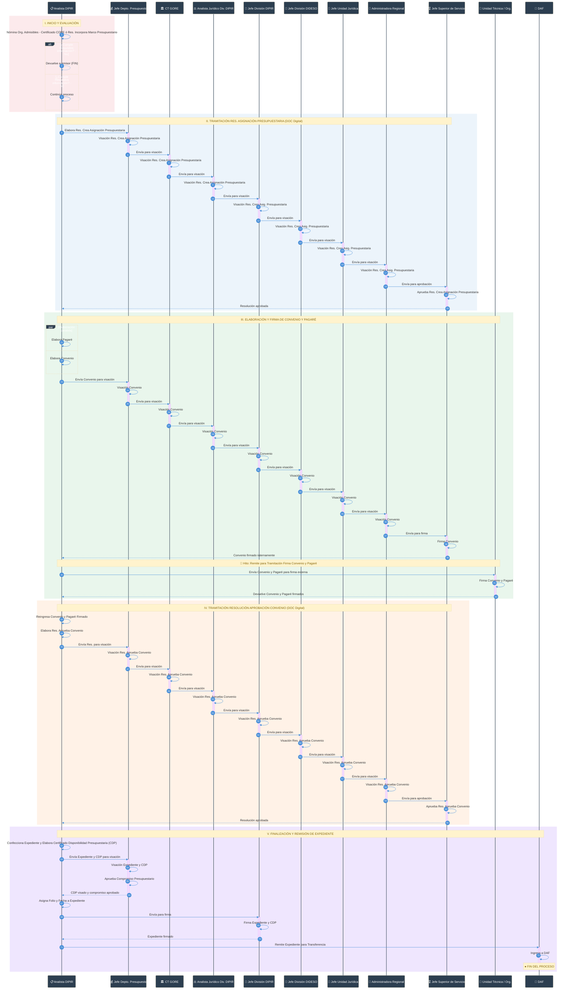

```mermaid
%%{init: {'theme': 'base', 'themeVariables': { 'actorBkg': '#2c3e50', 'actorTextColor': '#fff', 'actorLineColor': '#2c3e50', 'signalColor': '#4A90D9', 'signalTextColor': '#333', 'noteBkgColor': '#fff3cd', 'noteTextColor': '#856404'}}}%%

sequenceDiagram
    autonumber
    
    %% Participantes (orden de aparición en el proceso)
    participant AN as 📋 Analista DIPIR
    participant JP as 💰 Jefe Depto. Presupuesto
    participant CT as 🏛️ CT GORE
    participant AJ as ⚖️ Analista Jurídico Div. DIPIR
    participant JD as 📁 Jefe División DIPIR
    participant JDI as 🤝 Jefe División DIDESO
    participant JU as 📜 Jefe Unidad Jurídica
    participant AR as 👔 Administradora Regional
    participant JS as 🎖️ Jefe Superior de Servicio
    participant UT as 🏢 Unidad Técnica / Org.
    participant DAF as 🏦 DAF

    %% ========================================================================
    %% I. INICIO Y EVALUACIÓN DE REQUISITOS
    %% ========================================================================
    rect rgb(220, 53, 69, 0.1)
        Note over AN: I. INICIO Y EVALUACIÓN
        AN->>AN: Nómina Org. Admisibles - Certificado CORE ó Res. Incorpora Marco Presupuestario
        
        alt ¿Cumple Requisitos información? - No
            AN--xAN: Devuelve a emisor (FIN)
        else ¿Cumple Requisitos información? - Sí
            AN->>AN: Continúa proceso
        end
    end

    %% ========================================================================
    %% II. TRAMITACIÓN RESOLUCIÓN DE ASIGNACIÓN PRESUPUESTARIA
    %% ========================================================================
    rect rgb(74, 144, 217, 0.1)
        Note over AN,JS: II. TRAMITACIÓN RES. ASIGNACIÓN PRESUPUESTARIA (DOC Digital)
        
        AN->>JP: Elabora Res. Crea Asignación Presupuestaria
        activate JP
        JP->>JP: Visación Res. Crea Asignación Presupuestaria
        JP->>CT: Envía para visación
        deactivate JP
        
        activate CT
        CT->>CT: Visación Res. Crea Asignación Presupuestaria
        CT->>AJ: Envía para visación
        deactivate CT
        
        activate AJ
        AJ->>AJ: Visación Res. Crea Asignación Presupuestaria
        AJ->>JD: Envía para visación
        deactivate AJ
        
        activate JD
        JD->>JD: Visación Res. Crea Asig. Presupuestaria
        JD->>JDI: Envía para visación
        deactivate JD
        
        activate JDI
        JDI->>JDI: Visación Res. Crea Asig. Presupuestaria
        JDI->>JU: Envía para visación
        deactivate JDI
        
        activate JU
        JU->>JU: Visación Res. Crea Asig. Presupuestaria
        JU->>AR: Envía para visación
        deactivate JU
        
        activate AR
        AR->>AR: Visación Res. Crea Asig. Presupuestaria
        AR->>JS: Envía para aprobación
        deactivate AR
        
        activate JS
        JS->>JS: Aprueba Res. Crea Asignación Presupuestaria
        JS-->>AN: Resolución aprobada
        deactivate JS
    end

    %% ========================================================================
    %% III. ELABORACIÓN Y FIRMA DE CONVENIO Y PAGARÉ
    %% ========================================================================
    rect rgb(40, 167, 69, 0.1)
        Note over AN,UT: III. ELABORACIÓN Y FIRMA DE CONVENIO Y PAGARÉ
        
        par Elaboración paralela
            AN->>AN: Elabora Pagaré
        and
            AN->>AN: Elabora Convenio
        end
        
        AN->>JP: Envía Convenio para visación
        
        activate JP
        JP->>JP: Visación Convenio
        JP->>CT: Envía para visación
        deactivate JP
        
        activate CT
        CT->>CT: Visación Convenio
        CT->>AJ: Envía para visación
        deactivate CT
        
        activate AJ
        AJ->>AJ: Visación Convenio
        AJ->>JD: Envía para visación
        deactivate AJ
        
        activate JD
        JD->>JD: Visación Convenio
        JD->>JDI: Envía para visación
        deactivate JD
        
        activate JDI
        JDI->>JDI: Visación Convenio
        JDI->>JU: Envía para visación
        deactivate JDI
        
        activate JU
        JU->>JU: Visación Convenio
        JU->>AR: Envía para visación
        deactivate JU
        
        activate AR
        AR->>AR: Visación Convenio
        AR->>JS: Envía para firma
        deactivate AR
        
        activate JS
        JS->>JS: Firma Convenio
        JS-->>AN: Convenio firmado internamente
        deactivate JS
        
        Note over AN,UT: 📨 Hito: Remite para Tramitación Firma Convenio y Pagaré
        AN->>UT: Envía Convenio y Pagaré para firma externa
        
        activate UT
        UT->>UT: Firma Convenio y Pagaré
        UT-->>AN: Devuelve Convenio y Pagaré firmados
        deactivate UT
    end

    %% ========================================================================
    %% IV. TRAMITACIÓN RESOLUCIÓN APROBACIÓN CONVENIO
    %% ========================================================================
    rect rgb(253, 126, 20, 0.1)
        Note over AN,JS: IV. TRAMITACIÓN RESOLUCIÓN APROBACIÓN CONVENIO (DOC Digital)
        
        AN->>AN: Reingresa Convenio y Pagaré Firmado
        AN->>AN: Elabora Res. Aprueba Convenio
        AN->>JP: Envía Res. para visación
        
        activate JP
        JP->>JP: Visación Res. Aprueba Convenio
        JP->>CT: Envía para visación
        deactivate JP
        
        activate CT
        CT->>CT: Visación Res. Aprueba Convenio
        CT->>AJ: Envía para visación
        deactivate CT
        
        activate AJ
        AJ->>AJ: Visación Res. Aprueba Convenio
        AJ->>JD: Envía para visación
        deactivate AJ
        
        activate JD
        JD->>JD: Visación Res. Aprueba Convenio
        JD->>JDI: Envía para visación
        deactivate JD
        
        activate JDI
        JDI->>JDI: Visación Res. Aprueba Convenio
        JDI->>JU: Envía para visación
        deactivate JDI
        
        activate JU
        JU->>JU: Visación Res. Aprueba Convenio
        JU->>AR: Envía para visación
        deactivate JU
        
        activate AR
        AR->>AR: Visación Res. Aprueba Convenio
        AR->>JS: Envía para aprobación
        deactivate AR
        
        activate JS
        JS->>JS: Aprueba Res. Aprueba Convenio
        JS-->>AN: Resolución aprobada
        deactivate JS
    end

    %% ========================================================================
    %% V. FINALIZACIÓN Y REMISIÓN DE EXPEDIENTE
    %% ========================================================================
    rect rgb(102, 16, 242, 0.1)
        Note over AN,DAF: V. FINALIZACIÓN Y REMISIÓN DE EXPEDIENTE
        
        AN->>AN: Confecciona Expediente y Elabora Certificado Disponibilidad Presupuestaria (CDP)
        AN->>JP: Envía Expediente y CDP para visación
        
        activate JP
        JP->>JP: Visación Expediente y CDP
        JP->>JP: Aprueba Compromiso Presupuestario
        JP-->>AN: CDP visado y compromiso aprobado
        deactivate JP
        
        AN->>AN: Asigna Folio y Fecha a Expediente
        AN->>JD: Envía para firma
        
        activate JD
        JD->>JD: Firma Expediente y CDP
        JD-->>AN: Expediente firmado
        deactivate JD
        
        AN->>DAF: Remite Expediente para Transferencia
        
        activate DAF
        DAF->>DAF: Ingresa a DAF
        Note over DAF: ● FIN DEL PROCESO
        deactivate DAF
    end
```
