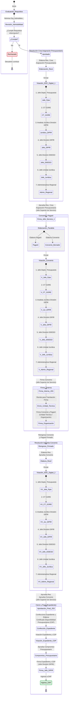

```mermaid
stateDiagram-v2
    classDef doc fill:#e1f5fe,stroke:#039be5,stroke-width:2px;
    classDef wait fill:#fff3cd,stroke:#ffc107,stroke-width:2px;
    classDef done fill:#d4edda,stroke:#28a745,stroke-width:2px;
    classDef error fill:#f8d7da,stroke:#dc3545,stroke-width:2px;
    classDef ext fill:#f8f9fa,stroke:#6c757d,stroke-dasharray: 5 5;

    [*] --> Evaluación_Requisitos: Inicio
    
    state Evaluación_Requisitos {
        [*] --> Revisión_Admisibilidad: Nómina Org. Admisibles...
        Revisión_Admisibilidad --> ¿Cumple?: ¿Cumple Requisitos<br/>información?
        ¿Cumple? --> Rechazado: No
        ¿Cumple? --> Aprobado: Sí
        Rechazado --> [*]: Devuelve a emisor
    }

    state "Resolución Crea Asignación Presupuestaria" as Res1 {
        Aprobado --> Elaboración_Res1: Elabora Res. Crea<br/>Asignación Presupuestaria
        Elaboración_Res1 --> Visación_DOC_Digital_1: Enviar
        
        state Visación_DOC_Digital_1 {
            [*] --> Jefe_Ppto: 1. Jefe Depto. Presupuesto
            Jefe_Ppto --> CT_GORE: 2. CT GORE
            CT_GORE --> Jurídico_DIPIR: 3. Analista Jurídico División DIPIR
            Jurídico_DIPIR --> Jefe_DIPIR: 4. Jefe División DIPIR
            Jefe_DIPIR --> Jefe_DIDESO: 5. Jefe División DIDESO
            Jefe_DIDESO --> Jefe_Jurídica: 6. Jefe Unidad Jurídica
            Jefe_Jurídica --> Admin_Regional: 7. Administradora Regional
        }

        Visación_DOC_Digital_1 --> Firma_Jefe_Servicio_1: Aprueba Res. Crea<br/>Asignación Presupuestaria<br/>(Jefe Superior de Servicio)
    }

    state "Convenio y Pagaré" as Conv {
        Firma_Jefe_Servicio_1 --> Elaboración_Paralela
        
        state Elaboración_Paralela {
            [*] --> Pagaré: Elabora Pagaré
            [*] --> Convenio_Borrador: Elabora Convenio
        }
        
        Elaboración_Paralela --> Visación_Convenio: Enviar
        
        state Visación_Convenio {
             [*] --> V_Jefe_Ppto: 1. Jefe Depto. Presupuesto
             V_Jefe_Ppto --> V_CT_GORE: 2. CT GORE
             V_CT_GORE --> V_Jur_DIPIR: 3. Analista Jurídico División DIPIR
             V_Jur_DIPIR --> V_Jefe_DIPIR: 4. Jefe División DIPIR
             V_Jefe_DIPIR --> V_Jefe_DIDESO: 5. Jefe División DIDESO
             V_Jefe_DIDESO --> V_Jefe_Jurídica: 6. Jefe Unidad Jurídica
             V_Jefe_Jurídica --> V_Admin_Regional: 7. Administradora Regional
        }
        
        Visación_Convenio --> Firma_Interna_JSS: Firma Convenio<br/>(Jefe Superior de Servicio)
        
        state Firma_Externa {
             Firma_Interna_JSS --> Envio_Unidad_Tecnica: Remite para Tramitación Firma
             Envio_Unidad_Tecnica --> Firma_Organización: Firma Convenio y Pagaré<br/>(Unidad Técnica / Organización)
             Firma_Organización --> Reingreso_Firmado: Reingresa Convenio<br/>y Pagaré Firmado
        }
    }

    state "Resolución Aprueba Convenio" as Res2 {
        Reingreso_Firmado --> Elabora_Res2: Elabora Res.<br/>Aprueba Convenio
        Elabora_Res2 --> Visación_DOC_Digital_2: Enviar
        
        state Visación_DOC_Digital_2 {
             [*] --> VV_Jefe_Ppto: 1. Jefe Depto. Presupuesto
             VV_Jefe_Ppto --> VV_CT_GORE: 2. CT GORE
             VV_CT_GORE --> VV_Jur_DIPIR: 3. Analista Jurídico División DIPIR
             VV_Jur_DIPIR --> VV_Jefe_DIPIR: 4. Jefe División DIPIR
             VV_Jefe_DIPIR --> VV_Jefe_DIDESO: 5. Jefe División DIDESO
             VV_Jefe_DIDESO --> VV_Jefe_Jurídica: 6. Jefe Unidad Jurídica
             VV_Jefe_Jurídica --> VV_Admin_Regional: 7. Administradora Regional
        }
        
        Visación_DOC_Digital_2 --> Aprobación_Final_JSS: Aprueba Res.<br/>Aprueba Convenio<br/>(Jefe Superior de Servicio)
    }

    state "Cierre y Pago (Expediente)" as Cierre {
        Aprobación_Final_JSS --> Confección_Expediente: Confecciona Expediente y Elabora<br/>Certificado Disponibilidad<br/>Presupuestaria (CDP)
        Confección_Expediente --> Visación_Expediente_CDP: Visación Expediente y CDP
        Visación_Expediente_CDP --> Compromiso_Presupuestario: Aprueba Compromiso<br/>Presupuestario
        Compromiso_Presupuestario --> Firma_Jefe_DIPIR: Firma Expediente y CDP<br/>(Jefe División DIPIR)
        Firma_Jefe_DIPIR --> Ingreso_DAF: Ingresa a DAF
        Ingreso_DAF --> [*]
    }

    %% Estilos
    class Rechazado error
    class Firma_Organización ext
    class Ingreso_DAF done
```
