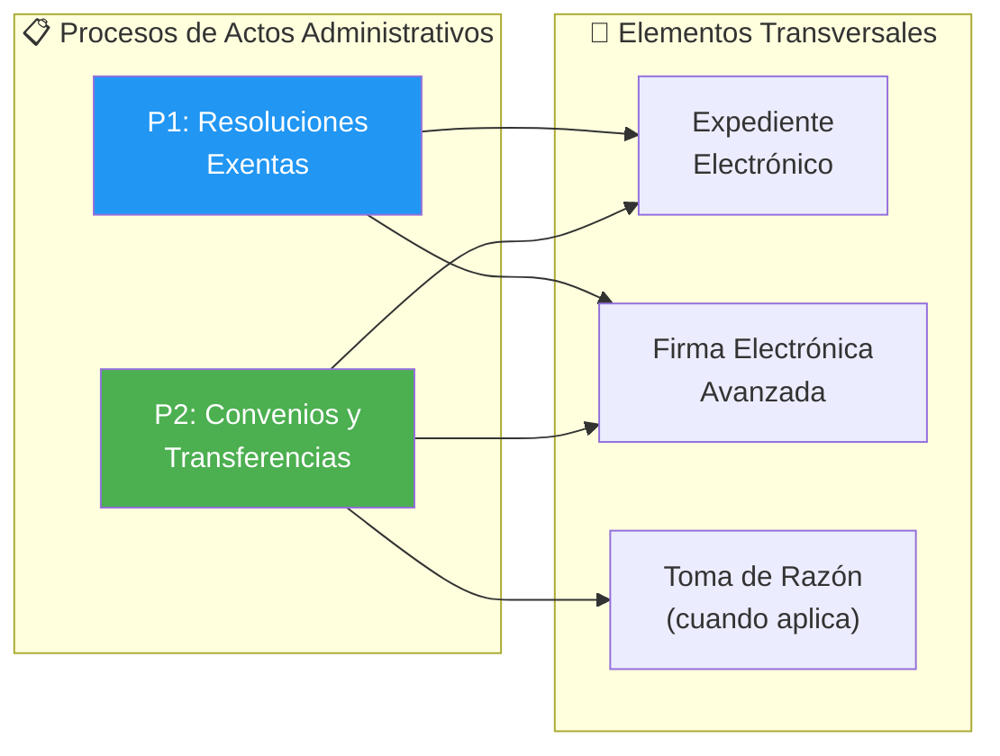
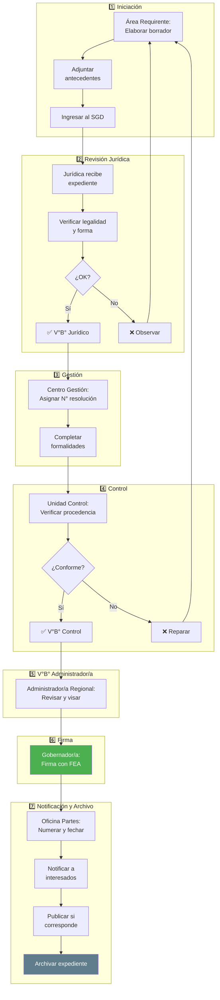
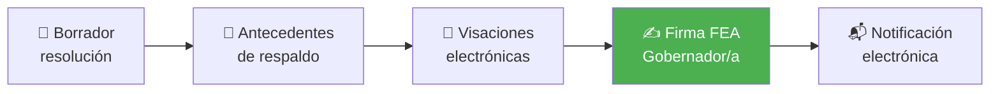
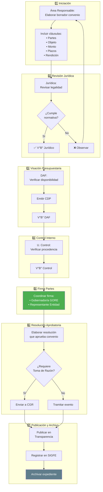
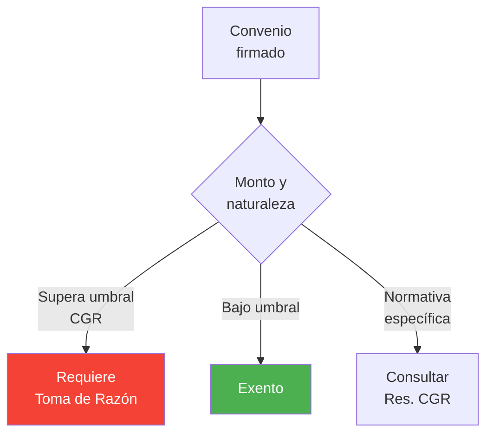
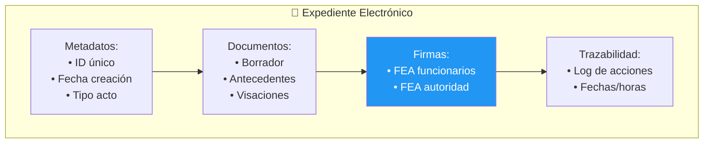

# D01: Tramitación de Actos Administrativos

## Metadatos del Dominio

| Campo           | Valor                                                                                                                                                |
| --------------- | ---------------------------------------------------------------------------------------------------------------------------------------------------- |
| **ID**          | `DOM-ACTOS-ADMIN`                                                                                                                                    |
| **Criticidad**  | 🟠 Alta                                                                                                                                               |
| **Dueño**       | Unidad Jurídica                                                                                                                                      |
| **Procesos**    | 2                                                                                                                                                    |
| **Subprocesos** | ~14 fases                                                                                                                                            |
| **Ref. Fuente** | [kb_gn_054_bpmn_c4_koda.yml](file:///Users/felixsanhueza/Developer/gorenuble/knowledge/domains/gn/arquitectura/kb_gn_054_bpmn_c4_koda.yml) L.100-499 |

---

## Mapa General del Dominio

---

## P1: Flujo de Resoluciones Exentas

| Campo     | Valor                          |
| --------- | ------------------------------ |
| **ID**    | `BPMN-GN-RES-EXENTAS-FLUJO-01` |
| **Fases** | 7                              |
| **SLA**   | 15 días hábiles                |

### Diagrama de Flujo Completo

### Roles por Fase

| Fase             | Responsable              | Acción Principal      |
| ---------------- | ------------------------ | --------------------- |
| 1. Iniciación    | Área Requirente          | Elaborar borrador     |
| 2. Rev. Jurídica | Unidad Jurídica          | Verificar legalidad   |
| 3. Gestión       | Centro de Gestión        | Asignar N°            |
| 4. Control       | Unidad de Control        | Verificar procedencia |
| 5. V°B°          | Administrador/a Regional | Visar                 |
| 6. Firma         | Gobernador/a             | Firma FEA             |
| 7. Notificación  | Oficina de Partes        | Notificar, archivar   |

### Requisitos Expediente Electrónico

---

## P2: Aprobación de Transferencias y Convenios

| Campo     | Valor                                     |
| --------- | ----------------------------------------- |
| **ID**    | `PROC-GORE-BPMN-TRAMITACION-CONVENIOS-01` |
| **Fases** | 7                                         |
| **SLA**   | 30 días hábiles                           |

### Diagrama de Flujo Completo

### Contenido Mínimo del Convenio

| Elemento         | Descripción                       |
| ---------------- | --------------------------------- |
| **Partes**       | GORE + Entidad receptora          |
| **Objeto**       | Descripción del programa/proyecto |
| **Monto**        | Valor total y calendario          |
| **Plazos**       | Duración y fechas clave           |
| **Obligaciones** | Deberes de cada parte             |
| **Rendición**    | Modalidad, plazos, SISREC         |
| **Restitución**  | Condiciones de devolución         |
| **Probidad**     | Cláusulas anticorrupción          |

### Criterios Toma de Razón

---

## Expediente Electrónico (Ley 21.180)

### Estructura del Expediente

### Principios TDE

| Principio                   | Aplicación                           |
| --------------------------- | ------------------------------------ |
| **Equivalencia funcional**  | Documento digital = papel            |
| **Neutralidad tecnológica** | Sin dependencia de proveedor         |
| **Interoperabilidad**       | Comunicación entre sistemas          |
| **Seguridad**               | Integridad, autenticidad, no repudio |

---

## Sistemas Involucrados

| Sistema             | Función                        |
| ------------------- | ------------------------------ |
| `SYS-DOCDIGITAL`    | Gestión documental, expediente |
| `SYS-FIRMAGOB`      | Firma Electrónica Avanzada     |
| `SYS-SIGFE`         | Registro de compromisos        |
| `SYS-TRANSPARENCIA` | Publicación                    |

---

## Normativa Aplicable

| Norma                      | Alcance                      |
| -------------------------- | ---------------------------- |
| **Ley 19.880 LBPA**        | Procedimiento administrativo |
| **Ley 21.180 TDE**         | Expediente electrónico       |
| **Ley 19.799**             | Firma electrónica            |
| **Resolución 30/2015 CGR** | Rendiciones                  |
| **Ley 19.886**             | Contratación pública         |

---

## Referencias Cruzadas

| Dominio Relacionado                                                                                                                            | Vínculo                      |
| ---------------------------------------------------------------------------------------------------------------------------------------------- | ---------------------------- |
| [D03 Gestión IPR](file:///Users/felixsanhueza/Developer/gorenuble/knowledge/domains/gn/arquitectura/bpmn/D03_gestion_ipr.md)                   | Fase 4 Formalización         |
| [D02 Ciclo Presupuestario](file:///Users/felixsanhueza/Developer/gorenuble/knowledge/domains/gn/arquitectura/bpmn/D02_ciclo_presupuestario.md) | Modificaciones, resoluciones |
| [D08 Rendiciones](file:///Users/felixsanhueza/Developer/gorenuble/knowledge/domains/gn/arquitectura/bpmn/D08_rendiciones.md)                   | Convenios de transferencia   |

---

*Última actualización: 2025-12-16*
