```mermaid
flowchart TD
    A["Propuesta GORE<br/>a DIPRES"] --> B["Negociación técnica<br/>GORE-DIPRES"]
    B --> C["Incorporación en<br/>Proyecto Ley de Presupuestos"]
    C --> D["Debate<br/>parlamentario"]
    D --> E["Promulgación<br/>Ley de Presupuestos"]
    E --> F["Resolución GORE:<br/>Distribución interna"]
    F --> G{"¿Requiere<br/>Toma de Razón?"}
    G -->|"Sí"| H["Envío a CGR"]
    G -->|"No"| I["✅ Vigente"]
    H --> I

    style E fill:#4CAF50,color:#fff
    style I fill:#2196F3,color:#fff
```

```mermaid
flowchart TD
    A["Ley de Presupuestos<br/>promulgada"] --> B["Resolución GORE<br/>distribución por subtítulos"]
    B --> C["Incorporar SIC<br/>(Saldo Inicial Caja)"]
    C --> D["Solicitar transferencias<br/>iniciales a DIPRES"]
    D --> E["Apertura SIGFE<br/>nuevo ejercicio"]
    E --> F["Decreto distribución<br/>fondos a divisiones"]
    F --> G["CUF habilitada<br/>para operación"]

    style G fill:#FF9800,color:#fff
```

# D02: Ciclo Presupuestario Regional

## Metadatos del Dominio

| Campo           | Valor                                                                                                                                                 |
| --------------- | ----------------------------------------------------------------------------------------------------------------------------------------------------- |
| **ID**          | `DOM-PRESUPUESTO`                                                                                                                                     |
| **Criticidad**  | 🔴 Crítica                                                                                                                                             |
| **Dueño**       | DAF (Funcionamiento) / DIPIR (Inversión)                                                                                                              |
| **Procesos**    | 5                                                                                                                                                     |
| **Subprocesos** | ~15                                                                                                                                                   |
| **Ref. Fuente** | [kb_gn_054_bpmn_c4_koda.yml](file:///Users/felixsanhueza/Developer/gorenuble/knowledge/domains/gn/arquitectura/kb_gn_054_bpmn_c4_koda.yml) L.500-1886 |

---

## Mapa General del Dominio

```mermaid
flowchart LR
    subgraph CICLO["📅 Ciclo Anual"]
        P1["P1: Formulación<br/>(May-Jun)"]
        P2["P2: Aprobación<br/>(Sep-Nov)"]
        P3["P3: Distribución<br/>(Dic-Ene)"]
        P4["P4: Ejecución<br/>(Todo el año)"]
        P5["P5: Control y<br/>Cierre (Dic-Ene)"]
    end

    subgraph TRANSVERSAL["🔄 Transversal"]
        PM["Modificaciones<br/>Presupuestarias"]
    end

    P1 --> P2 --> P3 --> P4 --> P5
    P4 <--> PM
    P5 -.->|"Retroalimentación"| P1

    style P1 fill:#2196F3,color:#fff
    style P2 fill:#4CAF50,color:#fff
    style P3 fill:#FF9800,color:#fff
    style P4 fill:#9C27B0,color:#fff
    style P5 fill:#607D8B,color:#fff
    style PM fill:#E91E63,color:#fff
```

---

## P1: Formulación del Presupuesto

| Campo       | Valor                                |
| ----------- | ------------------------------------ |
| **ID**      | `BPMN-GN-PRESUPUESTO-FORMULACION-01` |
| **Período** | Mayo-Junio (año anterior)            |

### Diagrama de Flujo

```mermaid
flowchart TD
    A["📜 DIPRES emite<br/>instructivo y clasificador"] --> B["Definir techos<br/>preliminares"]
    
    subgraph INVERSION["💼 Inversión (DIPIR)"]
        C1["Propuesta marco<br/>de inversión"]
        C2["Cartera proyectos<br/>con RS vigente"]
        C3["Asignaciones por<br/>fuente (FNDR/FRIL/FRPD)"]
    end

    subgraph FUNCIONAMIENTO["🏢 Funcionamiento (DAF)"]
        D1["Personal (Subt. 21)"]
        D2["Bienes/Servicios (Subt. 22)"]
        D3["Transferencias (Subt. 24)"]
    end

    B --> C1 & D1
    C1 --> C2 --> C3
    D1 --> D2 --> D3
    C3 & D3 --> E["Consolidación<br/>propuesta"]
    E --> F["Presentación a<br/>Gobernador/a"]
    F --> G["Ajustes según<br/>prioridades ERD"]
    G --> H["📤 Envío a DIPRES"]

    style A fill:#2196F3,color:#fff
    style H fill:#4CAF50,color:#fff
```

### Estructura del Presupuesto

| Subtítulo | Concepto                  | Responsable |
| --------- | ------------------------- | ----------- |
| 21        | Personal                  | DAF         |
| 22        | Bienes y Servicios        | DAF         |
| 24        | Transferencias Corrientes | DAF/DIPIR   |
| 29        | Activos No Financieros    | DAF         |
| 31        | Inversión (Iniciativas)   | DIPIR       |
| 33        | Transferencias de Capital | DIPIR       |

---

## P2: Aprobación del Presupuesto

| Campo       | Valor                               |
| ----------- | ----------------------------------- |
| **ID**      | `BPMN-GN-PRESUPUESTO-APROBACION-01` |
| **Período** | Septiembre-Noviembre                |

### Diagrama de Flujo

---

## P3: Distribución Inicial

| Campo       | Valor                                 |
| ----------- | ------------------------------------- |
| **ID**      | `BPMN-GN-PRESUPUESTO-DISTRIBUCION-01` |
| **Período** | Diciembre-Enero                       |

### Diagrama de Flujo

---

## P4: Ejecución Presupuestaria

| Campo           | Valor                                 |
| --------------- | ------------------------------------- |
| **ID**          | `BPMN-GN-PRESUPUESTO-EJECUCION-01`    |
| **Período**     | Todo el año                           |
| **Subprocesos** | Cadena SIGFE, Tesorería, Contabilidad |

### Cadena Presupuestaria SIGFE

```mermaid
flowchart LR
    subgraph CADENA["🔗 Cadena Presupuestaria"]
        A["1️⃣ CDP<br/>Certificado<br/>Disponibilidad"]
        B["2️⃣ COMPROMISO<br/>Acto<br/>administrativo"]
        C["3️⃣ DEVENGO<br/>Obligación<br/>exigible"]
        D["4️⃣ PAGO<br/>Extinción<br/>obligación"]
    end

    A --> B --> C --> D

    style A fill:#2196F3,color:#fff
    style B fill:#FF9800,color:#fff
    style C fill:#9C27B0,color:#fff
    style D fill:#4CAF50,color:#fff
```

### Gestión de Tesorería

```mermaid
flowchart TD
    subgraph PAC["📊 Programación de Caja"]
        A["PAC: Programación<br/>Anual de Caja"]
        B["Solicitud fondos<br/>mensual a DIPRES"]
        C["Recepción en CUF"]
    end

    subgraph PAGOS["💳 Pagos"]
        D["Verificar saldo"]
        E["Procesar pago<br/>TEF/cheque"]
        F["Actualizar SIGFE"]
    end

    subgraph INGRESOS["📥 Ingresos"]
        G["Recaudar ingresos<br/>propios"]
        H["Recibir traspasos<br/>FNDR/FRPD"]
        I["Conciliar cuentas"]
    end

    A --> B --> C --> D --> E --> F
    G & H --> I

    style C fill:#4CAF50,color:#fff
```

### Contabilidad Gubernamental

```mermaid
flowchart TD
    A["Registro diario<br/>en SIGFE"] --> B["Conciliaciones<br/>bancarias"]
    B --> C["Análisis de<br/>cuentas"]
    C --> D["Cierre mensual"]
    D --> E["Generación<br/>estados financieros"]
    E --> F["Validación con<br/>normas NICSP"]

    style F fill:#607D8B,color:#fff
```

---

## Modificaciones Presupuestarias

| Campo     | Valor                                                |
| --------- | ---------------------------------------------------- |
| **ID**    | `BPMN-GN-PRESUPUESTO-MODIFICACION-01`                |
| **Tipos** | Reasignación, Suplemento, Transferencia Consolidable |

### Diagrama de Niveles

```mermaid
flowchart TD
    A["Detectar necesidad<br/>de modificación"] --> B{"Tipo de<br/>modificación"}
    
    B -->|"Interna mismo<br/>subtítulo"| C["📋 Nivel 1:<br/>Resolución GORE"]
    B -->|"Entre subtítulos<br/>misma naturaleza"| D["📋 Nivel 2:<br/>Res. GORE + TdR CGR"]
    B -->|"Suplementos/<br/>Nuevas asignaciones"| E["📜 Nivel 3:<br/>Decreto DIPRES"]

    C --> F{"¿Requiere<br/>CORE?"}
    D --> F
    E --> F

    F -->|"Sí"| G["Sesión y votación CORE"]
    F -->|"No (excepción)"| H["Tramitar directamente"]
    
    G & H --> I["Registro en SIGFE"]

    style C fill:#8BC34A,color:#fff
    style D fill:#FFC107,color:#000
    style E fill:#f44336,color:#fff
```

### Excepciones sin Acuerdo CORE

| Excepción                 | Condición                    |
| ------------------------- | ---------------------------- |
| Leyes generales           | Reajustes, sentencias        |
| Regularización ingresos   | Sin incidencia en gastos     |
| Emergencias Glosa 14      | Uso del 3%                   |
| Aumento costo proyectos   | Hasta 10% (tope 7.000 UTM)   |
| Adjudicación licitaciones | Variación hasta 10% sobre RS |

### Transferencias Consolidables

---

## P5: Control y Cierre de Ejercicio

| Campo       | Valor                           |
| ----------- | ------------------------------- |
| **ID**      | `BPMN-GN-PRESUPUESTO-CIERRE-01` |
| **Período** | Diciembre-Enero                 |

### Diagrama de Flujo

```mermaid
flowchart TD
    subgraph CONTROL["🔍 Control Durante el Año"]
        A["Control interno<br/>(DAF, DIPIR, U. Control)"]
        B["Seguimiento DIPRES<br/>(mensual)"]
        C["Sistema KPIs y<br/>alertas tempranas"]
    end

    subgraph CIERRE["📅 Cierre 31/12"]
        D["Consolidar<br/>información (DAF)"]
        E["Cerrar cuentas<br/>en SIGFE"]
        F["Calcular deuda<br/>flotante"]
        G["Regularizar<br/>deuda flotante"]
        H["Informe cierre<br/>a DIPRES/CGR"]
    end

    subgraph EVALUACION["📊 Evaluación"]
        I["Evaluar resultados<br/>físicos y financieros"]
        J["Informe evaluación<br/>ex post (DIPIR)"]
    end

    A & B & C --> D --> E --> F --> G --> H
    H --> I --> J

    style H fill:#607D8B,color:#fff
    style J fill:#9C27B0,color:#fff
```

### Deuda Flotante

```mermaid
flowchart TD
    A["Obligaciones devengadas<br/>al 31/12 pendientes<br/>de pago"] --> B{"¿SIC<br/>suficiente?"}
    B -->|"Sí"| C["Financiar con<br/>SIC"]
    B -->|"No"| D["SIC + Mayor<br/>aporte fiscal"]
    C & D --> E["Incorporar en<br/>presupuesto año siguiente"]
    E --> F["Primera prioridad<br/>de pago"]

    style F fill:#FF9800,color:#fff
```

### Reportería Oficial

| Reporte                   | Frecuencia     | Destinatario      |
| ------------------------- | -------------- | ----------------- |
| Informe Ejecución Mensual | Mensual        | DIPRES, CORE      |
| Informes por Glosas       | Trimestral     | Transparencia     |
| Cartera de Proyectos      | Mensual        | Web institucional |
| Acuerdos CORE             | 5 días hábiles | Web institucional |

---

## Sistemas Involucrados

| Sistema             | Función                    |
| ------------------- | -------------------------- |
| `SYS-SIGFE`         | Gestión financiera central |
| `SYS-BIP-SNI`       | Inversión pública          |
| `SYS-TRANSPARENCIA` | Publicación información    |

---

## Normativa Aplicable

| Norma                       | Alcance                      |
| --------------------------- | ---------------------------- |
| LOC 19.175 Art. 72-73       | Competencias presupuestarias |
| Decreto 854/2004 Hacienda   | Clasificador presupuestario  |
| Ley de Presupuestos (anual) | Marco legal ejercicio        |
| Glosa 14 Partida 31         | 3% emergencias               |
| Glosa 16 Partida 31         | Transparencia                |
| NICSP-CGR                   | Contabilidad gubernamental   |
| Resolución 30/2015 CGR      | Rendiciones                  |

---

## Referencias Cruzadas

| Dominio Relacionado                                                                                                                 | Vínculo                       |
| ----------------------------------------------------------------------------------------------------------------------------------- | ----------------------------- |
| [D03 Gestión IPR](file:///Users/felixsanhueza/Developer/gorenuble/knowledge/domains/gn/arquitectura/bpmn/D03_gestion_ipr.md)        | CDP, financiamiento proyectos |
| [D08 Rendiciones](file:///Users/felixsanhueza/Developer/gorenuble/knowledge/domains/gn/arquitectura/bpmn/D08_rendiciones.md)        | Contabilización, SIGFE        |
| [D04 Compras](file:///Users/felixsanhueza/Developer/gorenuble/knowledge/domains/gn/arquitectura/bpmn/D04_compras_contrataciones.md) | Órdenes de compra, contratos  |

---

*Última actualización: 2025-12-16*
