# D07: Gestión de Personas (RRHH)

## Metadatos del Dominio

| Campo           | Valor                                                                                                                                                  |
| --------------- | ------------------------------------------------------------------------------------------------------------------------------------------------------ |
| **ID**          | `DOM-RRHH`                                                                                                                                             |
| **Criticidad**  | 🟠 Alta                                                                                                                                                 |
| **Dueño**       | Área de Gestión de Personas                                                                                                                            |
| **Procesos**    | 7                                                                                                                                                      |
| **Subprocesos** | ~20                                                                                                                                                    |
| **Ref. Fuente** | [kb_gn_054_bpmn_c4_koda.yml](file:///Users/felixsanhueza/Developer/gorenuble/knowledge/domains/gn/arquitectura/kb_gn_054_bpmn_c4_koda.yml) L.1410-1880 |

---

## Mapa General del Dominio

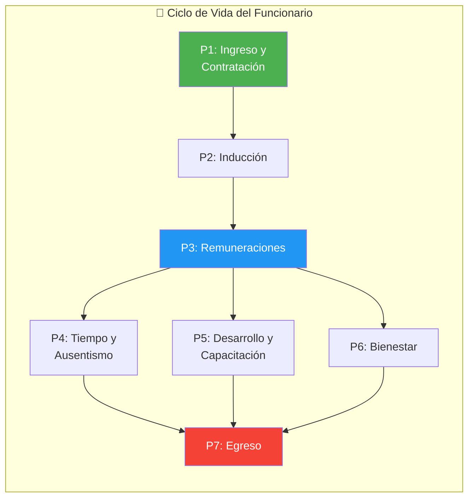

---

## P1: Ingreso y Contratación

| Campo        | Valor                     |
| ------------ | ------------------------- |
| **ID**       | `BPMN-GN-RRHH-INGRESO-01` |
| **Sistemas** | SIGPER, SIAPER            |

### Diagrama de Flujo

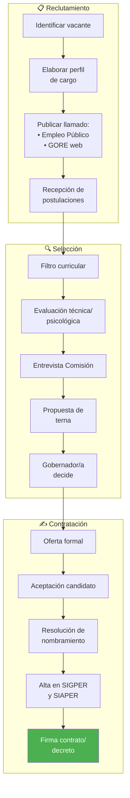

### Tipos de Contrato

| Tipo           | Descripción                                |
| -------------- | ------------------------------------------ |
| **Planta**     | Cargo titular, carrera funcionaria         |
| **Contrata**   | Transitorio, renovación anual              |
| **Honorarios** | Servicios específicos, sin vínculo laboral |

---

## P2: Inducción e Integración

| Campo     | Valor                       |
| --------- | --------------------------- |
| **ID**    | `BPMN-GN-RRHH-INDUCCION-01` |
| **Fases** | 11                          |

### Diagrama de Flujo

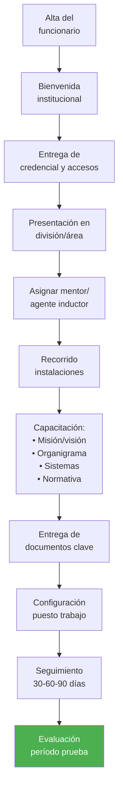

---

## P3: Remuneraciones y Compensaciones

| Campo        | Valor                            |
| ------------ | -------------------------------- |
| **ID**       | `BPMN-GN-RRHH-REMUNERACIONES-01` |
| **Sistemas** | SIGPER, PREVIRED, SIGFE          |
| **Base**     | Escala Única de Sueldos (EUS)    |

### Diagrama de Flujo Mensual

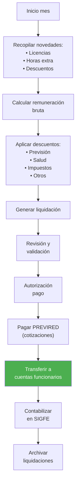

### Componentes de la Remuneración

| Componente       | Descripción                   |
| ---------------- | ----------------------------- |
| **Sueldo base**  | Según grado EUS               |
| **Asignaciones** | Zona, antigüedad, profesional |
| **Bonos**        | PMG, productividad, otros     |
| **Horas extra**  | Según normativa               |

---

## P4: Tiempo, Asistencia y Ausentismo

| Campo  | Valor                               |
| ------ | ----------------------------------- |
| **ID** | `BPMN-GN-RRHH-TIEMPO-AUSENTISMO-01` |

### Diagrama de Flujo

```mermaid
flowchart TD
    subgraph REGISTRO["📋 Registro"]
        A["Funcionario marca<br/>entrada/salida"]
        B["Sistema registra<br/>en reloj control"]
        C["Generar reporte<br/>diario"]
    end

    subgraph PERMISOS["📝 Permisos"]
        D["Solicitar permiso:<br/>• Administrativo<br/>• Particular"]
        E["Jefatura aprueba/<br/>rechaza"]
        F["Registrar en<br/>sistema"]
    end

    subgraph LICENCIAS["🏥 Licencias"]
        G["Funcionario presenta<br/>licencia médica"]
        H["RRHH recepciona<br/>y valida"]
        I["Enviar a Isapre/<br/>COMPIN"]
        J["Resolución:<br/>• Aprobada<br/>• Rechazada"]
        K["Ajustar<br/>remuneración"]
    end

    subgraph FERIADOS["🌴 Feriados"]
        L["Solicitar feriado<br/>legal/progresivo"]
        M["Verificar saldo<br/>disponible"]
        N["Jefatura autoriza"]
        O["Descontar días"]
    end

    A --> B --> C
    D --> E --> F
    G --> H --> I --> J --> K
    L --> M --> N --> O

    style K fill:#FF9800,color:#fff
```

---

## P5: Desarrollo Organizacional y Capacitación

| Campo  | Valor                            |
| ------ | -------------------------------- |
| **ID** | `BPMN-GN-RRHH-DESARROLLO-ORG-01` |

### Diagrama de Flujo

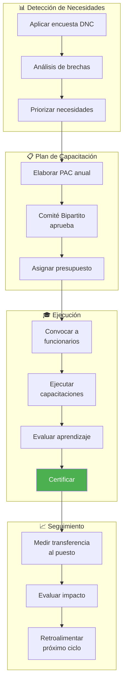

### Calificaciones

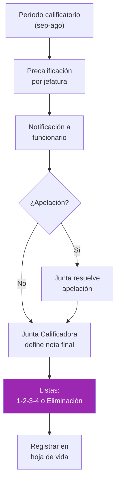

---

## P6: Bienestar y Calidad de Vida

| Campo  | Valor                       |
| ------ | --------------------------- |
| **ID** | `BPMN-GN-RRHH-BIENESTAR-01` |

### Diagrama de Flujo

```mermaid
flowchart TD
    subgraph AFILIACION["📋 Afiliación"]
        A["Funcionario ingresa"]
        B["Invitar a<br/>Servicio de Bienestar"]
        C["Aceptar y afiliar"]
        D["Descuento mensual<br/>por planilla"]
    end

    subgraph PRESTACIONES["🎁 Prestaciones"]
        E["Solicitar beneficio:<br/>• Médico<br/>• Económico<br/>• Préstamo<br/>• Convenio"]
        F["Unidad Bienestar<br/>evalúa"]
        G["Consejo Administrativo<br/>aprueba si requiere"]
        H["Otorgar beneficio"]
    end

    subgraph ACTIVIDADES["🎉 Actividades"]
        I["Planificar eventos:<br/>• Deportivos<br/>• Recreativos<br/>• Culturales"]
        J["Ejecutar actividad"]
        K["Evaluar satisfacción"]
    end

    A --> B --> C --> D
    E --> F --> G --> H
    I --> J --> K

    style H fill:#4CAF50,color:#fff
```

### Prevención de Riesgos

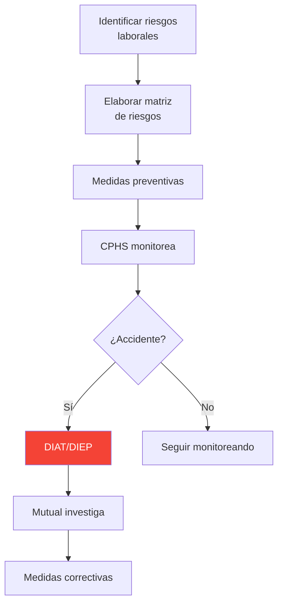

---

## P7: Egreso y Desvinculación

| Campo  | Valor                    |
| ------ | ------------------------ |
| **ID** | `BPMN-GN-RRHH-EGRESO-01` |

### Causales de Egreso

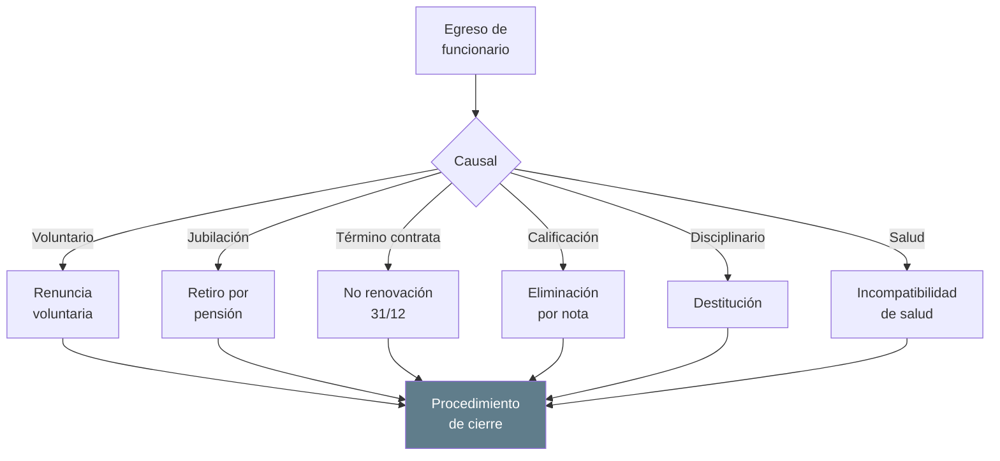

### Procedimiento de Cierre

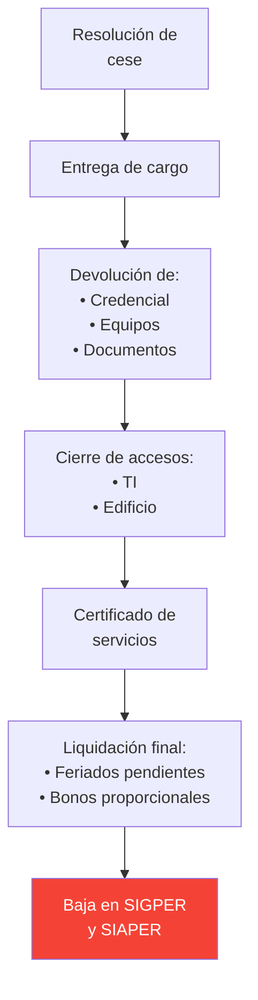

---

## Sistemas Involucrados

| Sistema        | Función                             |
| -------------- | ----------------------------------- |
| `SYS-SIGPER`   | Gestión de personas, remuneraciones |
| `SYS-SIAPER`   | Control personal Estado             |
| `SYS-PREVIRED` | Cotizaciones previsionales          |
| `SYS-SIGFE`    | Contabilización                     |

---

## Normativa Aplicable

| Norma                  | Alcance                     |
| ---------------------- | --------------------------- |
| **Ley 18.834**         | Estatuto Administrativo     |
| **Ley 18.575**         | Bases Administración Estado |
| **Ley 20.880**         | Probidad, declaraciones     |
| **Código del Trabajo** | Honorarios                  |

---

## Referencias Cruzadas

| Dominio Relacionado                                                                                                                              | Vínculo                      |
| ------------------------------------------------------------------------------------------------------------------------------------------------ | ---------------------------- |
| [D02 Ciclo Presupuestario](file:///Users/felixsanhueza/Developer/gorenuble/knowledge/domains/gn/arquitectura/bpmn/D02_ciclo_presupuestario.md)   | Subtítulo 21, Remuneraciones |
| [D01 Actos Administrativos](file:///Users/felixsanhueza/Developer/gorenuble/knowledge/domains/gn/arquitectura/bpmn/D01_actos_administrativos.md) | Resoluciones de nombramiento |

---

*Última actualización: 2025-12-16*
