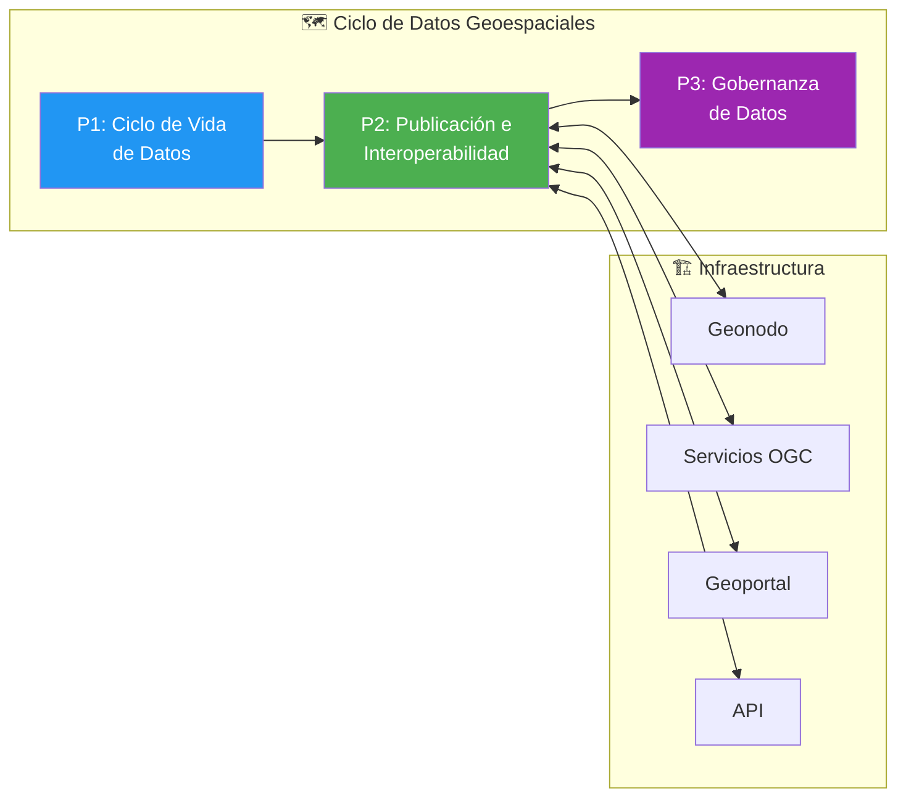
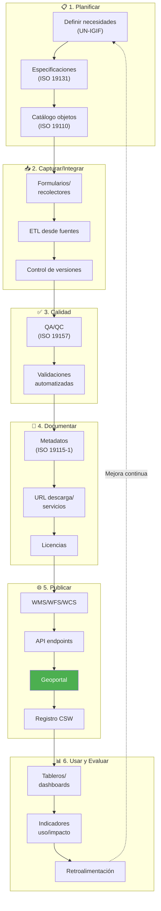
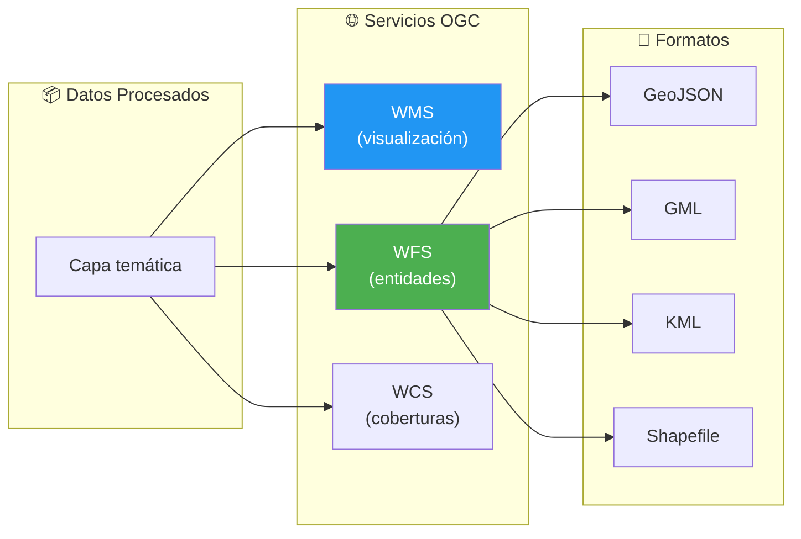
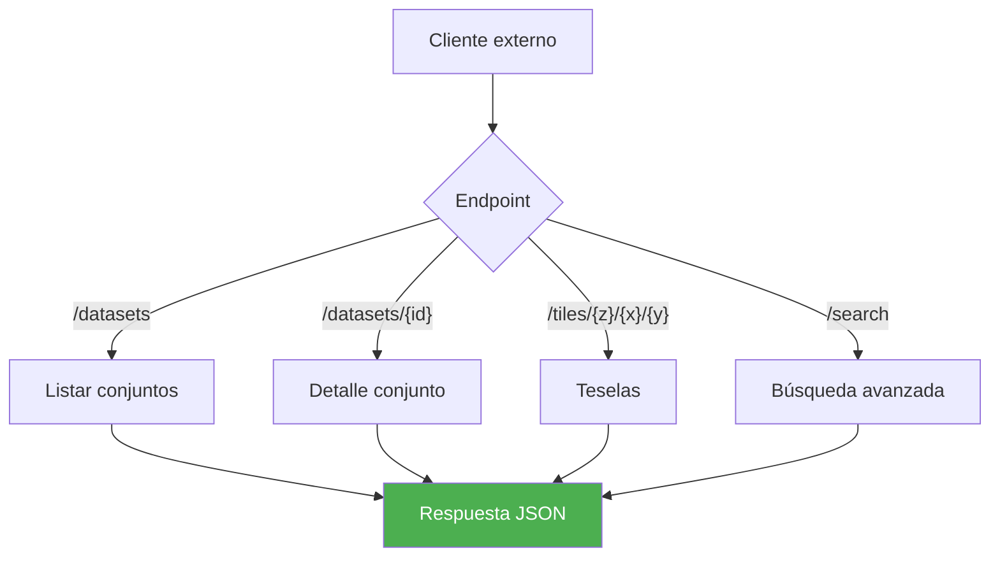
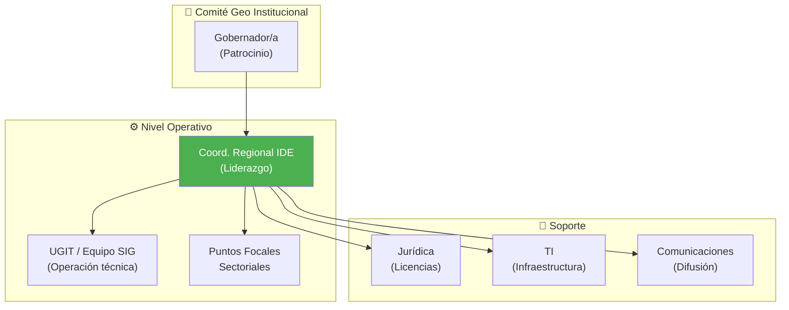
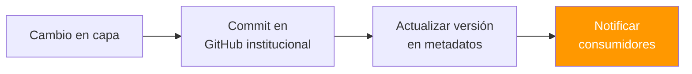
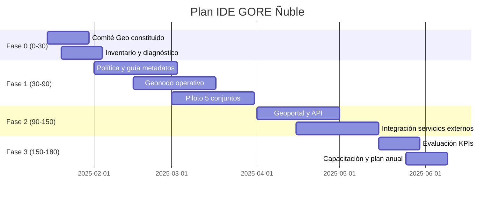

# D10: Gestión de Información Geoespacial (IDE/Geonodo)

## Metadatos del Dominio

| Campo           | Valor                                                                                                                                                  |
| --------------- | ------------------------------------------------------------------------------------------------------------------------------------------------------ |
| **ID**          | `DOM-GEO`                                                                                                                                              |
| **Criticidad**  | 🟡 Media                                                                                                                                                |
| **Dueño**       | Coordinador Regional IDE                                                                                                                               |
| **Procesos**    | 3                                                                                                                                                      |
| **Subprocesos** | ~10                                                                                                                                                    |
| **Ref. Fuente** | [kb_gn_054_bpmn_c4_koda.yml](file:///Users/felixsanhueza/Developer/gorenuble/knowledge/domains/gn/arquitectura/kb_gn_054_bpmn_c4_koda.yml) L.4308-4478 |

---

## Mapa General del Dominio

---

## Marco Estratégico

| Aspecto        | Alineamiento                  |
| -------------- | ----------------------------- |
| **ERD Ñuble**  | Gestión territorial informada |
| **IDE Chile**  | Interoperabilidad nacional    |
| **ISO/TC 211** | Estándares geoespaciales      |
| **OGC**        | Servicios web abiertos        |

---

## P1: Ciclo de Vida de Datos Geoespaciales

| Campo     | Valor                       |
| --------- | --------------------------- |
| **ID**    | `BPMN-GN-GEO-FLUJO-INST-01` |
| **Fases** | 6                           |

### Diagrama de Flujo

### Responsables por Etapa

| Etapa               | Responsable         |
| ------------------- | ------------------- |
| Planificar          | Coord. Regional IDE |
| Capturar/Calidad    | UGIT / Equipo SIG   |
| Documentar/Publicar | UGIT / Equipo SIG   |
| Usar y Evaluar      | Divisiones usuarias |

---

## P2: Publicación e Interoperabilidad

| Campo  | Valor                                |
| ------ | ------------------------------------ |
| **ID** | `BPMN-GN-GEO-PUBLICACION-DETALLE-01` |

### Servicios OGC

### API Institucional

### Geoportal

| Funcionalidad    | Descripción                        |
| ---------------- | ---------------------------------- |
| Búsqueda         | Por tema, palabra clave, ubicación |
| Previsualización | Visor WMS integrado                |
| Descarga         | Múltiples formatos                 |
| Tutoriales       | Guías por perfil de usuario        |

---

## P3: Gobernanza de Datos Geoespaciales

| Campo  | Valor                       |
| ------ | --------------------------- |
| **ID** | `BPMN-GN-GEO-GOBERNANZA-01` |

### Roles de Gobernanza

### Trazabilidad y Versionamiento

### Licenciamiento

| Tipo de Capa       | Licencia Recomendada |
| ------------------ | -------------------- |
| Datos abiertos     | CC BY 4.0            |
| Bases de datos     | ODbL                 |
| Datos restringidos | Acuerdo específico   |

---

## Ética de Datos Geoespaciales

### Principios

| Principio          | Aplicación                      |
| ------------------ | ------------------------------- |
| Minimización       | Evitar granularidad innecesaria |
| Anonimización      | Cuando corresponda              |
| Transparencia      | Declarar origen y licencias     |
| No estigmatización | Evitar visualizaciones dañinas  |
| Calidad            | Tratarla como deber público     |

---

## Plan de Implementación (180 días)

---

## Sistemas Involucrados

| Sistema                    | Función                |
| -------------------------- | ---------------------- |
| `SYS-GEONODO`              | Plataforma geoespacial |
| `SYS-CSW`                  | Catálogo de metadatos  |
| `SYS-OGC-SERVICES`         | WMS/WFS/WCS            |
| `SYS-GEO-PORTAL`           | Portal público         |
| `SYS-GEO-API`              | API REST               |
| `SYS-GITHUB-INSTITUCIONAL` | Versionamiento         |

---

## Normativa Aplicable

| Norma                  | Alcance                    |
| ---------------------- | -------------------------- |
| **ISO 19115-1**        | Metadatos                  |
| **ISO 19157**          | Calidad de datos           |
| **ISO 19131**          | Especificaciones           |
| **Política IDE Chile** | Interoperabilidad nacional |
| **Ley 21.455**         | Cambio climático (datos)   |

---

## Referencias Cruzadas

| Dominio Relacionado                                                                                                          | Vínculo                      |
| ---------------------------------------------------------------------------------------------------------------------------- | ---------------------------- |
| [D03 Gestión IPR](file:///Users/felixsanhueza/Developer/gorenuble/knowledge/domains/gn/arquitectura/bpmn/D03_gestion_ipr.md) | Georreferenciación proyectos |
| [D09 CIES/SITIA](file:///Users/felixsanhueza/Developer/gorenuble/knowledge/domains/gn/arquitectura/bpmn/D09_cies_sitia.md)   | Ubicación cámaras            |

---

*Última actualización: 2025-12-16*
