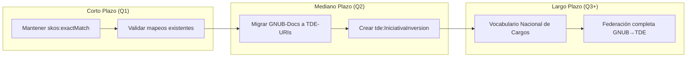

# Análisis de Integración Profunda: GORE Ñuble + TDE

**Fecha**: 2026-01-23
**Alcance**: Evaluación de interoperabilidad semántica, solapamientos y oportunidades de mejora.

---

## 1. Resumen Ejecutivo

La integración entre GNUB y TDE es sólida pero tiene áreas de mejora. Principales hallazgos:

- ✅ **Alineamiento Organizacional**: Correcto (`gnub:Division` ⊆ `tde:OAE`).
- ⚠️ **Duplicación de Taxonomías**: Documentos administrativos definidos en ambos bundles.
- ❌ **Brecha Conceptual**: TDE carece de concepto "Proyecto de Inversión".

---

## 2. Análisis de Solapamiento

### 2.1 Documentos Administrativos

| GNUB                        | TDE                                            | Relación            |
| --------------------------- | ---------------------------------------------- | ------------------- |
| `gnubd:_DocType_Resolution` | `tde-ref:_TipoDocumentoElectronico_resolucion` | `skos:exactMatch` ✅ |
| `gnubd:_DocType_Report`     | `tde-ref:_TipoDocumentoElectronico_informe`    | `skos:exactMatch` ✅ |
| `gnubd:_DocType_Decree`     | *(sin equivalente directo)*                    | Brecha              |

**Problema**: GNUB mantiene taxonomía local cuando podría usar URIs de TDE directamente.

### 2.2 Roles y Cargos

| Concepto        | GNUB                                            | TDE                                 |
| --------------- | ----------------------------------------------- | ----------------------------------- |
| Cargo funcional | `gnub:PositionType` (Gobernador, Jefe División) | `tde:Cargo` (genérico)              |
| Rol digital     | *(no aplica)*                                   | `tde:RolTDE` (CDO, Coord TD)        |
| Rol en trámite  | *(no aplica)*                                   | `tde:RolProcedimiento` (Interesado) |

**Análisis**: `gnub:PositionType ≡ tde:Cargo` está correctamente declarado en `alignmentGnubTde.ttl`.

### 2.3 Ciclo de Vida de Procesos

| GNUB                    | TDE                              | Observación            |
| ----------------------- | -------------------------------- | ---------------------- |
| `gnub:IPRPhase` (F0-F5) | `tde:EstadoTramite`              | Granularidad diferente |
| `gnub:AgreementState`   | *(sin equivalente)*              | Brecha                 |
| `gnub:RenditionState`   | `tde:EstadoTramite` (broadMatch) | Alineado               |

---

## 3. Problemas de Integración

| ID     | Severidad | Descripción                                                     | Impacto                                            |
| ------ | --------- | --------------------------------------------------------------- | -------------------------------------------------- |
| **P1** | 🔴 ALTO    | TDE no tiene concepto de "Proyecto" o "Cartera de Inversiones". | GNUB no puede federar sus proyectos IPR hacia TDE. |
| **P2** | 🟡 MEDIO   | Taxonomía de documentos duplicada entre bundles.                | Mantenimiento doble, riesgo de divergencia.        |
| **P3** | 🟡 MEDIO   | Estados de Convenio (`AgreementState`) no mapeados a TDE.       | Pérdida de información en integración.             |
| **P4** | 🟢 BAJO    | Falta vocabulario de Cargos Públicos estándar en TDE.           | GNUB define cargos ad-hoc sin referencia nacional. |

---

## 4. Oportunidades de Mejora

### 4.1 Para GNUB (Consumir TDE)

1. **Deprecar `gnub:DocumentType`**: Usar directamente `tde:TipoDocumentoElectronico`.
2. **Mapear `AgreementState` a `EstadoExpediente`**: Los convenios pueden verse como expedientes.

### 4.2 Para TDE (Elevation desde GNUB)

1. **Crear `tde:IniciativaInversion`**: Subclase de `gist:Project` para carteras regionales.
2. **Ampliar `EstadoExpediente`**: Incluir estados de convenios (Borrador, Visado, Formalizado).
3. **Crear vocabulario de Cargos Públicos**: Elevar `gnub:PositionType` como referencia nacional.

---

## 5. Estrategia de Convergencia

---

## 6. Conclusión

La integración GNUB-TDE está en un **estado maduro** pero requiere trabajo adicional para alcanzar interoperabilidad plena. La principal brecha es la ausencia de un concepto de "Proyecto" en TDE, lo cual limita la capacidad de los Gobiernos Regionales para federar su gestión de inversiones hacia el ecosistema nacional.

**Recomendación**: Priorizar la creación de `tde:IniciativaInversion` como extensión de Gist 14.0.
