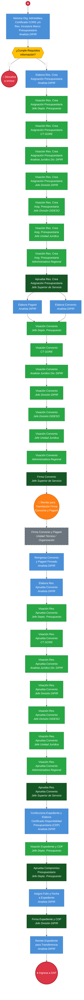

```mermaid
%%{init: {'theme': 'base', 'themeVariables': { 'primaryColor': '#4A90D9', 'primaryTextColor': '#fff', 'primaryBorderColor': '#2E6BA6', 'lineColor': '#555', 'secondaryColor': '#f5f5f5'}}}%%

flowchart TD
    %% ========================================================================
    %% I. INICIO Y EVALUACIÓN DE REQUISITOS
    %% ========================================================================
    START((●)) --> I1["Nómina Org. Admisibles;<br/>Certificado CORE y/o<br/>Res. Incorpora Marco Presupuestario<br/><i>Analista DIPIR</i>"]
    I1 --> GW{{"¿Cumple Requisitos<br/>información?"}}
    GW -->|No| END_R((○ Devuelve<br/>a emisor))
    GW -->|Sí| II1

    %% ========================================================================
    %% II. TRAMITACIÓN RES. ASIGNACIÓN PRESUPUESTARIA
    %% ========================================================================
    II1["Elabora Res. Crea<br/>Asignación Presupuestaria<br/><i>Analista DIPIR</i>"]
    II1 --> II2["Visación Res. Crea<br/>Asignación Presupuestaria<br/><i>Jefe Depto. Presupuesto</i>"]
    II2 --> II3["Visación Res. Crea<br/>Asignación Presupuestaria<br/><i>CT GORE</i>"]
    II3 --> II4["Visación Res. Crea<br/>Asignación Presupuestaria<br/><i>Analista Jurídico Div. DIPIR</i>"]
    II4 --> II5["Visación Res. Crea<br/>Asignación Presupuestaria<br/><i>Jefe División DIPIR</i>"]
    II5 --> II6["Visación Res. Crea<br/>Asig. Presupuestaria<br/><i>Jefe División DIDESO</i>"]
    II6 --> II7["Visación Res. Crea<br/>Asig. Presupuestaria<br/><i>Jefe Unidad Jurídica</i>"]
    II7 --> II8["Visación Res. Crea<br/>Asig. Presupuestaria<br/><i>Administradora Regional</i>"]
    II8 --> II9["Aprueba Res. Crea<br/>Asignación Presupuestaria<br/><i>Jefe Superior de Servicio</i>"]

    %% ========================================================================
    %% III. ELABORACIÓN Y FIRMA DE CONVENIO Y PAGARÉ
    %% ========================================================================
    II9 --> III1["Elabora Pagaré<br/><i>Analista DIPIR</i>"]
    II9 --> III2["Elabora Convenio<br/><i>Analista DIPIR</i>"]
    III1 --> III3
    III2 --> III3
    III3["Visación Convenio<br/><i>Jefe Depto. Presupuesto</i>"]
    III3 --> III4["Visación Convenio<br/><i>CT GORE</i>"]
    III4 --> III5["Visación Convenio<br/><i>Analista Jurídico Div. DIPIR</i>"]
    III5 --> III6["Visación Convenio<br/><i>Jefe División DIPIR</i>"]
    III6 --> III7["Visación Convenio<br/><i>Jefe División DIDESO</i>"]
    III7 --> III8["Visación Convenio<br/><i>Jefe Unidad Jurídica</i>"]
    III8 --> III9["Visación Convenio<br/><i>Administradora Regional</i>"]
    III9 --> III10["Firma Convenio<br/><i>Jefe Superior de Servicio</i>"]
    III10 --> HITO(("📨 Remite para<br/>Tramitación Firma<br/>Convenio y Pagaré"))
    HITO --> III12["Firma Convenio y Pagaré<br/><i>Unidad Técnica / Organización</i>"]

    %% ========================================================================
    %% IV. TRAMITACIÓN RES. APROBACIÓN DE CONVENIO
    %% ========================================================================
    III12 --> IV1["Reingresa Convenio<br/>y Pagaré Firmado<br/><i>Analista DIPIR</i>"]
    IV1 --> IV2["Elabora Res.<br/>Aprueba Convenio<br/><i>Analista DIPIR</i>"]
    IV2 --> IV3["Visación Res.<br/>Aprueba Convenio<br/><i>Jefe Depto. Presupuesto</i>"]
    IV3 --> IV4["Visación Res.<br/>Aprueba Convenio<br/><i>CT GORE</i>"]
    IV4 --> IV5["Visación Res.<br/>Aprueba Convenio<br/><i>Analista Jurídico Div. DIPIR</i>"]
    IV5 --> IV6["Visación Res.<br/>Aprueba Convenio<br/><i>Jefe División DIPIR</i>"]
    IV6 --> IV7["Visación Res.<br/>Aprueba Convenio<br/><i>Jefe División DIDESO</i>"]
    IV7 --> IV8["Visación Res.<br/>Aprueba Convenio<br/><i>Jefe Unidad Jurídica</i>"]
    IV8 --> IV9["Visación Res.<br/>Aprueba Convenio<br/><i>Administradora Regional</i>"]
    IV9 --> IV10["Aprueba Res.<br/>Aprueba Convenio<br/><i>Jefe Superior de Servicio</i>"]

    %% ========================================================================
    %% V. FINALIZACIÓN Y REMISIÓN DE EXPEDIENTE
    %% ========================================================================
    IV10 --> V1["Confecciona Expediente y Elabora<br/>Certificado Disponibilidad<br/>Presupuestaria (CDP)<br/><i>Analista DIPIR</i>"]
    V1 --> V2["Visación Expediente y CDP<br/><i>Jefe Depto. Presupuesto</i>"]
    V2 --> V3["Aprueba Compromiso<br/>Presupuestario<br/><i>Jefe Depto. Presupuesto</i>"]
    V3 --> V4["Asigna Folio y Fecha<br/>a Expediente<br/><i>Analista DIPIR</i>"]
    V4 --> V5["Firma Expediente y CDP<br/><i>Jefe División DIPIR</i>"]
    V5 --> V6["Remite Expediente<br/>para Transferencia<br/><i>Analista DIPIR</i>"]
    V6 --> END_DAF((● Ingresa a DAF))

    %% ========================================================================
    %% ESTILOS
    %% ========================================================================
    classDef startEnd fill:#dc3545,stroke:#a71d2a,color:#fff,stroke-width:3px
    classDef gateway fill:#ffc107,stroke:#d39e00,color:#000,stroke-width:2px
    classDef taskAnalista fill:#4A90D9,stroke:#2E6BA6,color:#fff,stroke-width:1px
    classDef visacion fill:#28a745,stroke:#1e7e34,color:#fff,stroke-width:1px
    classDef aprobacion fill:#155724,stroke:#0d3d15,color:#fff,stroke-width:2px
    classDef externo fill:#6c757d,stroke:#495057,color:#fff,stroke-width:2px,stroke-dasharray: 5 5
    classDef hito fill:#fd7e14,stroke:#dc6a12,color:#fff,stroke-width:2px

    class START,END_R,END_DAF startEnd
    class GW gateway
    class I1,II1,III1,III2,IV1,IV2,V1,V4,V6 taskAnalista
    class II2,II3,II4,II5,II6,II7,II8,III3,III4,III5,III6,III7,III8,III9,IV3,IV4,IV5,IV6,IV7,IV8,IV9,V2 visacion
    class II9,III10,IV10,V3,V5 aprobacion
    class III12 externo
    class HITO hito
```
