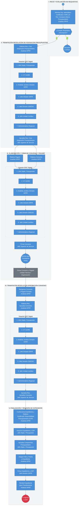

```mermaid
%%{init: {'theme': 'base', 'themeVariables': { 'primaryColor': '#4A90D9', 'primaryTextColor': '#fff', 'primaryBorderColor': '#2E6BA6', 'lineColor': '#666', 'tertiaryColor': '#f3f4f6'}}}%%

flowchart TB
    %% ========================================================================
    %% DIAGRAMA ESTRUCTURAL POR FASES (SWIMLANES SIMULADOS)
    %% Fuente: Res. 2.0.0 (Fuente de Verdad) - Verbatim Text
    %% ========================================================================

    subgraph I_INICIO [I. INICIO Y EVALUACIÓN DE REQUISITOS]
        direction TB
        START((●)) --> A1["Nómina Org. Admisibles;<br/>Certificado CORE y/o<br/>Res. Incorpora Marco Presupuestario<br/><i>Analista DIPIR</i>"]
        A1 --> GW{{"¿Cumple Requisitos<br/>información?"}}
        GW -->|No| RECHAZADO((Devuelve<br/>a emisor))
    end

    subgraph II_RES1 [II. TRAMITACIÓN RESOLUCIÓN DE ASIGNACIÓN PRESUPUESTARIA]
        direction TB
        GW -->|Sí| B1["Elabora Res. Crea<br/>Asignación Presupuestaria<br/><i>Analista DIPIR</i>"]
        
        subgraph VIS1 [Visación DOC Digital]
            direction TB
            V1_1["1. Jefe Depto. Presupuesto"] --> V1_2["2. CT GORE"]
            V1_2 --> V1_3["3. Analista Jurídico División DIPIR"]
            V1_3 --> V1_4["4. Jefe División DIPIR"]
            V1_4 --> V1_5["5. Jefe División DIDESO"]
            V1_5 --> V1_6["6. Jefe Unidad Jurídica"]
            V1_6 --> V1_7["7. Administradora Regional"]
        end
        B1 --> V1_1
        V1_7 --> B8["Aprueba Res. Crea<br/>Asignación Presupuestaria<br/><i>Jefe Superior de Servicio</i>"]
    end

    subgraph III_CONVENIO [III. ELABORACIÓN Y FIRMA DE CONVENIO Y PAGARÉ]
        direction TB
        B8 --> C1["Elabora Pagaré<br/><i>Analista DIPIR</i>"]
        B8 --> C2["Elabora Convenio<br/><i>Analista DIPIR</i>"]
        
        subgraph VIS2 [Visación DOC Digital]
            direction TB
            V2_1["1. Jefe Depto. Presupuesto"] --> V2_2["2. CT GORE"]
            V2_2 --> V2_3["3. Analista Jurídico División DIPIR"]
            V2_3 --> V2_4["4. Jefe División DIPIR"]
            V2_4 --> V2_5["5. Jefe División DIDESO"]
            V2_5 --> V2_6["6. Jefe Unidad Jurídica"]
            V2_6 --> V2_7["7. Administradora Regional"]
        end
        
        C1 --> V2_1
        C2 --> V2_1
        V2_7 --> C9["Firma Convenio<br/><i>Jefe Superior de Servicio</i>"]
        C9 --> HITO(("Remite para<br/>Tramitación<br/>Firma"))
        HITO --> C10["Firma Convenio y Pagaré<br/><i>Unidad Técnica / Organización</i>"]:::externo
    end

    subgraph IV_RES2 [IV. TRAMITACIÓN RESOLUCIÓN APROBACIÓN CONVENIO]
        direction TB
        C10 --> D1["Reingresa Convenio<br/>y Pagaré Firmado<br/><i>Analista DIPIR</i>"]
        D1 --> D2["Elabora Res.<br/>Aprueba Convenio<br/><i>Analista DIPIR</i>"]
        
        subgraph VIS3 [Visación DOC Digital]
            direction TB
            V3_1["1. Jefe Depto. Presupuesto"] --> V3_2["2. CT GORE"]
            V3_2 --> V3_3["3. Analista Jurídico División DIPIR"]
            V3_3 --> V3_4["4. Jefe División DIPIR"]
            V3_4 --> V3_5["5. Jefe División DIDESO"]
            V3_5 --> V3_6["6. Jefe Unidad Jurídica"]
            V3_6 --> V3_7["7. Administradora Regional"]
        end
        D2 --> V3_1
        V3_7 --> D9["Aprueba Res.<br/>Aprueba Convenio<br/><i>Jefe Superior de Servicio</i>"]
    end

    subgraph V_CIERRE [V. FINALIZACIÓN Y REMISIÓN DE EXPEDIENTE]
        direction TB
        D9 --> E1["Confecciona Expediente y Elabora<br/>Certificado Disponibilidad<br/>Presupuestaria (CDP)<br/><i>Analista DIPIR</i>"]
        E1 --> E2["Visación Expediente y CDP<br/><i>Jefe Depto. Presupuesto</i>"]
        E2 --> E3["Aprueba Compromiso<br/>Presupuestario<br/><i>Jefe Depto. Presupuesto</i>"]
        E3 --> E4["Asigna Folio y Fecha<br/>a Expediente<br/><i>Analista DIPIR</i>"]
        E4 --> E5["Firma Expediente y CDP<br/><i>Jefe División DIPIR</i>"]
        E5 --> E6["Remite Expediente<br/>para Transferencia<br/><i>Analista DIPIR</i>"]
        E6 --> FIN((● Ingresa<br/>a DAF)):::fin
    end

    %% Styles
    classDef externo fill:#6c757d,stroke:#333,color:#fff,stroke-dasharray: 5 5
    classDef fin fill:#dc3545,stroke:#a71d2a,color:#fff
    class VIS1,VIS2,VIS3 fill:#f8f9fa,stroke:#ced4da,color:#495057
```
